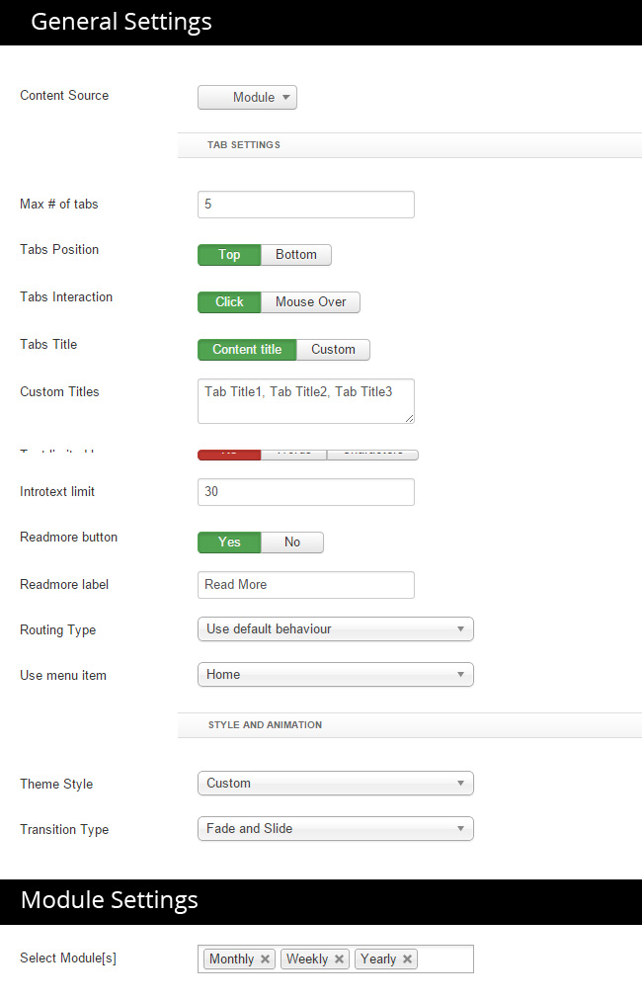

## Installation

Follow [fresh installation guideline](http://www.themexpert.com/docs/expose/basics/installation) if you are having problem to install template.

<div class="row">
	<div class="col-md-6">
		<div class="panel panel-primary">
		  <!-- Default panel contents -->
		  <div class="panel-heading">Complimentary Extensions</div>
		  <!-- List group -->
		  <div class="list-group">
		    <div><a class="list-group-item" href="http://www.unitecms.net/joomla-extensions/unite-revolution-slider-responsive">Revolution Slider</a></div>
            <div><a class="list-group-item" href="http://www.themexpert.com/joomla-extensions/xpert-tabs">Xpert Tabs</a></div>
            <div><a class="list-group-item" href="http://www.themexpert.com/joomla-extensions/xpert-gallery">Xpert Gallery</a></div>
		    <div><a class="list-group-item" href="http://www.rockettheme.com/joomla/extensions/roksprocket">RockSprocket</a></div>
            <div><a class="list-group-item" href="http://www.themexpert.com/joomla-extensions/xpert-contact">Xpert Contact</a></div>
		 </div>
		</div>
	</div>

	<div class="col-md-6">
		<div class="panel panel-default"> 
			<div class="panel-heading">Optional</div>
 
			<div class="list-group">
				<div><a class="list-group-item" href="http://getk2.org">K2</a></div>
			</div>
		</div>
	</div>
</div>

## Template Settings

To load factory settings of this template please open template settings and click `Configurator` button. Under `Load configuration` button you will see all available settings there and choose settings named as your template name. Then press load button and you&#39;re done!


## Homepage Settings

The screenshot below shows you the modules we have published on the homepage of the demo site.


## Revolution Slider Settings

This module is powered by [Revolution Slider](http://www.unitecms.net/joomla-extensions/unite-revolution-slider-responsive) and here are the settings.

	Module Position: slider

### Revolution Slider component settings


### Revolution Slider slide settings


## Service Module

```
Module Type: Custom HTML
Module Position: Services
Class Suffix: services align-center nopadding nomargin
```
```
<div class="width-33 visible-desktop">

	<div class="service-intro">
	
		<h3>Our Services</h3>
	</div>

</div>

<div class="width-33">

	<div class="service-item">
		<span class="bc-tools-2 icon-4x"></span>
		<h3>Web Development</h3>
		<p>Proin iaculis purus consequat sem cure digni ssim Donec porttitora entum suscipit 
aenean rhoncus posuere odio</p>
	</div>
	
	<div class="service-item">
		<span class="bc-browser icon-4x"></span>
		<h3>Beutiful Designs</h3>
		<p>Proin iaculis purus consequat sem cure digni ssim Donec porttitora entum suscipit 
aenean rhoncus posuere odio</p>
	</div>
	
</div>

<div class="width-33">
	<div class="service-item">
		<span class="bc-briefcase icon-4x"></span>
		<h3>Web Development</h3>
		<p>Proin iaculis purus consequat sem cure digni ssim Donec porttitora entum suscipit 
aenean rhoncus posuere odio</p>
	</div>
	
	<div class="service-item light">
		<span class="bc-presentation icon-4x"></span>
		<h3>Marketing tools</h3>
		<p>Proin iaculis purus consequat sem cure digni ssim Donec porttitora entum suscipit 
aenean rhoncus posuere odio</p>
	</div>
	
</div>
```

## Our Vision Module

```
Module Type: Custom HTML
Module Position: about
Class Suffix: vision
```
```
<div class="vision">

	<div class="width-60">
		
	</div>

	<div class="width-40">
		<div class="vision-text">
	<h3 class="title">Our Vision</h3>
	<p>
Nulla sagittis convallis arcu. Sed sed nunc. Curabitur consequat. Quisque metus enim, venenatis fermentum, mollis in, porta et, nibh. Duis vulputate elit in elit.  Default model text, and a search for ‘lorem ipsum’ will uncover.
	</p>
	<br>
	<a href="#" class="btn btn-primary-border">Learn More</a>
	</div>
	</div>
</div>

```


## Xpert Tabs Settings
This module is powered by our [Xpert Tabs](http://www.unitecms.net/joomla-extensions/unite-revolution-slider-responsive) and here are the settings.
```
Module Position: header
Class Suffix: tabs nomargin nopadding
```
```
### General Settings


```

## Pricing Table Module

We've used Xpert Tabs with Custom HTML modules to show Pricing Table section.

	Module Position: Pricing Table





## Testimonial Module

We've used RokSprocket module to show Testimonial section.

	Module Position: Feature
    Class Suffix: .align-center


## Precious Clients Module

```
Module Type: Custom HTML
Module Position: main-top
Class Suffix: .align-center

```
```
<div class="clients-wrapper clearfix">
	<div class="width-20">
	
</div>

<div class="width-20 wow animation-slide-bottom animated" data-wow-delay="0.2s">
	
</div>

<div class="width-20 wow animation-slide-bottom animated" data-wow-delay="0.5s">
	
</div>

<div class="width-20 wow animation-slide-bottom animated" data-wow-delay="0.8s">
	
</div>

<div class="width-20 wow animation-slide-bottom animated" data-wow-delay="1.1s">
	
</div>
</div>

```

## Support Module

```
Module Type: Custom HTML
Module Position: support
Class Suffix: .support .align-center
```
```

<a class="btn btn-primary wow animation-fade" href="index.php/blog">VIEW BLOG POSTS</a>

<div class="clearfix">
	
	<div class="width-33">
<div class="support-wrapper">


<h3>CHAT SUPPORT</h3>
<p>Lorem Ipsum is simply dummy text of the printing and typesetting industry</p>

</div>
</div>

<div class="width-33">
<div class="support-wrapper wow animation-slide-bottom" data-wow-delay="0.2s">


<h3>FORUM SUPPORT</h3>
<p>Lorem Ipsum is simply dummy text of the printing and typesetting industry</p>

</div>
</div>

<div class="width-33">
<div class="support-wrapper wow animation-slide-bottom" data-wow-delay="0.5s">


<h3>QUICK SUPPORT</h3>
<p>Lorem Ipsum is simply dummy text of the printing and typesetting industry</p>

</div>
</div>
	
</div>

```

## Data Center Page/Xpert Gallery Settings

Data Center Page is powered by our [Xpert Gallery](http://www.themexpert.com/docs/joomla-extensions/xpert-gallery) and here are the settings.

	Module Position: call-to-action

