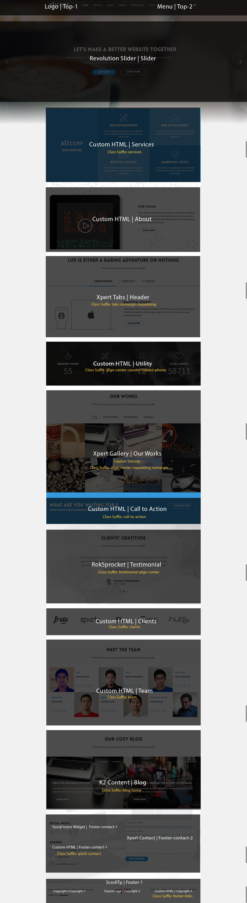
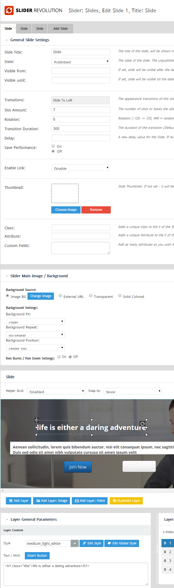
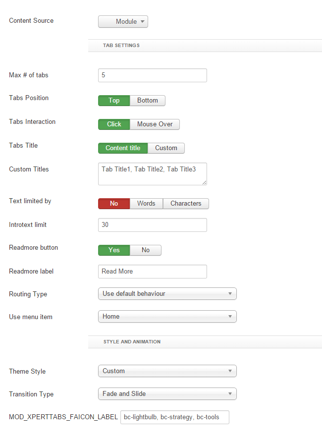
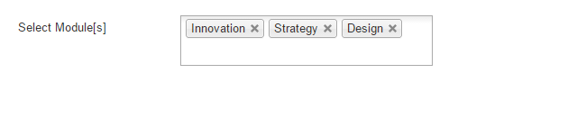
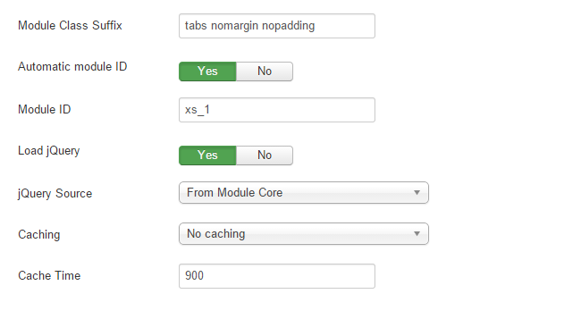
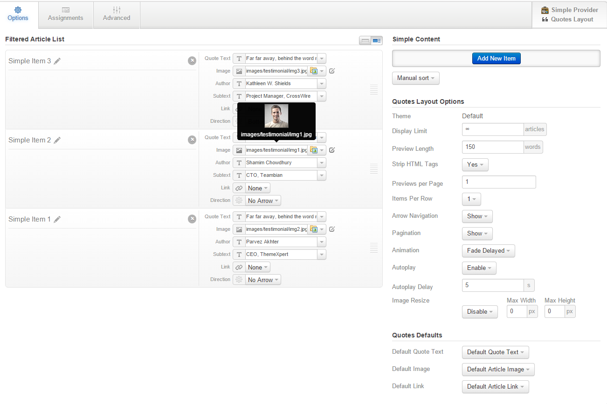
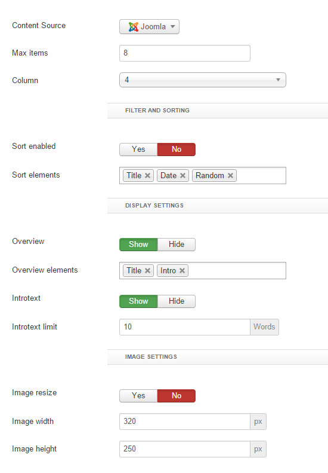
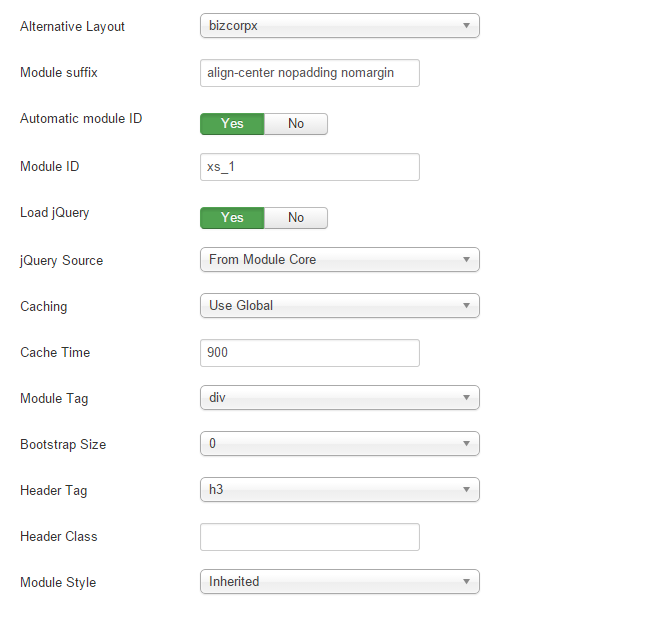

## Installation

Follow [fresh installation guideline](http://www.themexpert.com/docs/expose/basics/installation) if you are having problem to install template.

<div class="row">
	<div class="col-md-6">
		<div class="panel panel-primary">
		  <!-- Default panel contents -->
		  <div class="panel-heading">Complimentary Extensions</div>
		  <!-- List group -->
		  <div class="list-group">
		    <div><a class="list-group-item" href="http://www.unitecms.net/joomla-extensions/unite-revolution-slider-responsive">Revolution Slider</a></div>
            <div><a class="list-group-item" href="http://www.themexpert.com/joomla-extensions/xpert-tabs">Xpert Tabs</a></div>
            <div><a class="list-group-item" href="http://www.themexpert.com/joomla-extensions/xpert-gallery">Xpert Gallery</a></div>
		    <div><a class="list-group-item" href="http://www.rockettheme.com/joomla/extensions/roksprocket">RockSprocket</a></div>
            <div><a class="list-group-item" href="http://www.themexpert.com/joomla-extensions/xpert-contact">Xpert Contact</a></div>
		 </div>
		</div>
	</div>

	<div class="col-md-6">
		<div class="panel panel-default"> 
			<div class="panel-heading">Optional</div>
 
			<div class="list-group">
				<div><a class="list-group-item" href="http://getk2.org">K2</a></div>
			</div>
		</div>
	</div>
</div>

## Template Settings

To load factory settings of this template please open template settings and click `Configurator` button. Under `Load configuration` button you will see all available settings there and choose settings named as your template name. Then press load button and you&#39;re done!


## Homepage Settings

The screenshot below shows you the modules we have published on the homepage of the demo site.




## Revolution Slider Settings

This module is powered by [Revolution Slider](http://www.unitecms.net/joomla-extensions/unite-revolution-slider-responsive) and here are the settings.

	Module Position: slider

### Revolution Slider component settings


### Revolution Slider slide settings



## Service Module

```
Module Type: Custom HTML
Module Position: Services
Class Suffix: services align-center nopadding nomargin
```
```
<div class="width-33 visible-desktop">

	<div class="service-intro">
	
		<h3>Our Services</h3>
	</div>

</div>

<div class="width-33">

	<div class="service-item">
		<span class="bc-tools-2 icon-4x"></span>
		<h3>Web Development</h3>
		<p>Proin iaculis purus consequat sem cure digni ssim Donec porttitora entum suscipit 
aenean rhoncus posuere odio</p>
	</div>
	
	<div class="service-item">
		<span class="bc-browser icon-4x"></span>
		<h3>Beutiful Designs</h3>
		<p>Proin iaculis purus consequat sem cure digni ssim Donec porttitora entum suscipit 
aenean rhoncus posuere odio</p>
	</div>
	
</div>

<div class="width-33">
	<div class="service-item">
		<span class="bc-briefcase icon-4x"></span>
		<h3>Web Development</h3>
		<p>Proin iaculis purus consequat sem cure digni ssim Donec porttitora entum suscipit 
aenean rhoncus posuere odio</p>
	</div>
	
	<div class="service-item light">
		<span class="bc-presentation icon-4x"></span>
		<h3>Marketing tools</h3>
		<p>Proin iaculis purus consequat sem cure digni ssim Donec porttitora entum suscipit 
aenean rhoncus posuere odio</p>
	</div>
	
</div>
```

## Our Vision Module

```
Module Type: Custom HTML
Module Position: about
Class Suffix: vision
```
```
<div class="vision">

	<div class="width-60">
		
	</div>

	<div class="width-40">
		<div class="vision-text">
	<h3 class="title">Our Vision</h3>
	<p>
Nulla sagittis convallis arcu. Sed sed nunc. Curabitur consequat. Quisque metus enim, venenatis fermentum, mollis in, porta et, nibh. Duis vulputate elit in elit.  Default model text, and a search for ‘lorem ipsum’ will uncover.
	</p>
	<br>
	<a href="#" class="btn btn-primary-border">Learn More</a>
	</div>
	</div>
</div>

```


## Xpert Tabs Settings
This module is powered by our [Xpert Tabs](http://www.unitecms.net/joomla-extensions/unite-revolution-slider-responsive) and here are the settings.
```
Module Position: header
Class Suffix: tabs nomargin nopadding
```
```
### General Settings




### Module Settings



### Advance Settings



```

## Counter Module

```
Module Type: Custom HTML
Module Position: utility
Class Suffix: align-center counter hidden-phone
```
```
<div class="width-25">
	<div class="counter-wrapper">
		<span class="icon bc-anchor"></span>
		<h3>Awesome Themes</h3>
		<span class="counter">55</span>
	</div>
</div>

<div class="width-25">
	<div class="counter-wrapper">
		<span class="icon bc-tools-2"></span>
		<h3>Useful Extensions</h3>
		<span class="counter">17</span>
	</div>
</div>

<div class="width-25">
	<div class="counter-wrapper">
		<span class="icon bc-profile-male"></span>
		<h3>Team Members</h3>
		<span class="counter">22</span>
	</div>
</div>

<div class="width-25">
	<div class="counter-wrapper">
		<span class="icon bc-heart"></span>
		<h3>Loyal Clients</h3>
		<span class="counter">58711</span>
	</div>
</div>

```


## Testimonial Module

We've used RokSprocket module to show Testimonial section.

	Module Position: Testimonial
    Class Suffix: testimonial align-center




## Clients Module

```
Module Type: Custom HTML
Module Position: clients
Class Suffix: clients hidden-phone

```
```
<div class="width-20">
	<a href="#"></a>
</div>

<div class="width-20">
	<a href="#"></a>
</div>

<div class="width-20">
	<a href="#"></a>
</div>

<div class="width-20">
	<a href="#"></a>
</div>

<div class="width-20">
	<a href="#"></a>
</div>


```

## Our Works/Xpert Gallery Settings

Data Center Page is powered by our [Xpert Gallery](http://www.themexpert.com/docs/joomla-extensions/xpert-gallery) and here are the settings.

```
Module Type: Xpert Gallery
Module Position: works
Class Suffix: align-center nopadding nomargin

```
```
### General Settings


### Article Settings


### Advance Settings


```
```

Module Type: Custom HTML
Module Position: Team
Class Suffix: team
```
```
<div class="width-33">
  <div class= "width-50 arrow-right">
    
  </div>
  
  <div class= "width-50">
    <div class="details">
      <p>
        <span class="position">
          CEO
        </span>
      </p>
      <p>
        <span class="name">
          Parvez Akhter
        </span>
      </p>
      <ul class="social-icons clearfix">
        <li class="twitter">
          <a href="http://www.twitter.com/ThemeXpert" target="_blank">
            <i class="bc-twitter">
            </i>
          </a>
        </li>
        <li class="facebook">
          <a href="http://www.facebook.com/ThemeXpert" target="_blank">
            <i class="bc-facebook">
            </i>
          </a>
        </li>
        <li class="gplus">
          <a href="http://www.twitter.com/ThemeXpert" target="_blank">
            <i class="bc-googleplus">
            </i>
          </a>
        </li>
        <li class="lin">
          <a href="http://www.twitter.com/ThemeXpert" target="_blank">
            <i class="bc-linkedin">
            </i>
          </a>
        </li>
      </ul>
	</div>
  </div>
</div>

<div class="width-33">
  <div class= "width-50 arrow-right">
    
  </div>
  
  <div class= "width-50">
    <div class="details">
      <p>
        <span class="position">
          COO
        </span>
      </p>
      <p>
        <span class="name">
          Shamim Choudhury
        </span>
      </p>
      <ul class="social-icons clearfix">
        <li class="twitter">
          <a href="http://www.twitter.com/ThemeXpert" target="_blank">
            <i class="bc-twitter">
            </i>
          </a>
        </li>
        <li class="facebook">
          <a href="http://www.facebook.com/ThemeXpert" target="_blank">
            <i class="bc-facebook">
            </i>
          </a>
        </li>
        <li class="gplus">
          <a href="http://www.twitter.com/ThemeXpert" target="_blank">
            <i class="bc-googleplus">
            </i>
          </a>
        </li>
        <li class="lin">
          <a href="http://www.twitter.com/ThemeXpert" target="_blank">
            <i class="bc-linkedin">
            </i>
          </a>
        </li>
      </ul>
	</div>
  </div>
</div>

<div class="width-33">
  <div class= "width-50 arrow-right">
    
  </div>
  
  <div class= "width-50">
    <div class="details">
      <p>
        <span class="position">
          Developer
        </span>
      </p>
      <p>
        <span class="name">
          Moh. Musharrof
        </span>
      </p>
      <ul class="social-icons clearfix">
        <li class="twitter">
          <a href="http://www.twitter.com/ThemeXpert" target="_blank">
            <i class="bc-twitter">
            </i>
          </a>
        </li>
        <li class="facebook">
          <a href="http://www.facebook.com/ThemeXpert" target="_blank">
            <i class="bc-facebook">
            </i>
          </a>
        </li>
        <li class="gplus">
          <a href="http://www.twitter.com/ThemeXpert" target="_blank">
            <i class="bc-googleplus">
            </i>
          </a>
        </li>
        <li class="lin">
          <a href="http://www.twitter.com/ThemeXpert" target="_blank">
            <i class="bc-linkedin">
            </i>
          </a>
        </li>
      </ul>
	</div>
  </div>
</div>


<div class="width-33">
  
  <div class= "width-50">
    <div class="details">
      <p>
        <span class="position">
          Developer
        </span>
      </p>
      <p>
        <span class="name">
          Shuvo Musa
        </span>
      </p>
      <ul class="social-icons clearfix">
        <li class="twitter">
          <a href="http://www.twitter.com/ThemeXpert" target="_blank">
            <i class="bc-twitter">
            </i>
          </a>
        </li>
        <li class="facebook">
          <a href="http://www.facebook.com/ThemeXpert" target="_blank">
            <i class="bc-facebook">
            </i>
          </a>
        </li>
        <li class="gplus">
          <a href="http://www.twitter.com/ThemeXpert" target="_blank">
            <i class="bc-googleplus">
            </i>
          </a>
        </li>
        <li class="lin">
          <a href="http://www.twitter.com/ThemeXpert" target="_blank">
            <i class="bc-linkedin">
            </i>
          </a>
        </li>
      </ul>
	</div>
  </div>
  <div class= "width-50 arrow-left">
    
  </div>
  
</div>

<div class="width-33">
  
  <div class= "width-50">
    <div class="details">
      <p>
        <span class="position">
          Designer
        </span>
      </p>
      <p>
        <span class="name">
          Anamoul Rouf
        </span>
      </p>
      <ul class="social-icons clearfix">
        <li class="twitter">
          <a href="http://www.twitter.com/ThemeXpert" target="_blank">
            <i class="bc-twitter">
            </i>
          </a>
        </li>
        <li class="facebook">
          <a href="http://www.facebook.com/ThemeXpert" target="_blank">
            <i class="bc-facebook">
            </i>
          </a>
        </li>
        <li class="gplus">
          <a href="http://www.twitter.com/ThemeXpert" target="_blank">
            <i class="bc-googleplus">
            </i>
          </a>
        </li>
        <li class="lin">
          <a href="http://www.twitter.com/ThemeXpert" target="_blank">
            <i class="bc-linkedin">
            </i>
          </a>
        </li>
      </ul>
	</div>
  </div>
  <div class= "width-50 arrow-left">
    
  </div>
  
</div>

<div class="width-33">
  
  <div class= "width-50">
    <div class="details">
      <p>
        <span class="position">
          Technical Writer
        </span>
      </p>
      <p>
        <span class="name">
          Ahmed Eshaan
        </span>
      </p>
      <ul class="social-icons clearfix">
        <li class="twitter">
          <a href="http://www.twitter.com/ThemeXpert" target="_blank">
            <i class="bc-twitter">
            </i>
          </a>
        </li>
        <li class="facebook">
          <a href="http://www.facebook.com/ThemeXpert" target="_blank">
            <i class="bc-facebook">
            </i>
          </a>
        </li>
        <li class="gplus">
          <a href="http://www.twitter.com/ThemeXpert" target="_blank">
            <i class="bc-googleplus">
            </i>
          </a>
        </li>
        <li class="lin">
          <a href="http://www.twitter.com/ThemeXpert" target="_blank">
            <i class="bc-linkedin">
            </i>
          </a>
        </li>
      </ul>
	</div>
  </div>
  <div class= "width-50 arrow-left">
    
  </div>
  
</div>

```