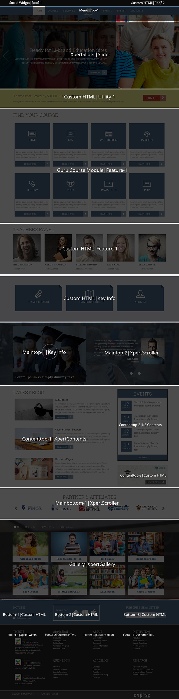
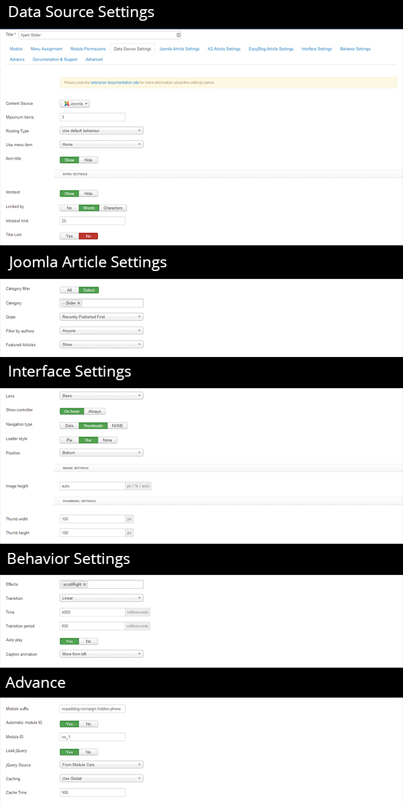

<h2>Installation</h2>

----------
Follow [fresh installation guideline](http://www.themexpert.com/documentation/expose-framework/getting-started) if you are having problem to install template.


<div class="row">
	<div class="col-md-6">
		<div class="panel panel-primary">
  <!-- Default panel contents -->
  <div class="panel-heading">Complimentary Extensions:</div>

  <!-- List group -->
  <div class="list-group">
    <div><a  class="list-group-item" href="http://www.themexpert.com/joomla-extensions/xpert-slider">Xpert Slider</a></div>
    <div><a class="list-group-item" href="http://www.themexpert.com/joomla-extensions/xpert-tweets">Xpert Tweets</a></div>
    <div><a class="list-group-item" href="http://www.themexpert.com/joomla-extensions/xpert-scroller">Xpert Scroller</a></div>
    <div><a class="list-group-item" href="http://www.themexpert.com/joomla-extensions/xpert-contents">Xpert Contents</a></div>
    <div><a class="list-group-item" href="http://www.themexpert.com/joomla-extensions/xpert-gallery">Xpert Gallery</a></div>
    <div><a class="list-group-item" href="http://www.themexpert.com/joomla-extensions/xpert-access">Xpert Access</a></div>
  </div>
</div>
	</div>
	<div class="col-md-6">
		<div class="panel panel-default">
  <!-- Default panel contents -->
  <div class="panel-heading">Optional:</div>
  <!-- List group -->
  <div class="list-group">
    <div><a class="list-group-item" href="http://guru.ijoomla.com">Guru</a></div>
    <div><a class="list-group-item" href="http://jomsocial.com">JomSocial</a></div>
    <div><a class="list-group-item" href="http://getk2.org">K2</a></div>
  </div>
</div>
	</div>
</div>
<h2>Template Settings</h2>

----------
To load factory settings of this template please open template settings and click `Configurator` button. Under `Load configurationbutton` you will see all available settings there and choose settings named as your template name. Then press load button and you're done!


<h2>Homepage</h2>

----------
The screenshot below shows you the modules we have published on the homepage of the demo site.



<h2>Slideshow Settings</h2>

----------
This module is powered by our Xpert Slider and here are the settings.

```
Module Position: Slider
```



<h2>Testimonial Settings</h2>

----------
We've used our Xpert Scroller module for Testimonial, have a look on the settings.

```
Module Position: maintop-2
```


<h2>Latest Blogs Settings</h2>

----------
We've used Xpert Contents module here, have a look on the settings.

```
Module Position: contenttop-1
```
```
Module Class Suffix: guru-courses
```


<h2>Partner & Affiliates Settings</h2>
----------
We've used our Xpert Scroller module here, have a look on the settings.

```
Module Position: main-bottom-1
```


<h2>Login & Register Settings</h2>

----------
We've used our Xpert Access module here, have a look on the settings.

```
Module Position: roof-3
```


<h2>Image Gallery Settings</h2>


----------
We've used our Xpert Gallery module here, have a look on the settings.

```
Module Position: gallery
```


<h2>3rd-Party Module Settings</h2>

----------
<h3>Guru Courses Settings</h3>

----------
We've used Guru Courses module here, have a look on the settings.

```
Module Position: feature-1
```
```
Module Class Suffix: guru-courses
```


<h3>K2 Events Settings</h3>

----------
We've used K2 Contents module here, have a look on the settings.


```
Module Position: sidebar-b
```


<h3>Add/Edit Logo</h3>

----------
Please, follow these steps to add logo in EduXpert template based sites:

1. Create a menu item in middle of all menu items
  
2. Select menu item type as __menu item alias__ and select menu item default __home__ menu item


3 . Now, click on Expose Menu Settings and add __logo hidden-phone__  in Custom CSS class field


4 . Click to __save__ and you're done