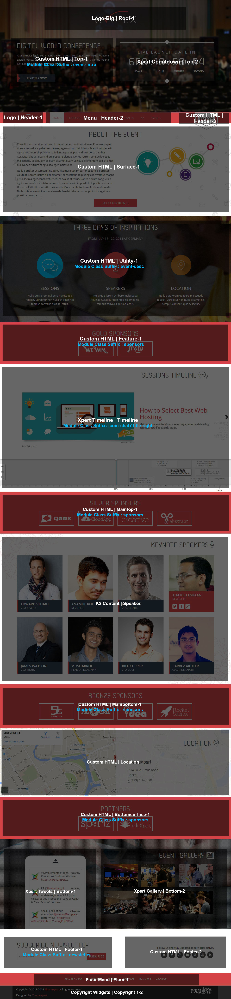
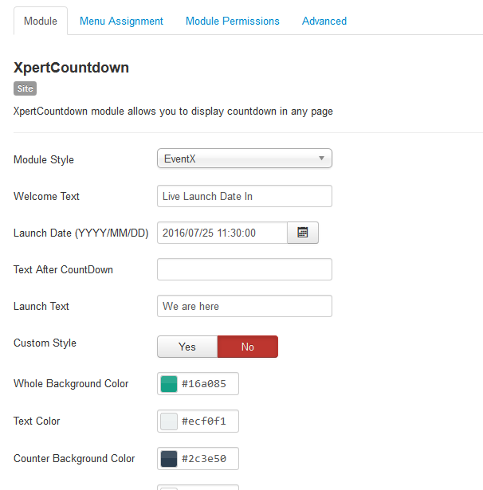
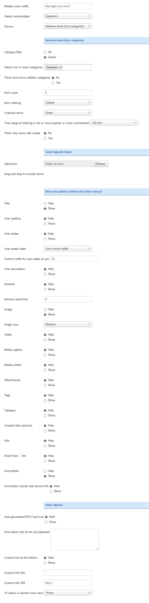
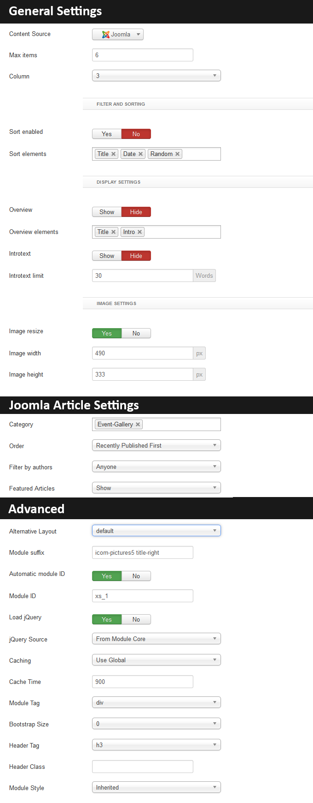
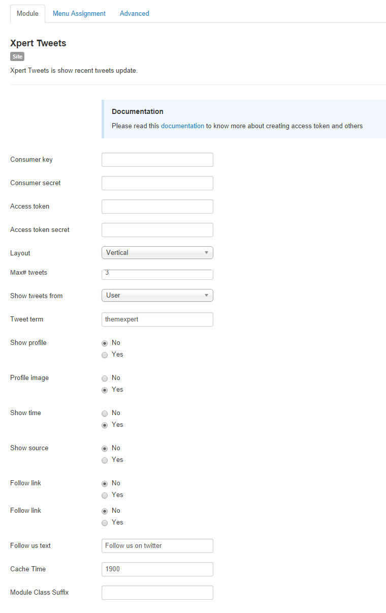

## Installation

Follow [fresh installation guideline](index.php?option=com_k2&amp;view=itemlist&amp;task=category&amp;id=8:getting-started&amp;Itemid=258) if you are having problem to install template.

<div class="row">
	<div class="col-md-6">
		<div class="panel panel-primary">
		  <!-- Default panel contents -->
		  <div class="panel-heading">Complimentary Extensions</div>
		  <!-- List group -->
		  <div class="list-group">
		    <div><a class="list-group-item" href="http://www.themexpert.com/joomla/extensions/xpert-gallery">Xpert Gallery</a></div>
		    <div><a class="list-group-item" href="http://www.themexpert.com/joomla-extensions/xpert-tweets">Xpert Tweets</a></div>
		    <div><a class="list-group-item" href="http://www.themexpert.com/joomla-extensions/xpert-countdown">Xpert Countdown</a></div>	
		    <div><a class="list-group-item" href="http://www.themexpert.com/joomla-extensions/xpert-timeline">Xpert Timeline</a></div>	    
		 </div>
		</div>
	</div>

	<div class="col-md-6">
		<div class="panel panel-default"> 
			<div class="panel-heading">Optional</div>
 
			<div class="list-group">
				<div><a class="list-group-item" href="http://getk2.org/" target="_blank">K2</a></div>
			</div>
		</div>
	</div>
</div>

## Template Settings

To load factory settings of this template please open template settings and click `Configurator` button. Under `Load configuration` button you will see all available settings there and choose settings named as your template name. Then press load button and you&#39;re done!


## Homepage Settings

The screenshot below shows you the modules we have published on the homepage of the demo site.




## Countdown Settings

This module is powered by our [Xpert Countdown](http://www.themexpert.com/docs/joomla-extensions/xpert-countdown) and here are the settings.

	Module Position: top-2



## About the Event Module

```
Module Type: Custom HTML
Module Position: surface-1
Class Suffix: title-center
```
```
<div class="clearfix">
	<div class="pull-left width-50">
		<p>Curabitur arcu erat, accumsan id imperdiet et, porttitor at sem. Praesent sapien massa, convallis a pellentesque nec, egestas non nisi. Mauris blandit aliquet elit, eget tincidunt nibh pulvinar a. Pellentesque in ipsum id orci porta dapibus. Curabitur aliquet quam id dui posuere blandit. Donec rutrum congue leo eget malesuada. Vestibulum ac diam sit amet quam vehicula elementum sed sit amet dui. Donec rutrum congue leo eget malesuada.</p>
		<p>Nulla porttitor accumsan tincidunt. Vivamus suscipit tortor eget felis porttitor volutpat. Lorem ipsum dolor sit amet, consectetur adipiscing elit. Vivamus magna justo, lacinia eget consectetur sed, convallis at tellus. Donec rutrum congue leo eget malesuada. Curabitur arcu erat, accumsan id imperdiet et, porttitor at sem. Donec sollicitudin molestie malesuada. Donec sollicitudin molestie malesuada. Nulla quis lorem ut libero malesuada feugiat. Vivamus suscipit tortor eget felis porttitor volutpat.</p>
	</div>
	<div class="pull-right width-40">
		<p></p>
	</div>
</div>
<p class="align-center"><a href="#" class="btn btn-primary btn-large">Check for details</a></p>
```
## Three Days of Inspirations Module

```
Module Type: Custom HTML
Module Position: utility-1
Class Suffix: event-desc
```
```
<div class="event-block">
	
	<h3>Sessions</h3>
	<p>Nulla quis lorem ut libero malesuada feugiat. Curabitur non nulla sit amet nisl tempus convallis quis ac lectus.</p>
</div>

<div class="event-block">
	
	<h3>Speakers</h3>
	<p>Nulla quis lorem ut libero malesuada feugiat. Curabitur non nulla sit amet nisl tempus convallis quis ac lectus.</p>
</div>

<div class="event-block">
	
	<h3>Location</h3>
	<p>Nulla quis lorem ut libero malesuada feugiat. Curabitur non nulla sit amet nisl tempus convallis quis ac lectus.</p>
</div>
```

## Timeline Settings

We've used our [Xpert Timeline](http://www.themexpert.com/docs/joomla-extensions/xpert-timeline) module here, have a look on the settings.

	Module Position: Timeline
	Class Suffix: icom-chat7 title-right


## Keynote Speakers Module

We've modified K2 content module to show Speaker section, `enable SEF` to have ajax loading.

	Module Position: Speakers



## Location Module

```
Module Type: Custom HTML
Module Position: location
```
```
<iframe src="https://www.google.com/maps/embed?pb=!1m14!1m8!1m3!1d3651.912589115564!2d90.3816811!3d23.750496300000002!3m2!1i1024!2i768!4f13.1!3m3!1m2!1s0x3755b8ae2a2b4613%3A0x8807f7e9d96bc2da!2sLake+Circus+Rd!5e0!3m2!1sen!2s!4v1404278241906" frameborder="0" style="border:0"></iframe>

<div class="location-info">
<h2 class="title"><span class="icom-map-pin"></span>Location</h2>
<address>
  <span class="company">ThemeXpert</span><br>
  35/4 Lake Circus Road<br>
 Dhaka<br>
  <abbr title="Phone">P:</abbr> (123) 456-7890
</address>
</div>
```

## Gallery Settings

We customized our [Xpert Gallery](http://www.themexpert.com/docs/joomla-extensions/xpert-gallery) module here, below it's settings for your convenience.

	Module Position: Bottom-2
	Class Suffix: icom-pictures5 title-right



## Tweets Settings

[Xpert Tweets](http://www.themexpert.com/docs/joomla-extensions/xpert-tweets) module used here in order to show latest tweets, have a look on the settings.

	Module Position: Bottom-1

