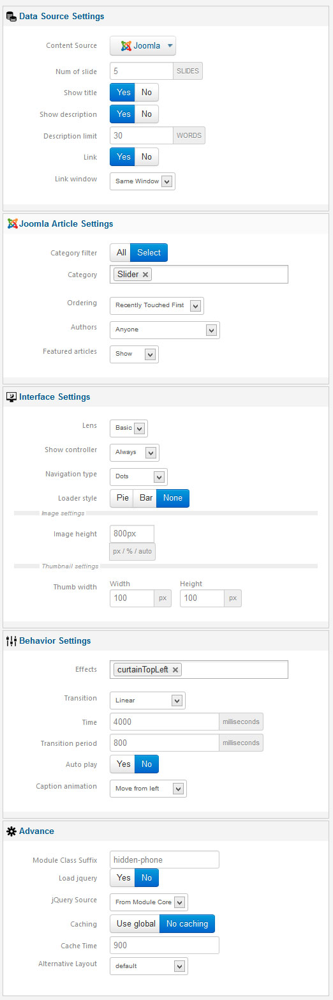
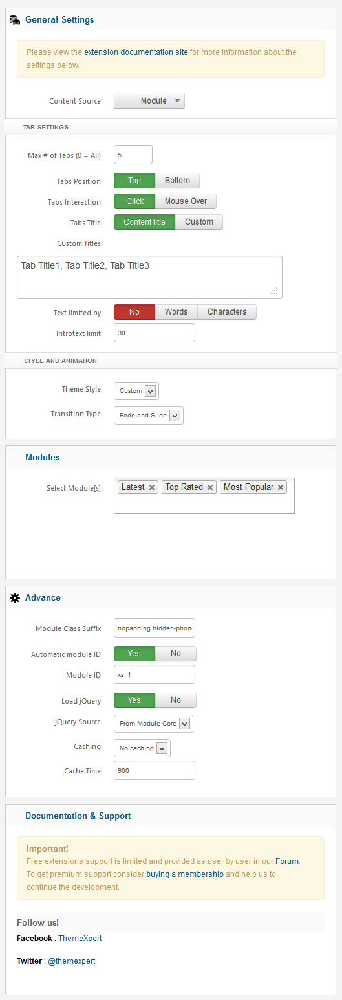
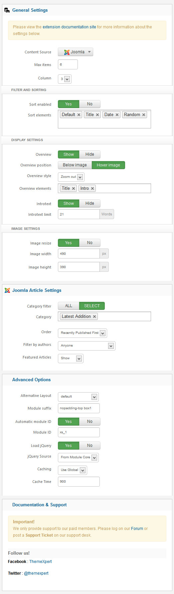

---
title: Simplex
taxonomy:
    category: docs
visible: true
---

##Installation
----------
Follow [fresh installation guideline](http://www.themexpert.com/documentation/expose-framework/getting-started) if you are having problem to install template.


<div class="row">
	<div class="col-md-12">
		<div class="panel panel-primary">
  <!-- Default panel contents -->
  <div class="panel-heading">Complimentary Extensions</div>

  <!-- List group -->
  <div class="list-group">
    <div><a class="list-group-item" href="http://www.themexpert.com/joomla/extensions/xpert-slider">Xpert Slider</a></div>
    <div><a class="list-group-item" href="http://www.themexpert.com/joomla-extensions/xpert-scroller">Xpert Scroller</a></div>
    <div><a class="list-group-item" href="http://www.themexpert.com/joomla-extensions/xpert-tabss">Xpert Tabs</a></div>
    
  </div>
</div>
	</div>

</div>

##Template Settings
----------
To load factory settings of this template please open template settings and click `Configurator` button. Under `Load configurationbutton` you will see all available settings there and choose settings named as your template name. Then press load button and you're done!


##Homepage Settings
----------

The screenshot below shows you the modules we have published on the homepage of the demo site.


###Some Utility Classes used in Extreme

- ```line``` and ```line2``` for bottom horizontal line in list item.
-   ```line-arrow``` and <code>line-arrow-circle</code> for arrow in list item.
-   ```line-bg``` for background in list item.


##Module Positions
----------


##Slideshow Settings
----------
This module is powered by our Xpert Slider and here are the settings.



##Scroller Settings
----------
This module is powered by our Xpert Scroller and here are the settings.


##News Ticker Settings 
----------
This module is powered by our Xpert Scroller and here is the settings.


##Recently Listed Settings
----------
This module is powered by our Xpert Scroller and here is the settings.


##Tabs Settings
----------
We've used Xpert Tabs module here, have a look on the settings.



##Tab(game-review) Settings
----------
This module is powered by our Xpert Tabs and here is the settings.


##Gallery Settings
----------
We used our powerful and feature-rich Image gallery module Xpert Gallery here and have a look on the settings.




