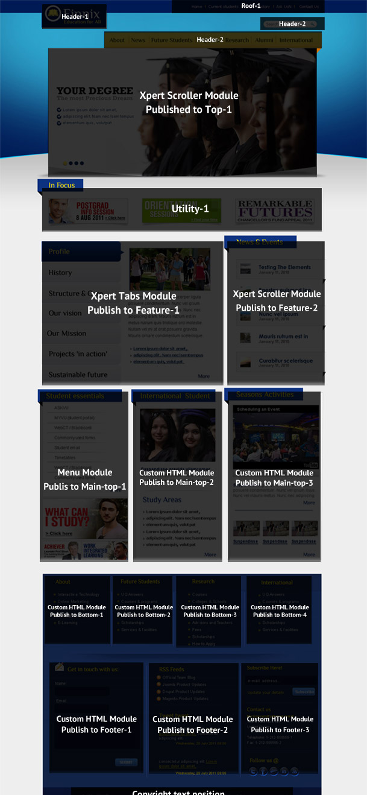
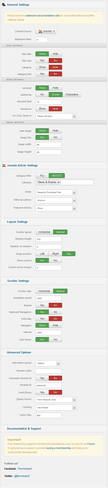

##Installation
----------
Follow [fresh installation guideline](http://www.themexpert.com/docs/expose/basics/installation) if you are having problem to install template.


<div class="row">
	<div class="col-md-6">
		<div class="panel panel-primary">
  <!-- Default panel contents -->
  <div class="panel-heading">Complimentary Extensions</div>

  <!-- List group -->
  <div class="list-group">
    <div><a class="list-group-item" href="http://www.themexpert.com/joomla-extensions/xpert-slider">Xpert Slider</a></div>
    <div><a class="list-group-item" href="http://www.themexpert.com/joomla-extensions/xpert-scroller">Xpert Scroller</a></div>
    <div><a class="list-group-item" href="http://www.themexpert.com/joomla-extensions/xpert-tabs" >Xpert Tabs</a> </div>
  </div>
</div>
	</div>
	<div class="col-md-6">
		<div class="panel panel-default">
  <!-- Default panel contents -->
  <div class="panel-heading">Optional</div>
  <!-- List group -->
  <div class="list-group">
    <div><a  class="list-group-item" href="http://getk2.org/">K2</a></div>
  </div>
</div>
	</div>
</div>

##Template Settings
----------
To load factory settings of this template please open template settings and click `Configurator` button. Under `Load configuration` button you will see all available settings there and choose settings named as your template name. Then press load button and you're done!


##Homepage Settings
----------
Finnix Homepage fully based on modules, and we turned off component display for the Homepage, to do this go to 
```Extensions → Template Manager → Tx_Finnix → Advance```
And turn on <code>Component Disable</code> option and enter your Home page menu id.


The screenshot below shows you the modules we have published on the homepage of the demo site.



##Module Positions
----------


##Slideshow Settings
----------
We used our powerful Xpert Slider here for slideshow and have a look on the required settings.


##Scroller Settings
----------
This module is powered by our Xpert Scroller and here is the settings.





##Tab settings
----------
This module is powered by our Xpert Tabs and here is the settings.


