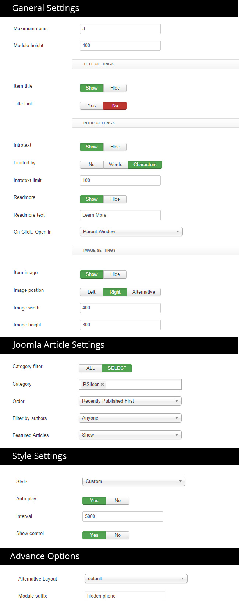
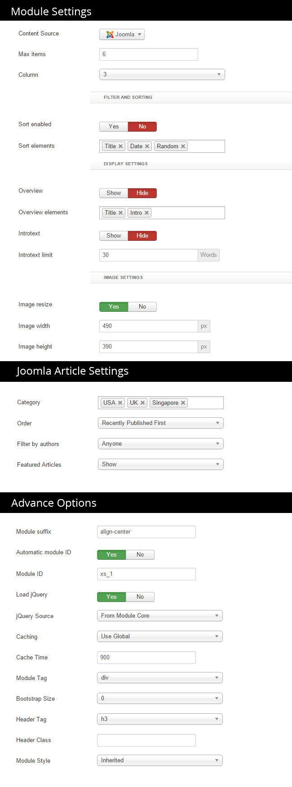

## Installation

Follow [fresh installation guideline](http://www.themexpert.com/docs/expose/basics/installation) if you are having problem to install template.

<div class="row">
	<div class="col-md-6">
		<div class="panel panel-primary">
		  <!-- Default panel contents -->
		  <div class="panel-heading">Complimentary Extensions</div>
		  <!-- List group -->
		  <div class="list-group">
		    <div><a class="list-group-item" href="http://www.themexpert.com/joomla-extensions/parallax-slider">Parallax Slider</a></div>
		    <div><a class="list-group-item" href="http://www.rockettheme.com/joomla/extensions/roksprocket">RockSprocket</a></div>
		 </div>
		</div>
	</div>

	<div class="col-md-6">
		<div class="panel panel-default"> 
			<div class="panel-heading">Optional</div>
 
			<div class="list-group">
				<div><a class="list-group-item" href="http://www.themexpert.com/joomla-extensions/xpert-gallery">Xpert Gallery</a></div>
			</div>
		</div>
	</div>
</div>

## Template Settings

To load factory settings of this template please open template settings and click `Configurator` button. Under `Load configuration` button you will see all available settings there and choose settings named as your template name. Then press load button and you&#39;re done!


## Homepage Settings

The screenshot below shows you the modules we have published on the homepage of the demo site.


## Parallax Slider Settings

This module is powered by our [Parallax Slider](http://www.themexpert.com/docs/joomla-extensions/parallax-slider) and here are the settings.

	Module Position: slider



## Domain Search Module

```
Module Type: Custom HTML
Module Position: Domain-Search
Class Suffix: .domain-search
```
```
<form class="form-inline wow animation-slide-bottom">
<span class="check-domain">CHECK YOUR DOMAIN</span> <input type="text" placeholder="type your domain">

<select>
  <option>.com</option>
  <option>.net</option>
  <option>.org</option>
</select>
  <a href="#" class="btn btn-primary"> Search</a>
</form>
```

## Awesome Features Module

```
Module Type: Custom HTML
Module Position: Header
Class Suffix: .awesome-features
```
```

<div class="width-33">
<div class="feature-wrapper wow animation-fade animated">


<h3>EASY TO MANAGE</h3>
<p>Lorem Ipsum is simply dummy text of the printing and typesetting industry</p>

</div>
</div>


<div class="width-33">
<div class="feature-wrapper wow animation-fade animated" data-wow-delay="0.1s">


<h3>VARIOUS PLATFORM</h3>
<p>Lorem Ipsum is simply dummy text of the printing and typesetting industry</p>

</div>
</div>


<div class="width-33">
<div class="feature-wrapper wow animation-fade animated" data-wow-delay="0.3s">


<h3>SSD TO BOOST</h3>
<p>Lorem Ipsum is simply dummy text of the printing and typesetting industry</p>

</div>
</div>

<div class="width-33">
<div class="feature-wrapper wow animation-fade animated" data-wow-delay="0.5s">


<h3>CONSOLE ACCESS</h3>
<p>Lorem Ipsum is simply dummy text of the printing and typesetting industry</p>

</div>
</div>


<div class="width-33">
<div class="feature-wrapper wow animation-fade animated" data-wow-delay="0.7s">


<h3>FRIENDLY SUPPORT</h3>
<p>Lorem Ipsum is simply dummy text of the printing and typesetting industry</p>

</div>
</div>


<div class="width-33">
<div class="feature-wrapper wow animation-fade animated" data-wow-delay="0.9s">


<h3>LIMITLESS BANDWIDTH</h3>
<p>Lorem Ipsum is simply dummy text of the printing and typesetting industry</p>

</div>
</div>

```


## Why Hostx Module

```
Module Type: Custom HTML
Module Position: utility-1
Class Suffix: .why
```
```

<div class="width-50 promo-video">

<!--Modal Image-->
<a href="#promo-video-modal"  data-toggle="modal">

</a> 

<!-- Modal -->
<div id="promo-video-modal" class="modal hide fade align-center" tabindex="-1" role="dialog" aria-labelledby="myModalLabel" aria-hidden="true">

<div class="modal-body">
<iframe width="500" height="350" src="//www.youtube.com/embed/Bx871r7oKcs" frameborder="0" allowfullscreen></iframe>
</div>

</div>
</div>

<div class="width-50">
	<div class="why-point-wrapper wow animation-slide-bottom" data-wow-delay="0.5s">
		
		<h3>Powerful Management Tools</h3>
		<p>Lorem Ipsum is simply dummy text of the printing and typesetting industry. Lorem Ipsum has been the industry's standard dummy text ever since the 1500s</p>
	</div>
	
	<div class="why-point-wrapper wow animation-slide-bottom" data-wow-delay="0.8s">
		
		<h3>24/7 Support</h3>
		<p>Lorem Ipsum is simply dummy text of the printing and typesetting industry. Lorem Ipsum has been the industry's standard dummy text ever since the 1500s</p>
	</div>
	
	<div class="why-point-wrapper wow animation-slide-bottom" data-wow-delay="1s">
		
		<h3>Cost Effective</h3>
		<p>Lorem Ipsum is simply dummy text of the printing and typesetting industry. Lorem Ipsum has been the industry's standard dummy text ever since the 1500s</p>
	</div>
	
</div>

```

## Pricing Table Module

We've used Xpert Tabs with Custom HTML modules to show Pricing Table section.

	Module Position: Pricing Table


## Testimonial Module

We've used RokSprocket module to show Testimonial section.

	Module Position: Feature
    Class Suffix: .align-center


## Precious Clients Module

```
Module Type: Custom HTML
Module Position: main-top
Class Suffix: .align-center

```
```
<div class="clients-wrapper clearfix">
	<div class="width-20">
	
</div>

<div class="width-20 wow animation-slide-bottom animated" data-wow-delay="0.2s">
	
</div>

<div class="width-20 wow animation-slide-bottom animated" data-wow-delay="0.5s">
	
</div>

<div class="width-20 wow animation-slide-bottom animated" data-wow-delay="0.8s">
	
</div>

<div class="width-20 wow animation-slide-bottom animated" data-wow-delay="1.1s">
	
</div>
</div>

```

## Follow/Blog/Support Module

```
Module Type: Custom HTML
Module Position: support
Class Suffix: .support .align-center
```
```

<a class="btn btn-primary wow animation-fade" href="index.php/blog">VIEW BLOG POSTS</a>

<div class="clearfix">
	
	<div class="width-33">
<div class="support-wrapper">


<h3>CHAT SUPPORT</h3>
<p>Lorem Ipsum is simply dummy text of the printing and typesetting industry</p>

</div>
</div>

<div class="width-33">
<div class="support-wrapper wow animation-slide-bottom" data-wow-delay="0.2s">


<h3>FORUM SUPPORT</h3>
<p>Lorem Ipsum is simply dummy text of the printing and typesetting industry</p>

</div>
</div>

<div class="width-33">
<div class="support-wrapper wow animation-slide-bottom" data-wow-delay="0.5s">


<h3>QUICK SUPPORT</h3>
<p>Lorem Ipsum is simply dummy text of the printing and typesetting industry</p>

</div>
</div>
	
</div>

```

## Data Center Page/Xpert Gallery Settings

Data Center Page is powered by our [Xpert Gallery](http://www.themexpert.com/docs/joomla-extensions/xpert-gallery) and here are the settings.

	Module Position: call-to-action

