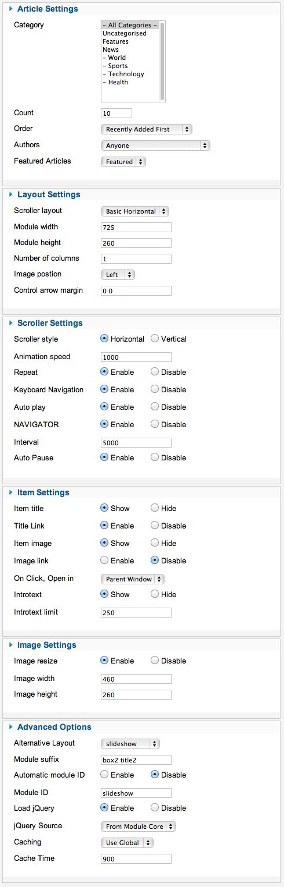
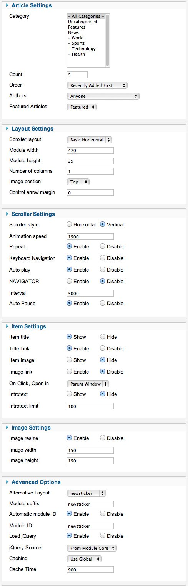
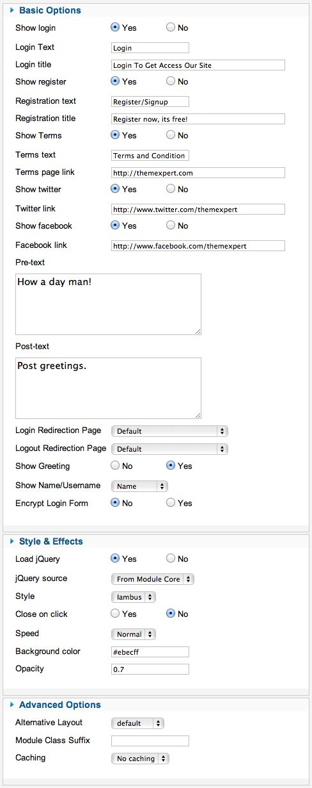

##Installation
----------
Follow [fresh installation guideline](http://www.themexpert.com/documentation/expose-framework/getting-started) if you are having problem to install template.

	

		

  <!-- Default panel contents -->
  
Complimentary Extensions

  <!-- List group -->
  

    
<a class="list-group-item" href="http://www.themexpert.com/joomla/extensions/xpert-captions">Xpert Scroller</a>

    
<a class="list-group-item" href="http://www.themexpert.com/joomla/extensions/xpert-access" >Xpert Access</a> 

  

	

	

		

  <!-- Default panel contents -->
  
Optional

  <!-- List group -->
  

    
<a  class="list-group-item" href="http://getk2.org/">K2</a>

  

	

##Homepage Settings
----------
The screenshot below shows you the modules we have published on the homepage of the demo site. Please see the explanation below regarding the usage and any other relevant information of the modules.

**Explain:**

- **News ticker:** Xpert Scroller module is published in roof-1 position. You can see a screenshot of the specific configuration below.
**Logo is coming from template image folder. You will find `logo.png` file from specific style you chosen like: 
<pre>templates/tx_iambus/images/style1/logo.png</pre></li>
- **Search:** This is a core joomla search module published on top-2 module position using module class suffix: `tx-search box3`
- **Menu:** The menu is rendered via the core Joomla menu module publish in header-5, and the menu options are controlled via the template.This menu is using module class suffix: `tx-menu`
- **Xpert Access:** Xpert Access module published in roof-2 position. You can see a screenshot of the specific configuration below.
- **Slideshow:** Xpert Scroller module is published in top-1. You can see a screenshot of the specific configuration below.
- **Scroller:** Xpert Scroller module published in main-bottom-1 position. You can see a screenshot of the specific configuration below.
- **Date:** Date is a gist published in fixed position.
##Menu settings
----------

##Layout Settings
----------

##Gist Settings
----------

##Module Positions
----------

##Slideshow Settings
----------
This module is powered by our Xpert Scroller and here is the required settings.

##News ticker Settings
----------
This module is powered by our Xpert Scroller and here is the required settings.

##Scroller Settings
----------
This module is powered by our Xpert Scroller and here is the required settings.

##Xpert Access Settings
----------
This module is powered by our Xpert Access and here is the required settings.

