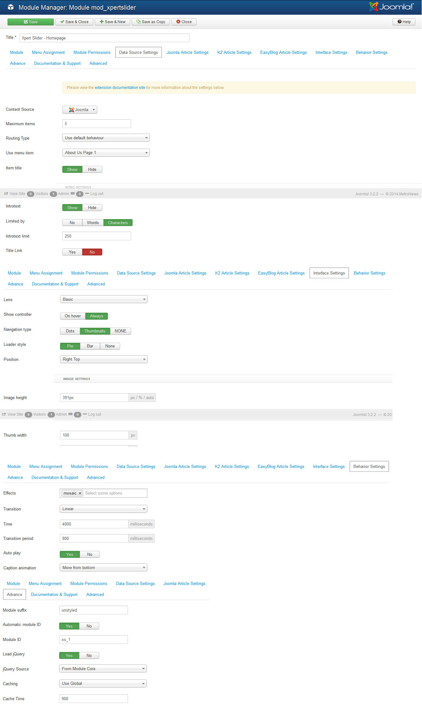
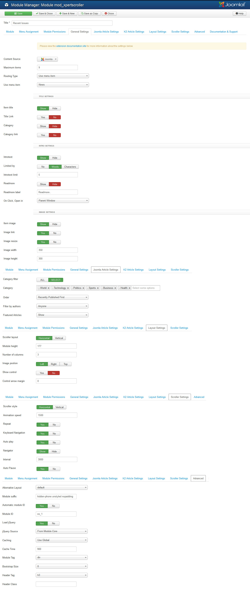

##Installation
----------
Follow [fresh installation guideline](http://www.themexpert.com/docs/expose/basics/installation) if you are having problem to install template.

	

		

  <!-- Default panel contents -->
  
Complimentary Extensions:

  <!-- List group -->
  

    
<a class="list-group-item" href="http://www.themexpert.com/joomla-extensions/xpert-slider">Xpert Slider</a>

    
<a class="list-group-item" href="http://www.themexpert.com/joomla-extensions/xpert-tabs">Xpert Tabs</a>

    
<a class="list-group-item" href="http://www.themexpert.com/joomla-extensions/xpert-tweets">Xpert Tweets</a>

    
<a class="list-group-item" href="http://www.themexpert.com/joomla-extensions/xpert-scroller">Xpert Scroller</a>

    
<a  class="list-group-item" href="http://www.themexpert.com/joomla-extensions/xpert-contents">Xpert Contents</a>

  

	

	

		

  <!-- Default panel contents -->
  
Optional:

  <!-- List group -->
  

    
<a  class="list-group-item" href="http://stackideas.com/easyblog">EasyBlog</a>

  

	

##Template Settings
----------
To load factory settings of this template please open template settings and click `Configurator` button. Under `Load configurationbutton` you will see all available settings there and choose settings named as your template name. Then press load button and you're done!

##Homepage Settings

----------
The screenshot below shows you the modules we have published on the homepage of the demo site.

##Slideshow Settings

----------
This module is powered by our Xpert Slider and here are the settings.

##Scroller Settings

----------
We've used our Xpert Scroller module here, have a look on the settings.

##Tabs Settings
----------
This module is powered by our Xpert Tabs and here are the settings.

##Breaking News Settings
----------
We've used Xpert Contents module here, have a look on the settings.

##World News Settings
----------
This module is powered by our Xpert Contents and here are the settings.

