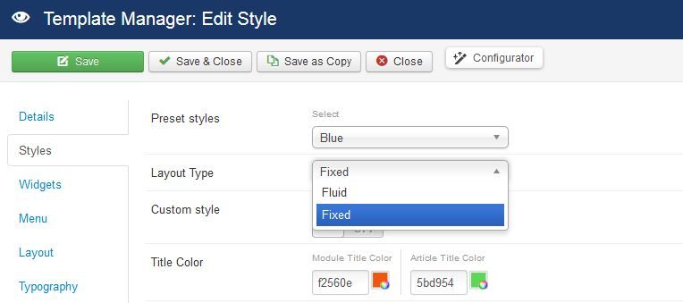
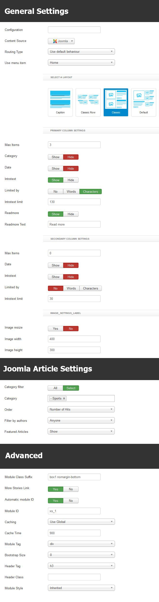

## Installation

Follow [fresh installation guideline](http://www.themexpert.com/docs/expose/basics/installation) if you are having problem to install template.

<div class="row">
	<div class="col-md-12">
		<div class="panel panel-primary">
		  <!-- Default panel contents -->
		  <div class="panel-heading">Complimentary Extensions</div>
		  <!-- List group -->
		  <div class="list-group">
		    <div><a class="list-group-item" href="http://www.themexpert.com/joomla-extensions/xpert-contents">Xpert Contents</a></div>
		    <div><a class="list-group-item" href="http://www.themexpert.com/joomla-extensions/xpert-scroller">Xpert Scroller</a></div>
		    <div><a class="list-group-item" href="http://www.themexpert.com/joomla-extensions/xpert-tabs">Xpert Tabs</a></div>	
		    <div><a class="list-group-item" href="#">TX Grid Slider</a></div>	    
		 </div>
		</div>
	</div>
</div>

## Template Settings

To load factory settings of this template please open template settings and click `Configurator` button. Under `Load configuration` button you will see all available settings there and choose settings named as your template name. Then press load button and you&#39;re done!


## Homepage Settings

The screenshot below shows you the modules we have published on the homepage of the demo site.


## Layout Types

Next News provides two types of layout - Fixed & Fluid. To select the layout type please open template settings, click `Styles` tab and you'll see `Layout Type` select box. Choose your layout type and Save.




## Slideshow Settings

This slideshow is powered by our brand new TX Grid Slider module and here are the settings.

```
Module Position: slider
Class Suffix: nomargin hidden-phone
```


## Business Module

We've used our Xpert Contents module here and have a look on the settings

```
Module Position: contenttop-1
Class Suffix: box1
```


## Tech News Module

This module is based on Xpert Contents, please look following settings to get a better idea.

```
Module Position: contenttop-1
Class Suffix: box1 nomargin-bottom
```


## Sports Module

We've used our [Xpert Contents](http://www.themexpert.com/docs/joomla-extensions/xpert-contents) module here, have a look on the settings.

	Module Position: contentbottom-1
	Class Suffix: box1 nomargin-bottom



## Editor's Pick Module

This module is powered by our Xpert Contents and here are the settings.

```
Module Position: Sidebar-b
Class Suffix: box2
```


