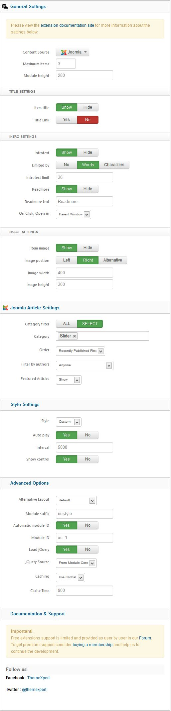

##Installation
----------
Follow [fresh installation guideline](http://www.themexpert.com/docs/expose/basics/installation) if you are having problem to install template.

	

		

  <!-- Default panel contents -->
  
Complimentary Extensions

  <!-- List group -->
  

    
<a class="list-group-item" href="http://www.themexpert.com/joomla-extensions/parallax-slider">Parallax Slider</a>

    
<a class="list-group-item" href="http://www.themexpert.com/joomla-extensions/xpert-captions">Xpert Captions</a>

    
<a class="list-group-item" href="http://www.themexpert.com/joomla-extensions/xpert-tweets">Xpert Tweets</a>

  

	

	

		

  <!-- Default panel contents -->
  
Optional

  <!-- List group -->
  

    
<a  class="list-group-item" href="http://stackideas.com/easyblog/">EasyBlog</a>

  

	

##Template Settings
----------
To load factory settings of this template please open template settings and click `Configurator` button. Under `Load configurationbutton` you will see all available settings there and choose settings named as your template name. Then press load button and you're done!

##Homepage Settings
----------
The screenshot below shows you the modules we have published on the homepage of the demo site.

##Module Positions
----------

##Slideshow Settings
----------
This module is powered by our Parallax Slider and here are the settings.

##Captions Settings
----------
This module is powered by our Xpert Captions and here are the settings.

##Tweets Settings
----------
We used our Xpert Tweets module here, have a look on the settings.

