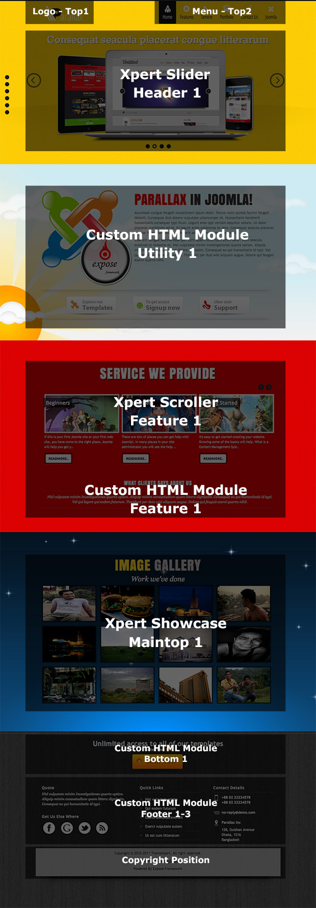
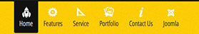
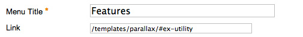
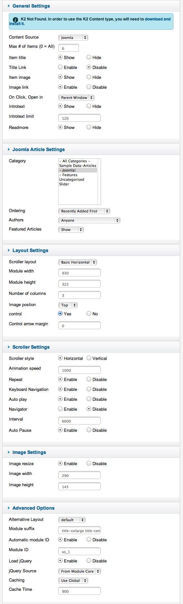
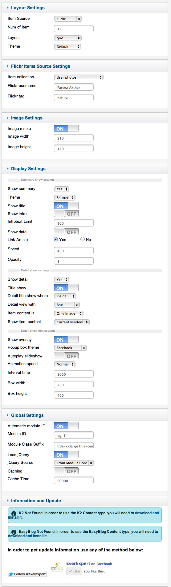

##Installation
----------
Follow [fresh installation guideline](http://www.themexpert.com/docs/expose/basics/installation) if you are having problem to install template.


<div class="row">
	<div class="col-md-12">
		<div class="panel panel-primary">
  <!-- Default panel contents -->
  <div class="panel-heading">Complimentary Extensions</div>

  <!-- List group -->
  <div class="list-group">
    <div><a class="list-group-item" href="http://www.themexpert.com/joomla-extensions/xpert-slider">Xpert Slider</a></div>
    <div><a class="list-group-item" href="http://www.themexpert.com/joomla-extensions/xpert-scroller">Xpert Scroller</a></div>
    <div class="list-group-item">Xpert Showcase (Deprecated)</div>
  </div>
</div>
	</div>

</div>

##Template Settings
----------
To load factory settings of this template please open template settings and click `Configurator` button. Under `Load configurationbutton` you will see all available settings there and choose settings named as your template name. Then press load button and you're done!


##Homepage Settings
Parallax Homepage fully based on modules, and we turned on component disable for the Homepage, to do this go to
```Extensions → Template Manager → Tx_Parallax → Advance```
And turn on `Component Disable` option and enter your Home page menu id.


The screenshot below shows you the modules we have published on the homepage of the demo site.




##Menu Explained



Along with Xpert menu system now parallax template comes with page navigation animation. You can navigate your page from the menu so you can easily make a single page beautiful website with good navigation system.

To enable page navigation you have to pass the Id name of the area on your menu and menu item type should be ```External URL```.



Just write the section name followed by the # key. If you host your site on subdomain or subfolder then you need to pass the relative path along with the section name. Eg: If your site is hosted on a folder of root like ```/mysite``` then you need to write the ```/mysite``` on the menu item URL.

###Page navigation section available in templates:


- \#ex-roof
- \#header-wrap
- \#ex-utility
- \#ex-feature
- \#ex-main-top
- \#ex-main-bottom
- \#bottom-wrap

##Enable Parallax


Parallax effect need to be enabled from Widgets settings. For performance reason parallax effect is opt-out from loading all pages. Enter menu Id's on the parallax menu ids box where you want to parallax take effect.

##Parallax scrolling effect


On every row there is an <code>overlay</code> div wrapped all inner modules. Scrolling parallax will take effect on that div. Parallax template comes with some extra field in Style settings tab called 'Overlay' where you can set background image for that area. This image will move according to your browser scrolling. All the overlay images comes from a special folder ```templates/tx_parallax/images/overlays```
Upload your images to that folder and you can see your images on Overlay image dropdown.

##Parallax mouse effect


Only ```Utility``` module area has the mouse driven parallax effect. Unlike parallax scroller this parallax effect will active when you mouse over the ```Utility``` area and you can see the background movement on your mouse move.

There are 4 in-built parallax style for this area but you can make your own. Upload images to
```templates/tx_parallax/images/```
folder and open the relavent style file you choose from backend. You will see 3 classes on the css file named ```layer_1, layer_2 and layer_3```. Load your background images on these layer and done!

##Navigation scroller


Navigation scroller enable animated navigation on template menu and sidebar navigation.

**Sidebar navigation:** Sidebar navigation is the site wide navigation system allow you to jump from each section to another. 

##Module Positions


##Slideshow settings

This module is powered by Xpert Slider and here are the settings.


##Scroller settings

We used our powerful scroller module Xpert Scroller here and have a look on the settings.



##Showcase settings

This module is powered by Xpert Showcase which is deprecated now, you may use Xpert Gallery instead of it. Following are the required settings.


