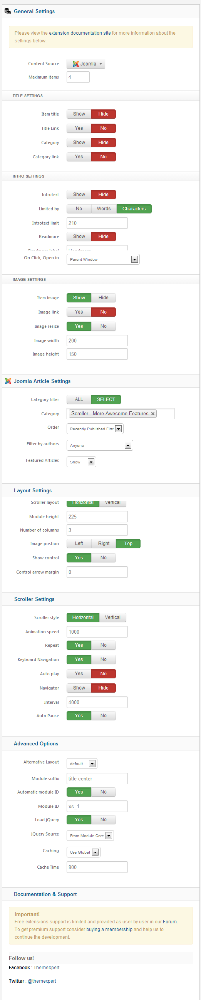

##Installation
----------
Follow [fresh installation guideline](http://www.themexpert.com/docs/expose/basics/installation) if you are having problem to install template.


<div class="row">
	<div class="col-md-12">
		<div class="panel panel-primary">
  <!-- Default panel contents -->
  <div class="panel-heading">Complimentary Extensions</div>

  <!-- List group -->
  <div class="list-group">
    <div><a class="list-group-item" href="http://www.themexpert.com/joomla-extensions/xpert-scroller">Xpert Scroller</a></div>
    
  </div>
</div>
	</div>
</div>

##Template Settings
----------
To load factory settings of this template please open template settings and click `Configurator` button. Under `Load configurationbutton` you will see all available settings there and choose settings named as your template name. Then press load button and you're done!


##Homepage Settings
----------
The screenshot below shows you the modules we have published on the homepage of the demo site.


###Some Module Class Suffixes used in Homepage
- **major-feature** in top-1 position.
- **our-features** in utility-1 position.
- **client-box** in bottom-1 position.
- **testimonial** in bottom-1 position.
- **news-letter** in floor-1 position.

##Scrollspy Effect
----------
In Photon we've implemented Scrollspy which listens to page scrolling and triggers events based on the scroll position. For example, if you scroll down a page and an element appears for the first time in the viewport you can trigger a smooth animation to fade in the element.

###Available Effects
- Fade
- Scale Up
- Scale Down
- Slide Top
- Slide Bottom
- Slide Left
- Slide Right

###How to use
It is very easy to use these effects. Just you have to add an animation class and a data type. For example in order to have "Scale Up" effect in a div just have a look on the following markup.

```
<div class="uk-scrollspy-init-inview uk-scrollspy-inview uk-animation-scale-up" data-uk-scrollspy="{cls:'uk-animation-scale-up'}">
.....
</div>
```

To have this effect for every time that content appeares just add ```repeat: true``` option.

```
<div class="uk-scrollspy-init-inview uk-scrollspy-inview uk-animation-scale-up" data-uk-scrollspy="{cls:'uk-animation-scale-up', repeat: true}">
.....
</div>
```

##Module Positions
----------


##Scroller Settings
----------
This module is powered by our Xpert Scroller and here are the settings.



