## Installation

Follow [fresh installation guideline](http://www.themexpert.com/docs/expose/basics/installation) if you are having problem to install template.

<div class="row">
	<div class="col-md-6">
		<div class="panel panel-primary">
		  <!-- Default panel contents -->
		  <div class="panel-heading">Complimentary Extensions</div>
		  <!-- List group -->
		  <div class="list-group">
		    <div><a class="list-group-item" href="http://www.unitecms.net/joomla-extensions/unite-revolution-slider-responsive">Revolution Slider</a></div>
            <div><a class="list-group-item" href="http://www.themexpert.com/joomla-extensions/xpert-contents">Xpert Content</a></div>
            <div><a class="list-group-item" href="http://www.themexpert.com/joomla-extensions">Xpert Contact</a></div>
		 </div>
		</div>
	</div>

	<div class="col-md-6">
		<div class="panel panel-default"> 
			<div class="panel-heading">Optional</div>
 
			<div class="list-group">
				<div><a class="list-group-item" href="http://getk2.org">K2</a></div>
			</div>
		</div>
	</div>
</div>

## Template Settings

To load factory settings of this template please open template settings and click `Configurator` button. Under `Load configuration` button you will see all available settings there and choose settings named as your template name. Then press load button and you&#39;re done!


## Homepage Settings

The screenshot below shows you the modules we have published on the homepage of the demo site. We have showed here Two Home variation module position.


### Ecommerce Home Variation

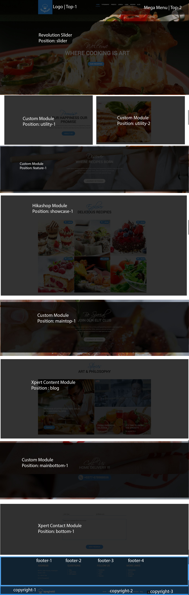

    You have to add "ecommerce" class in Home Display Settings in "Home-ecommerce" Menu
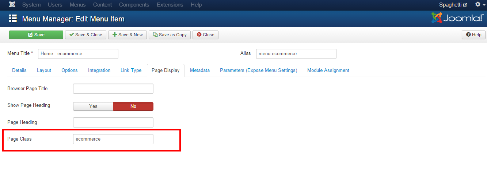


### Landing Page Home Variation

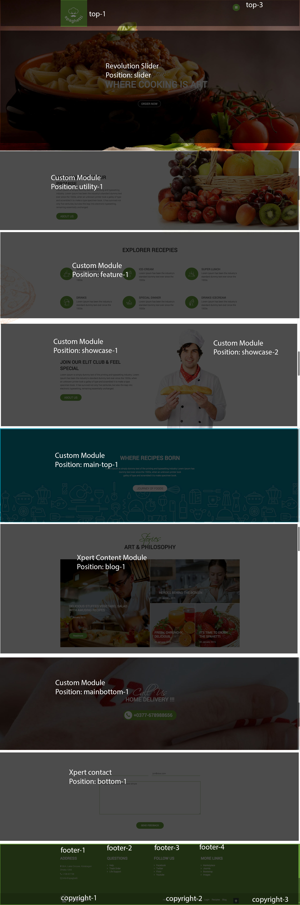

    You have to add "home-landing" class in Home Display Settings in "Home-Landing" Menu
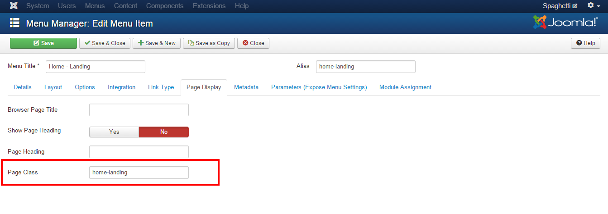


## Revolution Slider Settings

This module is powered by [Revolution Slider](http://www.unitecms.net/joomla-extensions/unite-revolution-slider-responsive) and here are the settings.

	Module Position: slider

### Revolution Slider component settings

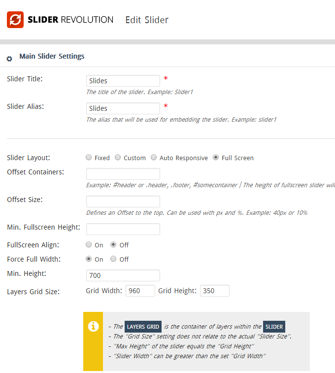

### Revolution Slider Slide Settings
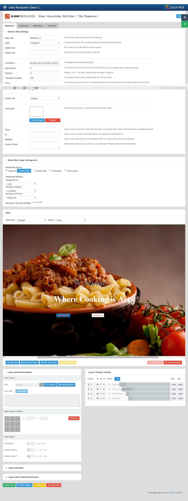

### Revolution Slider Content

    For 1st Layer use "large_bold_grey" style
    For 2nd Layer use "large_bold_white" style
    For Button use this "<a href='#' class='btn btn-primary'>Our Recepies</a>"


## Template Content

### Showcase 1

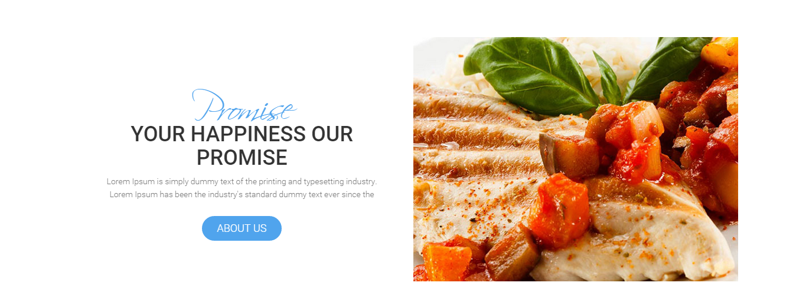

```
Module Type: Custom HTML
Module Name: Ecommerce-showcase-text
Module Position: utility-1
Class Suffix: ec-showcase
```


```
<div>
    <h3 class="wow fadeInDown" data-wow-duration="500ms" data-wow-delay=".5s">Promise</h3>
    <h4 class="wow fadeInDown" data-wow-duration="500ms" data-wow-delay="1s">Your happiness our promise</h4>
    <p class="wow fadeInDown" data-wow-duration="500ms" data-wow-delay="1.5s">Lorem Ipsum is simply dummy text of the printing and typesetting industry. Lorem Ipsum has been the industry's standard dummy text ever since the</p>
    <p class="wow fadeInDown" data-wow-duration="500ms" data-wow-delay="2s"><a class="btn btn-primary" href="#">About Us</a></p>
</div>
```

### Showcase 2

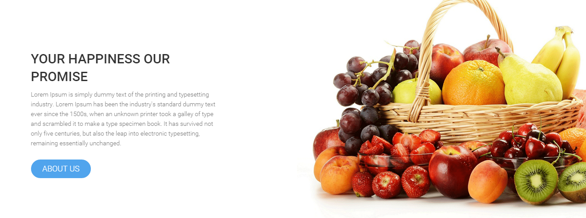

```
Module Type: Custom HTML
Module Name: Showcase-1 text
Module Position: utility-1
Class Suffix: showcase-text
```


```
<h3 class="wow fadeInDown" data-wow-duration="500ms" data-wow-delay="100ms">Your Happiness Our Promise</h3>
<p class="wow fadeInDown" data-wow-duration="500ms" data-wow-delay="500ms">Lorem Ipsum is simply dummy text of the printing and typesetting industry. Lorem Ipsum has been the industry's standard dummy text ever since the 1500s, when an unknown printer took a galley of type and scrambled it to make a type specimen book. It has survived not only five centuries, but also the leap into electronic typesetting, remaining essentially unchanged.</p>
<p class="wow fadeInDown" data-wow-duration="500ms" data-wow-delay="1s"><a class="btn btn-primary" href="#">About Us</a></p>
```

```
In this section, in right side there is fruits picture. This is not any module. That is section background images. If you want to change image then you have to replace image with as like our images in folder.
```


### Showcase 3

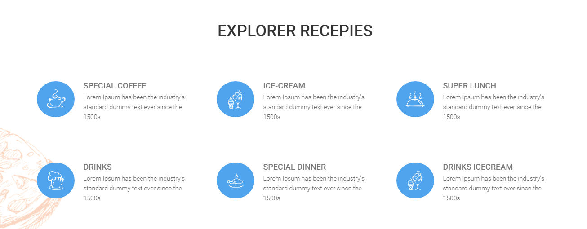

```
Module Type: Custom HTML
Module Name: Showcase-1 text
Module Position: feature-1
Class Suffix: feature-section nomargin-left nopadding-left nomargin-right nopadding-right
```


```
<div class="grid4 feature wow zoomIn" data-wow-duration="300ms" data-wow-delay="300ms">
    <div class="block">
        <div class="media">
            <div class="pull-left"></div>
            <div class="media-body">
                <h4 class="media-heading">Special Coffee</h4>
                <p>Lorem Ipsum has been the industry's standard dummy text ever since the 1500s</p>
            </div>
        </div>
    </div>
</div>
<div class="grid4 feature wow zoomIn" data-wow-duration="300ms" data-wow-delay="600ms">
    <div class="block">
        <div class="media">
            <div class="pull-left"></div>
            <div class="media-body">
                <h4 class="media-heading">Ice-cream</h4>
                <p>Lorem Ipsum has been the industry's standard dummy text ever since the 1500s</p>
            </div>
        </div>
    </div>
</div>
<div class="grid4 feature wow zoomIn" data-wow-duration="300ms" data-wow-delay="900ms">
    <div class="block">
        <div class="media">
            <div class="pull-left"></div>
            <div class="media-body">
                <h4 class="media-heading">Super Lunch</h4>
                <p>Lorem Ipsum has been the industry's standard dummy text ever since the 1500s</p>
            </div>
        </div>
    </div>
</div>
<div class="grid4 feature wow zoomIn" data-wow-duration="300ms" data-wow-delay="1.2s">
    <div class="block">
        <div class="media">
            <div class="pull-left"></div>
            <div class="media-body">
                <h4 class="media-heading">Drinks</h4>
                <p>Lorem Ipsum has been the industry's standard dummy text ever since the 1500s</p>
            </div>
        </div>
    </div>
</div>
<div class="grid4 feature wow zoomIn" data-wow-duration="300ms" data-wow-delay="1.5s">
    <div class="block">
        <div class="media">
            <div class="pull-left"></div>
            <div class="media-body">
                <h4 class="media-heading">Special Dinner</h4>
                <p>Lorem Ipsum has been the industry's standard dummy text ever since the 1500s</p>
            </div>
        </div>
    </div>
</div>
<div class="grid4 feature wow zoomIn" data-wow-duration="300ms" data-wow-delay="1.8s">
    <div class="block">
        <div class="media">
            <div class="pull-left"></div>
            <div class="media-body">
                <h4 class="media-heading">Drinks Icecream</h4>
                <p>Lorem Ipsum has been the industry's standard dummy text ever since the 1500s</p>
            </div>
        </div>
    </div>
</div>
```


### Call To Action

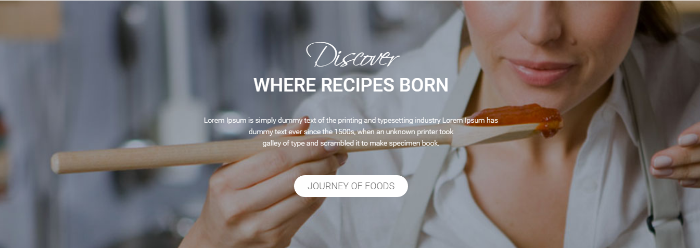
```
Module Type: Custom HTML
Module Name: EC-Call to action
Module Position: feature-1
Class Suffix: call-to-action  wow zoomIn animated
```

```
<div>
    <h3>Discover</h3>
    <h4>Where Recipes Born</h4>
    <p>Lorem Ipsum is simply dummy text of the printing and typesetting industry Lorem Ipsum has<br /> dummy text ever since the 1500s, when an unknown printer took<br /> galley of type and scrambled it to make specimen book.</p>
    <p><a class="btn btn-primary" href="#">Journey of Foods</a></p>
<div>

```

### Xpert Content

```
Module Type: Xpert Content
Module Name: Stories ART & PHILOSOPHY
Module Position: blog-1
Class Suffix: blog-item
```

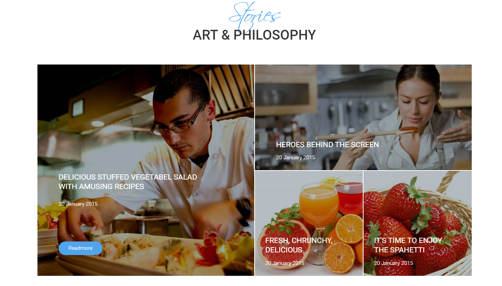
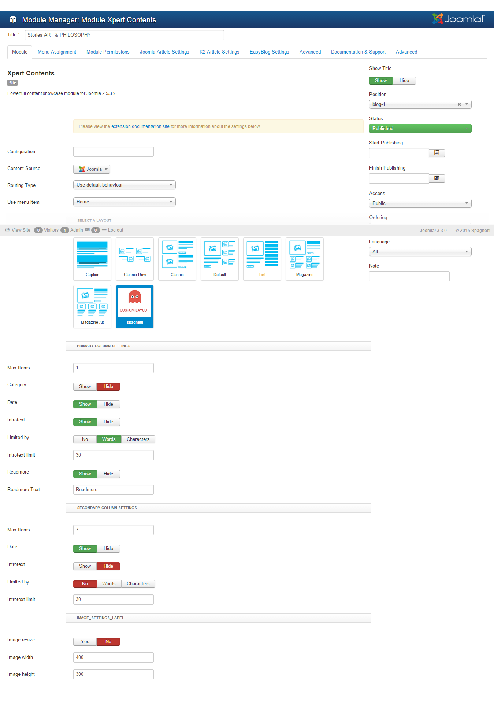

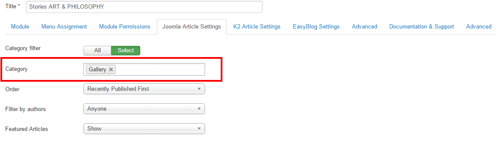

```
Here Latest Update/Recent Publish Article will show in Left Side. If you want to show article in your website then you have to use same size images we use.

```


### Home Delivery

```
Module Type: Custom HTML
Module Name: Home Delivery
Module Position: mainbottom-1
Class Suffix: home-delivery wow fadeInRight animated
```


```
<h3>Call Us</h3>
<h4>Home Delivery !!!</h4>
<p><a class="btn btn-primary" href="#">
    <span class="icon-phone"> </span>+0377-678988656
</a></p>

```


## Hikashop

This module is powered by [Hikashop](http://www.hikashop.com/)
You will get all settings here [Hikashop Youtube Video](https://www.youtube.com/watch?v=HA9YOyzBsic)


### Hikashop Main Settings
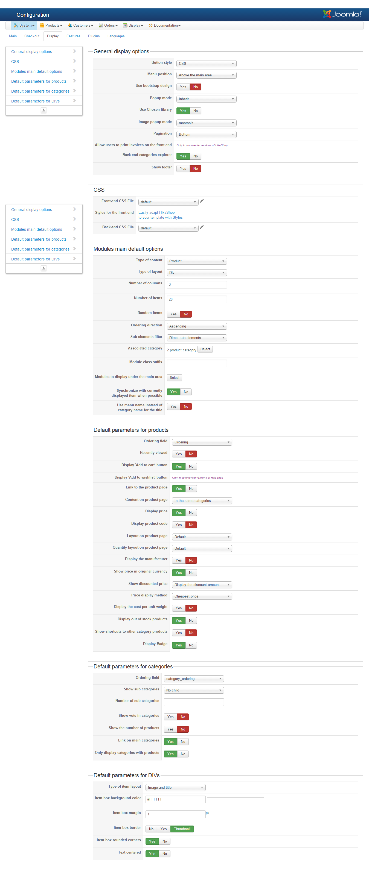

### Hikashop Module Settings
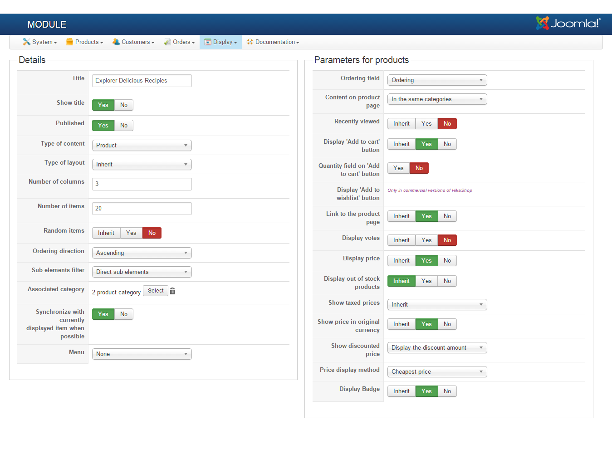


