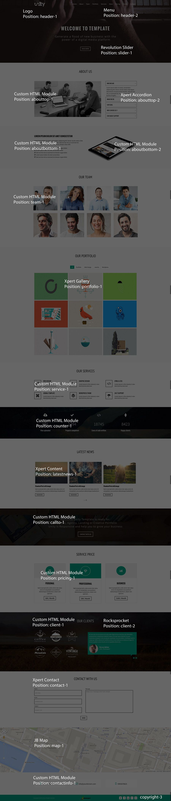
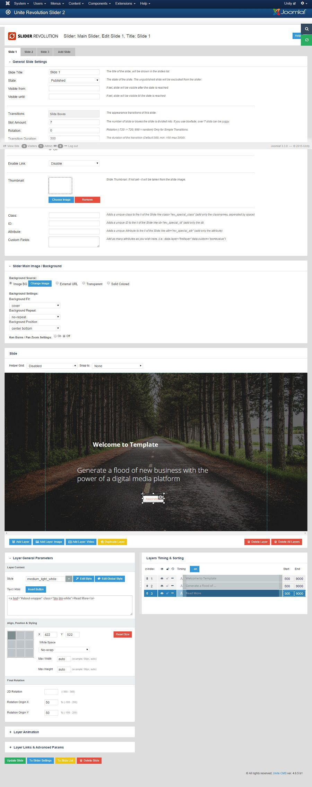
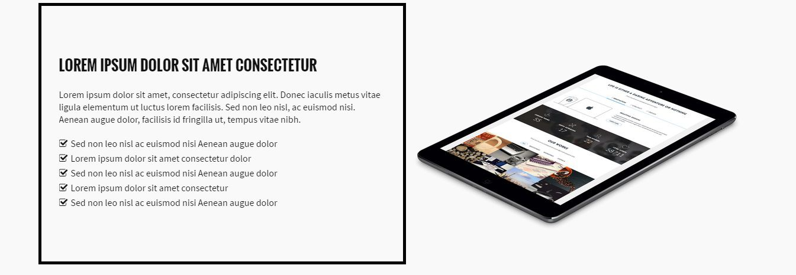
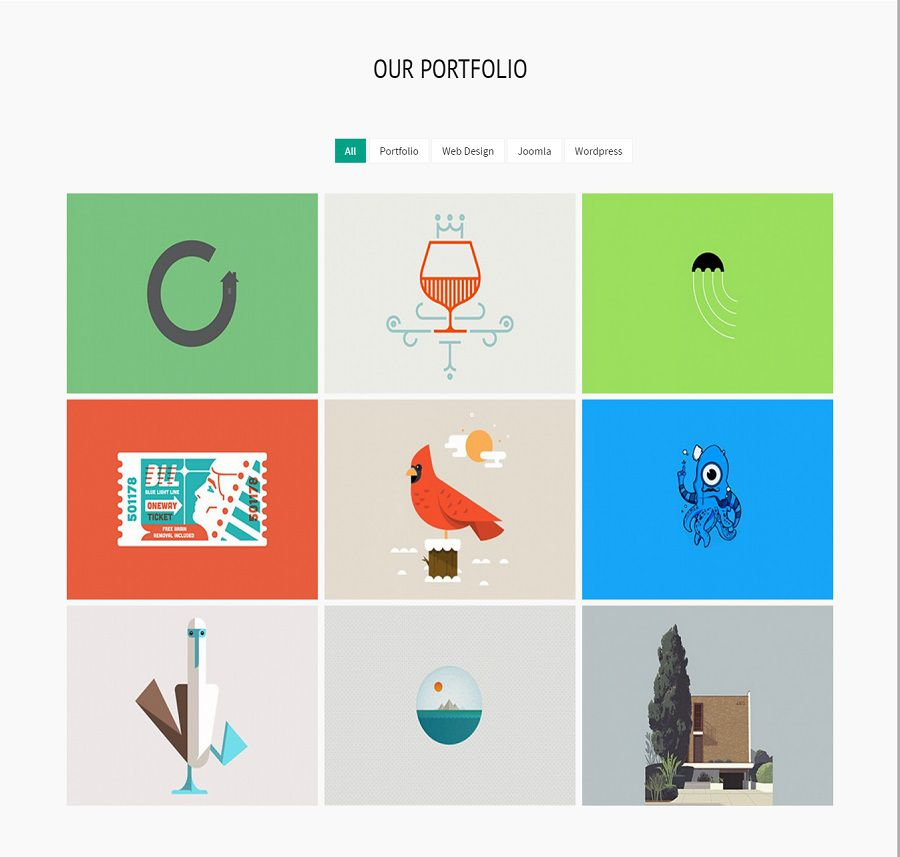
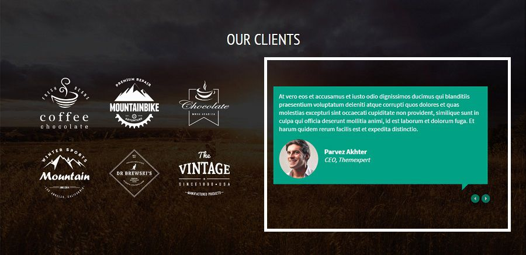

## Installation

Follow [fresh installation guideline](http://www.themexpert.com/docs/expose/basics/installation) if you are having problem to install template.

<div class="row">
	<div class="col-md-12">
		<div class="panel panel-primary">
		  <!-- Default panel contents -->
		  <div class="panel-heading">Complimentary Extensions</div>
		  <!-- List group -->
		  <div class="list-group">
		    <div><a class="list-group-item" href="http://www.unitecms.net/joomla-extensions/unite-revolution-slider-responsive">Revolution Slider</a></div>
            <div><a class="list-group-item" href="http://www.themexpert.com/joomla-extensions/xpert-contents">Xpert Scroller</a></div>
            <div><a class="list-group-item" href="http://www.themexpert.com/joomla-extensions">Xpert Contact</a></div>
            <div><a class="list-group-item" href="http://www.themexpert.com/joomla-extensions">Xpert Gallery</a></div>
            <div><a class="list-group-item" href="http://www.themexpert.com/joomla-extensions">Xpert Accordion</a></div>
            <div><a class="list-group-item" href="http://www.joomlabamboo.com/joomla-extensions/jb-maps-free-google-maps-module-for-joomla">JB Map</a></div>
            <div><a class="list-group-item" href="http://www.rockettheme.com/joomla/extensions/roksprocket">Rocksprocket</a></div>
		 </div>
		</div>
	</div>
</div>

## Template Settings

To load factory settings of this template please open template settings and click `Configurator` button. Under `Load configuration` button you will see all available settings there and choose settings named as your template name. Then press load button and you&#39;re done!


## Homepage Settings

The screenshot below shows you the modules we have published on the homepage of the demo site.





## Revolution Slider Settings

This module is powered by [Revolution Slider](http://www.unitecms.net/joomla-extensions/unite-revolution-slider-responsive) and here are the settings.


	Module Position: slider-1

### Revolution Slider component settings


### Revolution Slider Slide Settings


### Revolution Slider Content

    For 1st Layer use "large_bold_white" style
    For 2nd Layer use "medium_light_white" style
    For Button use this "<a href="#about-wrapper" class="btn btn-white">Read More</a>"


## About Us

### About Top Section


```
Module Type: Custom HTML
Module Name: About top image
Module Position: abouttop-1
```


```
<div class="wow fadeInLeft" data-wow-duration=".5s" data-wow-delay=".5s">
    
</div>
```

```
Module Type: Xpert Accordion
Module Name: Xpert Accordion
Module Position: abouttop-2
```


### About Bottom Section



```
Module Type: Custom HTML
Module Name: About Bottom Text 
Module Position: aboutbottom-1
```


```
<div class="about-text wow fadeInLeft" data-wow-duration=".5s" data-wow-delay="1s">
  <h3>LOREM IPSUM DOLOR SIT AMET CONSECTETUR</h3>
  <p>
    Lorem ipsum dolor sit amet, consectetur adipiscing elit. Donec iaculis metus vitae ligula elementum ut luctus lorem facilisis. Sed non leo nisl, ac euismod nisi. Aenean augue dolor, facilisis id fringilla ut, tempus vitae nibh.
  </p>
  <ul>
    <li><i class="fa fa-check-square-o"></i>Sed non leo nisl ac euismod nisi Aenean augue dolor</li>
    <li><i class="fa fa-check-square-o"></i>Lorem ipsum dolor sit amet consectetur dolor</li>
    <li><i class="fa fa-check-square-o"></i>Sed non leo nisl ac euismod nisi Aenean augue dolor</li>
    <li><i class="fa fa-check-square-o"></i>Lorem ipsum dolor sit amet consectetur</li>
    <li><i class="fa fa-check-square-o"></i>Sed non leo nisl ac euismod nisi Aenean augue dolor</li>
  </ul>
</div>
```


```
Module Type: Custom HTML
Module Name: About Bottom image 
Module Position: aboutbottom-2
```


```
<div class="wow fadeInRight" data-wow-duration=".5s" data-wow-delay="1s">

</div>
```


## Our Team


```
Module Type: Custom HTML
Module Name: Our Team
Module Position: team-1
Class Suffix: nomargin-left nopadding-left nomargin-right nopadding-right
```
### Full Code

```
<div class="team">
  <div class="grid3">
    <div class="team-member wow fadeInLeft" data-wow-duration=".5s" data-wow-delay=".3s">
    	
        	<div class="team-details">
            	<h4>John Doe</h4>
                <p>Founder & Director</p>
                <ul>
                	<li><a href="#"><i class="fa fa-facebook"></i></a></li>
                    <li><a href="#"><i class="fa fa-twitter"></i></a></li>
                    <li><a href="#"><i class="fa fa-linkedin"></i></a></li>
                    <li><a href="#"><i class="fa fa-pinterest"></i></a></li>
                    <li><a href="#"><i class="fa fa-dribbble"></i></a></li>
                </ul>
            </div>
     </div>
  </div>
  <div class="grid3">
    <div class="team-member wow fadeInLeft" data-wow-duration=".5s" data-wow-delay=".6s">
    	
        	<div class="team-details">
            	<h4>John Doe</h4>
                <p>Founder & Director</p>
                <ul>
                	<li><a href="#"><i class="fa fa-facebook"></i></a></li>
                    <li><a href="#"><i class="fa fa-twitter"></i></a></li>
                    <li><a href="#"><i class="fa fa-linkedin"></i></a></li>
                    <li><a href="#"><i class="fa fa-pinterest"></i></a></li>
                    <li><a href="#"><i class="fa fa-dribbble"></i></a></li>
                </ul>
            </div>
     </div>
  </div>
  <div class="grid3">
    <div class="team-member wow fadeInLeft" data-wow-duration=".5s" data-wow-delay=".9s">
    	
        	<div class="team-details">
            	<h4>John Doe</h4>
                <p>Founder & Director</p>
                <ul>
                	<li><a href="#"><i class="fa fa-facebook"></i></a></li>
                    <li><a href="#"><i class="fa fa-twitter"></i></a></li>
                    <li><a href="#"><i class="fa fa-linkedin"></i></a></li>
                    <li><a href="#"><i class="fa fa-pinterest"></i></a></li>
                    <li><a href="#"><i class="fa fa-dribbble"></i></a></li>
                </ul>
            </div>
     </div>
  </div>
  <div class="grid3">
    <div class="team-member wow fadeInLeft" data-wow-duration=".5s" data-wow-delay="1.2s">
    	
        	<div class="team-details">
            	<h4>John Doe</h4>
                <p>Founder & Director</p>
                <ul>
                	<li><a href="#"><i class="fa fa-facebook"></i></a></li>
                    <li><a href="#"><i class="fa fa-twitter"></i></a></li>
                    <li><a href="#"><i class="fa fa-linkedin"></i></a></li>
                    <li><a href="#"><i class="fa fa-pinterest"></i></a></li>
                    <li><a href="#"><i class="fa fa-dribbble"></i></a></li>
                </ul>
            </div>
     </div>
  </div>
  <div class="grid3">
    <div class="team-member wow fadeInLeft" data-wow-duration=".5s" data-wow-delay="1.5s">
    	
        	<div class="team-details">
            	<h4>John Doe</h4>
                <p>Founder & Director</p>
                <ul>
                	<li><a href="#"><i class="fa fa-facebook"></i></a></li>
                    <li><a href="#"><i class="fa fa-twitter"></i></a></li>
                    <li><a href="#"><i class="fa fa-linkedin"></i></a></li>
                    <li><a href="#"><i class="fa fa-pinterest"></i></a></li>
                    <li><a href="#"><i class="fa fa-dribbble"></i></a></li>
                </ul>
            </div>
     </div>
  </div>
  <div class="grid3">
    <div class="team-member wow fadeInLeft" data-wow-duration=".5s" data-wow-delay="1.8s">
    	
        	<div class="team-details">
            	<h4>John Doe</h4>
                <p>Founder & Director</p>
                <ul>
                	<li><a href="#"><i class="fa fa-facebook"></i></a></li>
                    <li><a href="#"><i class="fa fa-twitter"></i></a></li>
                    <li><a href="#"><i class="fa fa-linkedin"></i></a></li>
                    <li><a href="#"><i class="fa fa-pinterest"></i></a></li>
                    <li><a href="#"><i class="fa fa-dribbble"></i></a></li>
                </ul>
            </div>
     </div>
  </div>
  <div class="grid3">
    <div class="team-member wow fadeInLeft" data-wow-duration=".5s" data-wow-delay="2.1s">
    	
        	<div class="team-details">
            	<h4>John Doe</h4>
                <p>Founder & Director</p>
                <ul>
                	<li><a href="#"><i class="fa fa-facebook"></i></a></li>
                    <li><a href="#"><i class="fa fa-twitter"></i></a></li>
                    <li><a href="#"><i class="fa fa-linkedin"></i></a></li>
                    <li><a href="#"><i class="fa fa-pinterest"></i></a></li>
                    <li><a href="#"><i class="fa fa-dribbble"></i></a></li>
                </ul>
            </div>
     </div>
  </div>
  <div class="grid3">
    <div class="team-member wow fadeInLeft" data-wow-duration=".5s" data-wow-delay="2.4s">
    	
        	<div class="team-details">
            	<h4>John Doe</h4>
                <p>Founder & Director</p>
                <ul>
                	<li><a href="#"><i class="fa fa-facebook"></i></a></li>
                    <li><a href="#"><i class="fa fa-twitter"></i></a></li>
                    <li><a href="#"><i class="fa fa-linkedin"></i></a></li>
                    <li><a href="#"><i class="fa fa-pinterest"></i></a></li>
                    <li><a href="#"><i class="fa fa-dribbble"></i></a></li>
                </ul>
            </div>
     </div>
  </div>
</div>
```

### Single Team Member Code

```
<div class="team-member wow fadeInLeft" data-wow-duration=".5s" data-wow-delay="1.8s">
    
    <div class="team-details">
        <h4>John Doe</h4>
        <p>Founder & Director</p>
        <ul>
        	<li><a href="#"><i class="fa fa-facebook"></i></a></li>
            <li><a href="#"><i class="fa fa-twitter"></i></a></li>
            <li><a href="#"><i class="fa fa-linkedin"></i></a></li>
            <li><a href="#"><i class="fa fa-pinterest"></i></a></li>
            <li><a href="#"><i class="fa fa-dribbble"></i></a></li>
        </ul>
    </div>
</div>

```

## Portfolio Section

```
Module Type: Xpert Gallery
Module Name: Our Portfolio
Module Position: portfolio-1
Module Class Suffix: wow zoomIn
```



## Our Service Section
```
Module Type: Custom HTML Module
Module Name: Our Services
Module Position: service-1
Module Class Suffix: nomargin-left nopadding-left nomargin-right nopadding-right
```


### Full code
```
<div class="service-wrapper">
  <div class="grid4">
    <div class="block">
    <div class="service wow fadeInLeft" data-wow-duration=".5s" data-wow-delay=".3s">
    	<div class="media">
			<div class="pull-left"><i class="fa fa-magic"></i></div>
          	<div class="media-body">
				<h4 class="media-heading">Web Design</h4>
				<p>Lorem Ipsum is the industry's stan dard dummy text ever</p>
			</div>
      	</div>
     </div>
    </div>
  </div>
  <div class="grid4">
    <div class="block">
    <div class="service wow fadeInLeft" data-wow-duration=".5s" data-wow-delay=".6s">
    	<div class="media">
			<div class="pull-left"><i class="fa fa-gift"></i></div>
          	<div class="media-body">
				<h4 class="media-heading">Graphic Design</h4>
				<p>Lorem Ipsum is the industry's stan dard dummy text ever</p>
			</div>
      	</div>
     </div>
    </div>
  </div>
  <div class="grid4">
    <div class="block">
    <div class="service wow fadeInLeft" data-wow-duration=".5s" data-wow-delay=".9s">
    	<div class="media">
			<div class="pull-left"><i class="fa fa-code"></i></div>
          	<div class="media-body">
				<h4 class="media-heading">HTML and CSS</h4>
				<p>Lorem Ipsum is the industry's stan dard dummy text ever</p>
			</div>
      	</div>
     </div>
    </div>
  </div>
  <div class="grid4">
    <div class="block">
    <div class="service wow fadeInLeft" data-wow-duration=".5s" data-wow-delay="1.2s">
    	<div class="media">
			<div class="pull-left"><i class="fa fa-joomla"></i></div>
          	<div class="media-body">
				<h4 class="media-heading">Joomla Template</h4>
				<p>Lorem Ipsum is the industry's stan dard dummy text ever</p>
			</div>
      	</div>
     </div>
    </div>
  </div>
  <div class="grid4">
    <div class="block">
    <div class="service wow fadeInLeft" data-wow-duration=".5s" data-wow-delay="1.5s">
    	<div class="media">
			<div class="pull-left"><i class="fa fa-wordpress"></i></div>
          	<div class="media-body">
				<h4 class="media-heading">Wordpress Theme</h4>
				<p>Lorem Ipsum is the industry's stan dard dummy text ever</p>
			</div>
      	</div>
     </div>
    </div>
  </div>
  <div class="grid4">
    <div class="block">
    <div class="service wow fadeInLeft" data-wow-duration=".5s" data-wow-delay="1.8s">
    	<div class="media">
			<div class="pull-left"><i class="fa fa-umbrella"></i></div>
          	<div class="media-body">
              <h4 class="media-heading">24/7 Support</h4>
				<p>Lorem Ipsum is the industry's stan dard dummy text ever</p>
			</div>
      	</div>
     </div>
  </div>
  </div>
</div>
```

### Single Service Code

```
<div class="service wow fadeInLeft" data-wow-duration=".5s" data-wow-delay="1.8s">
    <div class="media">
	    <div class="pull-left"><i class="fa fa-umbrella"></i></div>
        <div class="media-body">
            <h4 class="media-heading">24/7 Support</h4>
				<p>Lorem Ipsum is the industry's stan dard dummy text ever</p>
        </div>
    </div>
</div>
```

## Counter Section
```
Module Type: Custom HTML
Module Name: Fun Facts Counter
Module Position: counter-1
Class Suffix: nomargin-left nopadding-left nomargin-right nopadding-right
```


### Full Section Code

```
<div class="grid3">
	<div class="block">
    	<div class="counter-item wow fadeInUp" data-wow-duration=".5s" data-wow-delay=".5s">
        	<i class="fa fa-cloud-upload"></i>
        	<div class="timer" id="item1" data-to="991" data-speed="5000"></div>
        	<h3>Files uploaded</h3>                               
        </div>
  	</div>
</div>
<div class="grid3">
	<div class="block">
    	<div class="counter-item wow fadeInUp" data-wow-duration=".5s" data-wow-delay="1s">
        	<i class="fa fa-check"></i>
        	<div class="timer" id="item1" data-to="1394" data-speed="5000"></div>
        	<h3>Projects completed</h3>                               
        </div>
  	</div>
</div>
<div class="grid3">
	<div class="block">
    	<div class="counter-item wow fadeInUp" data-wow-duration=".5s" data-wow-delay="1.5s">
        	<i class="fa fa-code"></i>
        	<div class="timer" id="item1" data-to="18745" data-speed="5000"></div>
        	<h3>Lines of code written</h3>                               
        </div>
  	</div>
</div>
<div class="grid3">
	<div class="block">
    	<div class="counter-item wow fadeInUp" data-wow-duration=".5s" data-wow-delay="2s">
        	<i class="fa fa-male"></i>
        	<div class="timer" id="item1" data-to="8423" data-speed="5000"></div>
        	<h3>Happy clients</h3>                               
        </div>
  	</div>
</div>
```

### Single Counter Code

```
<div class="counter-item wow fadeInUp" data-wow-duration=".5s" data-wow-delay=".5s">
    <i class="fa fa-cloud-upload"></i>
    <div class="timer" id="item1" data-to="991" data-speed="5000"></div>
    <h3>Files uploaded</h3>                               
</div>
```


## Latest News Section
```
Module Type: Xpert Scroller
Module Name: Latest News
Module Position: latestnews-1
Class Suffix: latest-news wow zoomIn
```


## Call To Action


```
Module Type: Custom HTML
Module Name: Call To Action
Module Position: callto-1
Class Suffix: nomargin-left nopadding-left nomargin-right nopadding-right
```


```
<div class="call-to-action wow zoomIn" data-wow-duration=".5s" data-wow-delay=".5s">
	<p>Awesome Unity Template is ready for <br> Business, Agency, Landing or Creative Portfolio<br>Unity is Responsive and help you to grow your business</p>
    <a href="#contact-section" class="btn btn-white">Contact With Us</a>
</div>
```


## Pricing Table
```
Module Type: Custom HTML Module
Module Name: Service Price
Module Position: pricing-1
Class Suffix: nomargin-left nopadding-left nomargin-right nopadding-right
```


### Full Section Code

```
<div class="grid4">
	<div class="block">
    	<div class="pricing wow zoomIn" data-wow-duration=".5s" data-wow-delay=".3s">
        	<div class="pricing-header">
        		<i class="fa fa-bars"></i>
        	</div>
        	<div class="pricing-body">
        		<h3 class="pricing-title">Personal</h3>
        		<p>Sed ut perspiciatis unde omnis iste natus error sit voluptatem accusantium doloremque laudantium, totam rem aperiam.</p>
        		<a href="#" class="btn btn-black">$69 / Mo</a>
        	</div>
        </div>
  	</div>
</div>
<div class="grid4">
	<div class="block">
    	<div class="pricing wow zoomIn" data-wow-duration=".5s" data-wow-delay=".6s">
        	<div class="pricing-header colored-bg">
        		<i class="fa fa-diamond"></i>
        	</div>
        	<div class="pricing-body">
        		<h3 class="pricing-title">Professional</h3>
        		<p>Sed ut perspiciatis unde omnis iste natus error sit voluptatem accusantium doloremque laudantium, totam rem aperiam.</p>
        		<a href="#" class="btn btn-black">$99 / Mo</a>
        	</div>
        </div>
  	</div>
</div>
<div class="grid4">
	<div class="block">
    	<div class="pricing wow zoomIn" data-wow-duration=".5s" data-wow-delay=".9s">
        	<div class="pricing-header">
        		<i class="fa fa-bar-chart-o"></i>
        	</div>
        	<div class="pricing-body">
        		<h3 class="pricing-title">Business</h3>
        		<p>Sed ut perspiciatis unde omnis iste natus error sit voluptatem accusantium doloremque laudantium, totam rem aperiam.</p>
        		<a href="#" class="btn btn-black">$169 / Mo</a>
        	</div>
        </div>
  	</div>
</div>
```

### Single Pricing Code

```
<div class="pricing wow zoomIn" data-wow-duration=".5s" data-wow-delay=".9s">
    <div class="pricing-header">
        <i class="fa fa-bar-chart-o"></i>
    </div>
    <div class="pricing-body">
        <h3 class="pricing-title">Business</h3>
        <p>Sed ut perspiciatis unde omnis iste natus error sit voluptatem accusantium doloremque laudantium, totam rem aperiam.</p>
        <a href="#" class="btn btn-black">$169 / Mo</a>
    </div>
</div>
```

## Client Section

### CLients Logo

```
Module Type: Custom HTML
Module Name: Clients Logo
Module Position: client-1
Module Class Suffix: wow fadeInLeft
```


```
<div class="clients">
	<ul>
		<li></li>
		<li></li>
		<li></li>
	
		<li></li>
		<li></li>
		<li></li>
	</ul>
</div>
```

### Client Testimonial

```
Module Type: Rocksprocket (Quotes)
Module Name: Testimonial
Module Position: client-2
Module Class Sufix: wow fadeInRight
```


    If you want to create new Testimonial then click "Add New item". Then a fild will generate and you can add content there.


## Google Map Settings

```
Module Type: JB Map
Module Name: JB Maps
Module Position: map-1
```


    
    Map Settings
    


## Contact Information

```
Module Type: Custom HTML
Module Name: Contact info
Module Position: contactinfo-1
Class Suffix: nomargin-left nopadding-left nomargin-right nopadding-right
```


### Full Section Code

```
<div class="grid4">
  <div class="block">
    <div class="contact-info text-center wow zoomIn" data-wow-duration=".5s" data-wow-delay=".3s">
      <i class="fa fa-map-marker"></i> 45/4, Jurassic Park, USA
    </div>
  </div>
</div>
<div class="grid4">
  <div class="block">
    <div class="contact-info text-center wow zoomIn" data-wow-duration=".5s" data-wow-delay=".6s">
      <i class="fa fa-envelope-o"></i> info@yourdomain.com
    </div>
  </div>
</div>
<div class="grid4">
  <div class="block">
    <div class="contact-info text-center wow zoomIn" data-wow-duration=".5s" data-wow-delay=".9s">
      <i class="fa fa-mobile"></i> +89026756578625
    </div>
  </div>
</div>
```

### Single Information Code

```
<div class="contact-info text-center wow zoomIn" data-wow-duration=".5s" data-wow-delay=".3s">
    <i class="fa fa-map-marker"></i> 45/4, Jurassic Park, USA
</div>
```


## Copyright Social

```
Module Type: Custom HTML
Module Name: Footer Social
Module Position: copyright-3
```


```
<div class="footer-social">
	<ul>
		<li><a href="#"><i class="fa fa-twitter"></i></a></li>
		<li><a href="#"><i class="fa fa-facebook"></i></a></li>
		<li><a href="#"><i class="fa fa-linkedin"></i></a></li>
		<li><a href="#"><i class="fa fa-google-plus"></i></a></li>
		<li><a href="#"><i class="fa fa-dribbble"></i></a></li>
	</ul>
</div>
```


## Copyright Logo

```
Module Type: Custom HTML
Module Name: Copyright Logo
Module Position: copyright-2
```


```
<div class="text-center">
  
</div>
```


