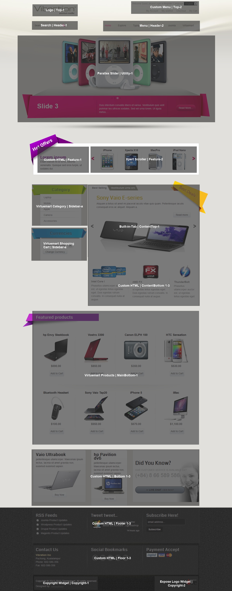
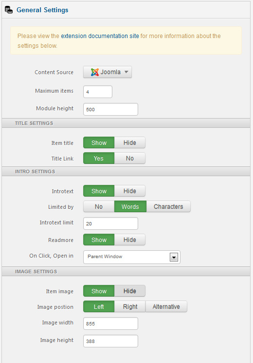
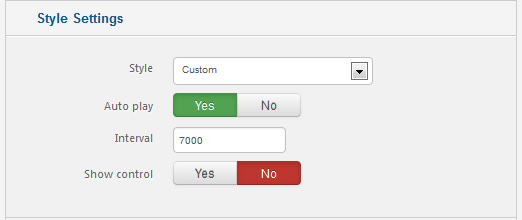
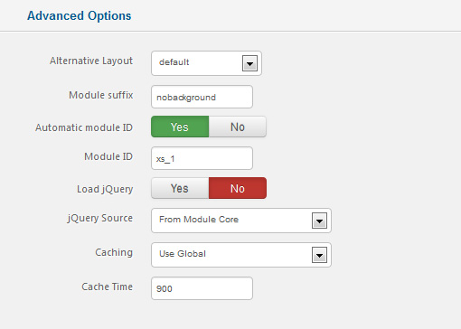
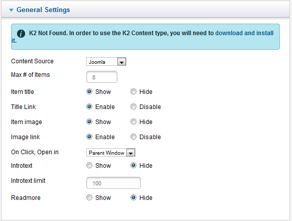
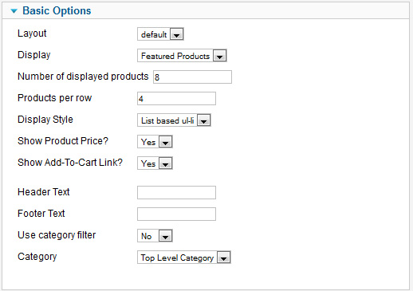
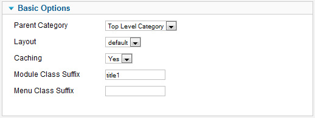

##Installation
----------
Follow [fresh installation guideline](http://www.themexpert.com/documentation/expose-framework/getting-started) if you are having problem to install template.


<div class="row">
	<div class="col-md-6">
		<div class="panel panel-primary">
  <!-- Default panel contents -->
  <div class="panel-heading">Complimentary Extensions</div>

  <!-- List group -->
  <div class="list-group">
    <div><a class="list-group-item" href="http://www.themexpert.com/joomla-extensions/parallax-slider">Parallax Slider</a></div>
    <div><a class="list-group-item" href="http://www.themexpert.com/joomla-extensions/xpert-scroller">Xpert Scroller</a></div>
    <div><a class="list-group-item" href="http://www.themexpert.com/joomla-extensions/xpert-tweets">Xpert Tweets</a></div>
  </div>
</div>
	</div>
	<div class="col-md-6">
		<div class="panel panel-default">
  <!-- Default panel contents -->
  <div class="panel-heading">Optional</div>
  <!-- List group -->
  <div class="list-group">
    <div><a  class="list-group-item" href="http://virtuemart.net/">Virtuemart</a></div>
  </div>
</div>
	</div>
</div>

##Template Settings
----------
To load factory settings of this template please open template settings and click `Configurator` button. Under `Load configurationbutton` you will see all available settings there and choose settings named as your template name. Then press load button and you're done!


##Homepage Settings
Vibration's Homepage fully based on modules, and we turned on component disable for the Homepage, to do this go to 
```Extensions → Template Manager → Tx_Vibration → Advance```

And turn on <code>Component Disable</code> option and enter your Home page menu id.


<p>The screenshot below shows you the modules we have published on the homepage of the demo site.</p>



Some Specific ```Module Class Suffixes``` used in the Homepage

-   nobackground for background none and border 0.
-    badge-hot-offers in feature-1.
-   title1 in VM Category module
-   title2 and hide-items in VM Products Module</li>
-   badge-best-deals in Xpert Scroller Module inside Tab.
-   customer-service in bottom-3
-   follow-us in floor-2


##Module Positions


##Slideshow Settings</h2>

This module is powered by our Parallax Slider and here is the settings.







##Scroller Settings

We've used our powerful scroller module Xpert Scroller here and have a look on the settings.




##Tweets Settings

This module is powered by our Xpert Tweets and here is the settings.


##VM Product Module settings




##VM Category Module settings


