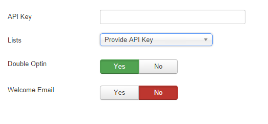

##Intro
XChimp is a plugin that automatically adds users to your MailChimp list account when they register to your site. No more exporting those lists and then importing them! We make the work of capturing your users data easy to help you re-engage with them in your e-mail marketing campaigns.

## XChimp Settings

**Scroll Bar Color :** Select a Color by Color Picker.

**Scroll Bar Width :** Input Scrollbar width in px.

**Border Radius :** Input Border Radius in px (if needed).

**Auto Hide :** If you want to auto hide your Scroll bar make it yes (deafult is no).

**Load jQuery :** If need to load jQury from plugin.