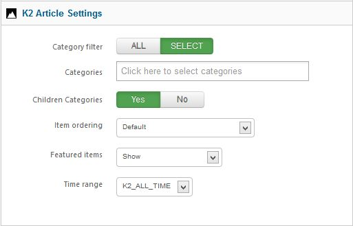

##Before you begin
Xpert Captions doesn't work without some content, so the first thing you will need to do is create some articles or K2 items. If you have a Expert Explorer package that includes Xpert Captions, you can view the demo content for an example.

You should first create a new category or select one that you wish to display articles from. Then place new articles into it with your content. Make sure to provide intro text and if you wish an image, as these are what is used to display the snippets.

Once you have your selection of content ready, you can then start to work with Xpert Captions.

##General Settings

**Content Source :** Select your content source.

**Maximum Items :** Maximum number of items to show, put 0 to show all.

###Title Settings
**Item Title :** This option allow you to show or hide article title.

**Title Link :** Set title will be linkable or not.

**Category :** This option allow you to show or hide category.

**Category Link :** Set category will be linkable or not.

###Intro Settings
**Introtext :** This option allow you to show the introtext.

**Limited By :** This option allow whether you limit introtext by word or character or no limitation.

**Introtext limit :**&nbsp;Intro text charectar limit.

**Readmore :** Show or hide readmore link.

**On Click, Open in :** Select where the article open.

###Image Settings
**Image Width :** Image width in px value. Do not enter px on the field.

**Image Height :** Image height in px value. Do not enter px on the field.

##Joomla Article Settings

**Category Filter :** Set whether article will fetch from all categories or specific categories.

**Category :** This option will only show if you set select in the Category Filter option. You can specify single or multiple categories here.

**Order :** Sort your article by selected order.

**Filter by Authors :** Filter all articles by authors.

**Featured Articles :** You can disable showing featured article or featured article only.

##K2 Article Settings

**Category Filter :&nbsp;**Select all or specific category.

**Categories :&nbsp;**Choose specific category.

**Children categories :&nbsp;**This option allow you to fetch item from any clildren category you've selected.

**Item Ordering**&nbsp;:&nbsp;Slect your article sorting order.

**Featured Item :&nbsp;**You can disable showing featured article or featured article only.

**Time range :**  Set time range if ordering is set to 'most popular' or 'most commented'.

##Captions Settings

**Animation :** Select animation type.

**Speed :** Animatin speed in milisecond.

**Opacity :** Accepts any value 0-1 (decimals included). Used to determine the opacity level the overlay is faded to when hovered over. Fade animation only

**Effect Applied on :** This option allow you to select where the animation will apply.

**Anchor :** This option allow you to select the caption position.

**Anchor Position :** Anchor starting point, higher negetive value means it will come slowly.

**Hover X :**&nbsp;Horizontal overlay hover positions.Width in pixed to be used.

**Hover Y :** Vertical overlay hover positions.Width in pixed to be used.

##Advance

**Module class suffix :&nbsp;**This allows you to apply a unique CSS style to this module, if you desire and have the style set in the template.

**Automatic Module Id :** If you have multiple Xpert Scroller module in one page this option will add a unique module id to each.

**Module Id :** If you want to assign module id by yourself then Disable Automatic Module Id and insert your own id.

**Load jQuery :&nbsp;**This option allow you to enable or disable loading jquery on your site. Xpert Scroller required jQuery 1.4.4+ to run, if you template already load jQuery then disable this option otherwise you should enable it.

**jQuery Source :&nbsp;**This option allow you to load jQuery form 2 source, Google CDN or from Module Core. We recommend to user **Google CDN** for live site because it will load faster and save your bandwidth, for local testing/development you can load jQuery **From Module Core**.

**Alternative Layout :** Use a different layout from the supplied module or overrides in the template.

##Troubleshooting
<em>**Do i need jQuery?**</em>

Yes this module require it.

<em>**Module Keep loading, why?**</em>

This is possible for a few reasons. If jQuery is already included on your site by the template or another extension, then make sure to disable it in in XpertCaptions. Sometime another extension load jquery, make sure jquery loaded only once in header and top of all script.

<em>**Image not showing, why?**</em>

Make sure your image path is ok and you have no **/** beginning of your image path. For K2 article it looks for article image not image from introtext, so make sure you have article image for each article.

<em>**Text not showing, why?**</em>

Make sure you have some text in your article and you've turned on **show introtext**&nbsp;option form module settings.

<em>**I can't save or apply admin settings, why?**</em>
We recommend to use Firefox 4+/Chrome/Safari/Opera for admin management. It has some problem saving settings from **Internet Explorer**.