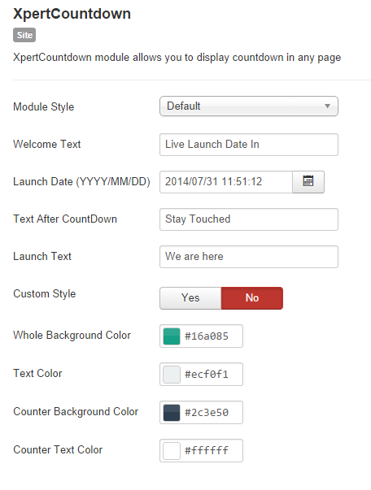

##Intro
XpertCountdown is a highly-customizable and top-tier Joomla countdown module. It allows you to display countdown in any page also it comes with extensive option handles and Various layout which is easy to configure and customize with your expected interface.

##Xpert Countdown Settings

**Module Style :** You can select a preset style of Xpert Coundown. Currently, there are 2 styles available EventX and Default.

**Welcome Text :** Text before Countdown. Leave it blank if you no need to add any welcome text.

**Launch Date :** Input or select Launch date from calender.

**Text After Countdown :** Write text if you want to some text after Countdown. Leave it blank if not needed.

**Launch Text :** This Text will show when Countdown time will be ended.

###Custom Style Settings

**Custom Style :** Switch it to yes, if you want to change apparence of Countdown. This Switch will make bottom options workable.

**Whole Background Color :** Module Background color.

**Text Color :** All Countdown Text color.

**Counter Background Color:** Only Countdown/Counters background.

**Counter Text Color:** Only Countdown/Counters Text color
