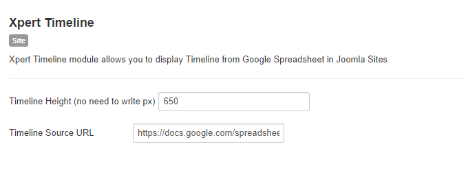

##Intro
Xpert Timeline module allows you to display Timeline from Google Spreadsheet. You can create your own gorgeous timeline easily, using nothing more than a Google spreadsheet.

## How to Build and Embed Spreadsheet
**Building Spreadsheet :** Build a new Google Spreadsheet using [This template](https://drive.google.com/previewtemplate?id=0AppSVxABhnltdEhzQjQ4MlpOaldjTmZLclQxQWFTOUE&mode=public). Drop dates, text and links to media into the appropriate columns.

*Note: Don't change the column headers, don't remove any columns, and don't leave any blank rows in your spreadsheet*

**Embeding Spreadsheet :**  Under the **File** menu, select **Publish to the Web**

In the next window, check **Automatically republish when changes are made.** Uncheck all other boxes. Click **start publishing** This will give you the URL to embed in your HTML file.

##Xpert Timeline Settings

**Timeline Height :** Insert Timeline height, no need to write px.

**Timeline Source URL :** Paste Your Google Spreadsheet's HTML file URL Which one you got recently (HTML file) to Get Timeline Data.

