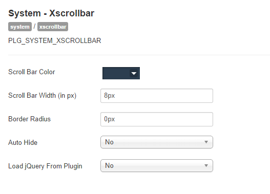

##Intro
XScrollbar is a Joomla! plugin for custom browser Scrollbars. It gives a consistent look browser scrollbar. XScrollbar based on most popular NiceScroll jQuery plugin. You can customize your browser Scrollbar without writing a single line of code.

## Xscrollbar Settings

**Scroll Bar Color :** Select a Color by Color Picker.

**Scroll Bar Width :** Input Scrollbar width in px.

**Border Radius :** Input Border Radius in px (if needed).

**Auto Hide :** If you want to auto hide your Scroll bar make it yes (deafult is no).

**Load jQuery :** If need to load jQury from plugin.