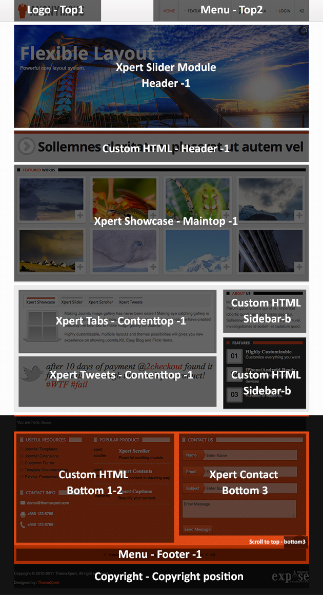
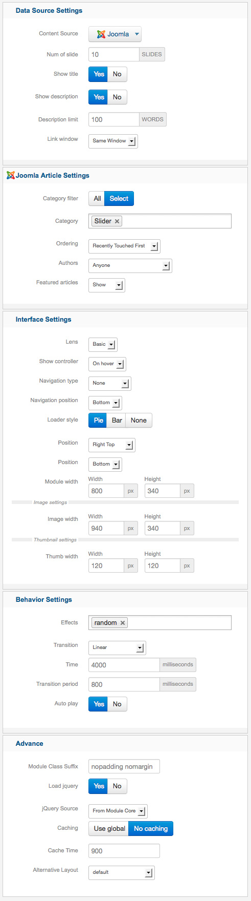
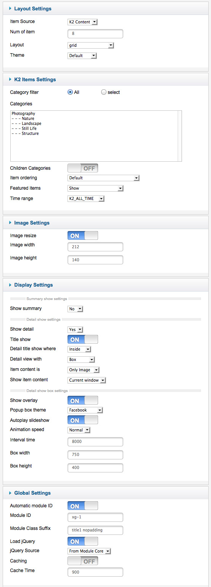

##Installation
----------
Follow [fresh installation guideline](http://www.themexpert.com/documentation/expose-framework/getting-started) if you are having problem to install template.


<div class="row">
	<div class="col-md-12">
		<div class="panel panel-primary">
  <!-- Default panel contents -->
  <div class="panel-heading">Complimentary Extensions</div>

  <!-- List group -->
  <div class="list-group">
    <div><a class="list-group-item" href="http://www.themexpert.com/joomla/extensions/xpert-slider">Xpert Slider</a></div>
    <div><a class="list-group-item" href="http://www.themexpert.com/joomla-extensions/xpert-tabs">Xpert Tabs</a></div>
    <div><a class="list-group-item" href="http://www.themexpert.com/joomla/extensions/xpert-tweets">Xpert Tweets</a></div>
    <div class="list-group-item">Xpert Showcase (Deprecated)</div>
  </div>
</div>
	</div>
</div>

##Template Settings
----------
To load factory settings of this template please open template settings and click `Configurator` button. Under `Load configurationbutton` you will see all available settings there and choose settings named as your template name. Then press load button and you're done!


##Homepage Settings
----------
Matheno Homepage fully based on modules, and we turned on component disable for the Homepage, to do this go to
```Extensions → Template Manager → Tx_Parallax → Advance```
And turn on `Component Disable` option and enter your Home page menu id.


The screenshot below shows you the modules we have published on the homepage of the demo site.


##Module Positions
----------


##Slideshow settings
----------
This module is powered by Xpert Slider and here is the settings




##Showcase settings
----------
We used Xpert Showcase here which is deprecated now, you may use Xpert Gallery instead of it. Have a look on the required settings



##Tab settings
----------
<p>This module is powered by Xpert Tabs and here is the settings</p>

