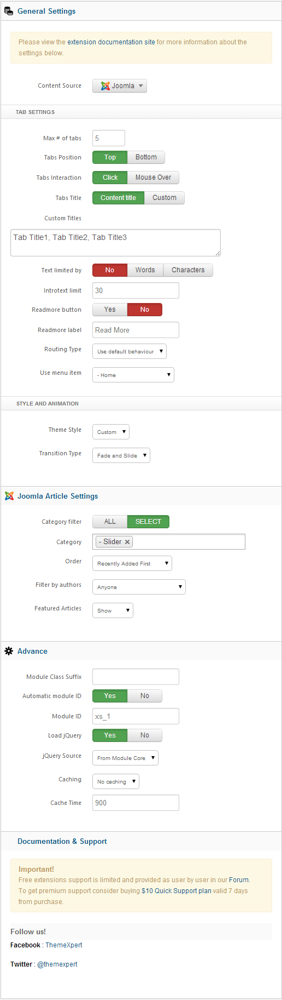

##Installation
----------
Follow [fresh installation guideline](http://www.themexpert.com/documentation/expose-framework/getting-started) if you are having problem to install template.


<div class="row">
	<div class="col-md-12">
		<div class="panel panel-primary">
  <!-- Default panel contents -->
  <div class="panel-heading">Complimentary Extensions</div>

  <!-- List group -->
  <div class="list-group">
    
    <div><a class="list-group-item" href="http://www.themexpert.com/joomla-extensions/parallax-slider">Parallax Slider</a></div>
    <div><a class="list-group-item" href="http://www.themexpert.com/joomla-extensions/xpert-scroller">Xpert Scroller</a></div>
    <div><a class="list-group-item" href="http://www.themexpert.com/joomla-extensions/xpert-tabs">Xpert Tabs</a></div>

  </div>
</div>
	</div>
</div>

##Template Settings
----------
To load factory settings of this template please open template settings and click `Configurator` button. Under `Load configurationbutton` you will see all available settings there and choose settings named as your template name. Then press load button and you're done!


##Homepage Settings

----------
The screenshot below shows you the modules we have published on the homepage of the demo site.


##Scrollspy Effect

----------
In Appy we've implemented Scrollspy which listens to page scrolling and triggers events based on the scroll position. For example, if you scroll down a page and an element appears for the first time in the viewport you can trigger a smooth animation to fade in the element.

###Available Effects
----------
- Fade
- Scale Up
- Scale Down
- Slide Top
- Slide Bottom
- Slide Left
- Slide Right

###How to use
----------
It is very easy to use these effects. Just you have to add an animation class and a data type. For example in order to have "Scale Up" effect in a div just have a look on the following markup.

```
<div data-scrollspy="{cls:'animation-scale-up'}">
.....
</div>
```

To have this effect for every time that content appeares just add `repeat: true` option.

```
<div data-scrollspy="{cls:'animation-scale-up', repeat: true}">
.....
</div>
```

##Slider Settings

----------
This module is powered by our Parallax Slider and here are the settings.


##Scroller Settings

----------
This module is powered by our Xpert Scroller and here are the settings.


##Tabs Settings

----------
We've used Xpert Tabs module here, have a look on the settings.



##Elastic Header Settings

----------
Elastic header is default feature of Appy Template. But, if you want to remove this feature please, follow these steps-

1. Goto Tx_appy->widgets-> open
   ```
elasticheader.php
```
1. Find out public function
  ```
isEnabled() { return TRUE; }
```
1. Change this line to
  ```
public function isEnabled() { return false; }
```
1. Now, add this CSS code to Custom CSS box from template Admin
  ```
body{padding-top: 0;} #roof{position: relative;}
```
you are done.


