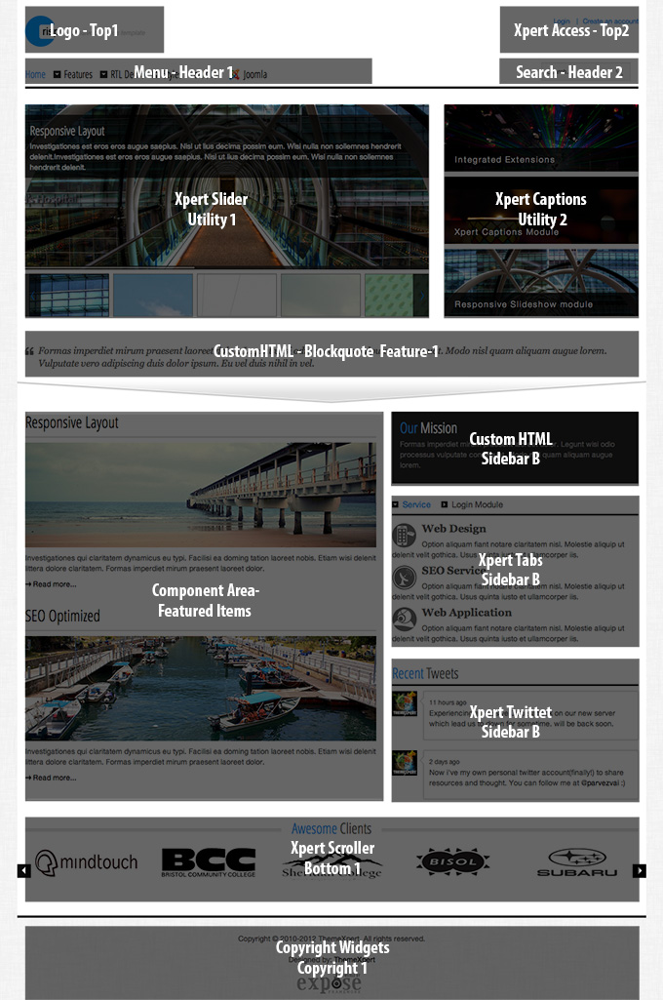
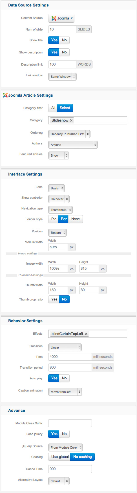
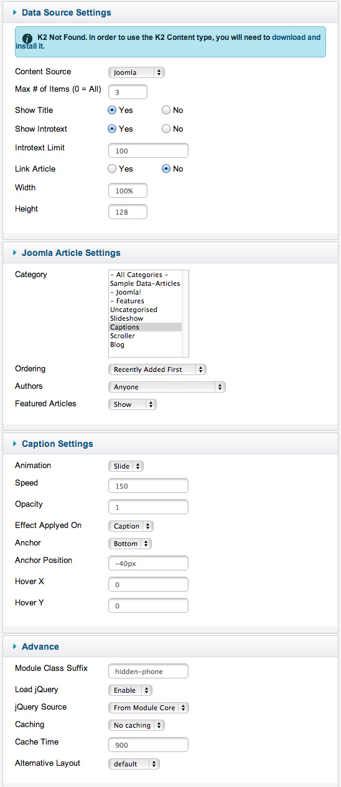
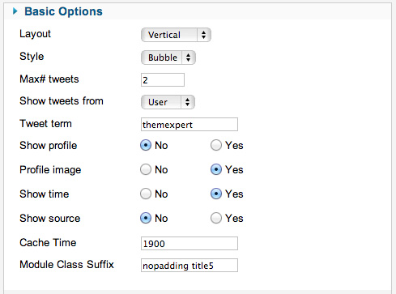

##Installation
----------
Follow [fresh installation guideline](http://www.themexpert.com/documentation/expose-framework/getting-started) if you are having problem to install template.

	

		

  <!-- Default panel contents -->
  
Complimentary Extensions

  <!-- List group -->
  

    
<a class="list-group-item" href="http://www.themexpert.com/joomla/extensions/xpert-slider">Xpert Slider</a>

    
<a class="list-group-item" href="http://www.themexpert.com/joomla-extensions/xpert-tabss">Xpert Tabs</a>

    
<a class="list-group-item" href="http://www.themexpert.com/joomla-extensions/xpert-scroller">Xpert Scroller</a>

    
<a class="list-group-item" href="http://www.themexpert.com/joomla/extensions/xpert-captions">Xpert Captions</a>

    
<a class="list-group-item" href="http://www.themexpert.com/joomla/extensions/xpert-tweets">Xpert Tweets</a>

    
<a class="list-group-item" href="http://www.themexpert.com/joomla/extensions/xpert-access">Xpert Access</a>

  

	

	

		

  <!-- Default panel contents -->
  
Optional

  <!-- List group -->
  

    
<a  class="list-group-item" href="http://stackideas.com/easyblog.html">Easyblog</a>

    
<a  class="list-group-item" href="http://getk2.org/">K2</a>

  

	

##Template Settings
----------
To load factory settings of this template please open template settings and click `Configurator` button. Under `Load configurationbutton` you will see all available settings there and choose settings named as your template name. Then press load button and you're done!

##Homepage Settings
----------
The screenshot below shows you the modules we have published on the homepage of the demo site.

##Module Positions

##Access settings

This module is powered by Xpert Access and here are the settings.

###Slideshow Settings

This module is powered by Xpert Slider and here is the settings.

##Captions settings

This module is powered by Xpert Captions and here are the settings.

##Tab settings

This module is powered by Xpert Tabs and here are the settings.

##Tweets settings

Here are the settings for our twitter module Xpert Tweets.

##Scroller settings

This module is powered by Xpert Scroller and here are the settings.

