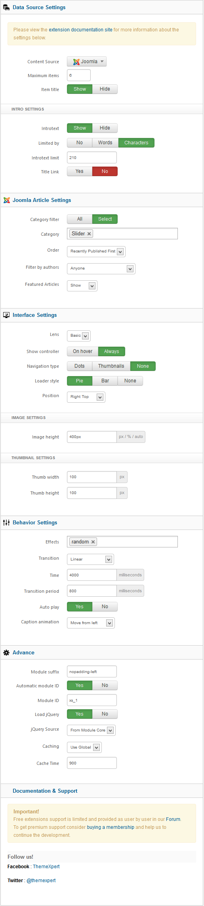
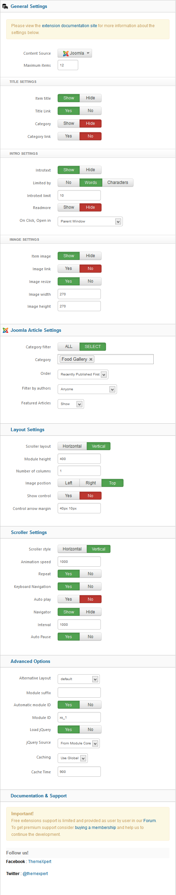
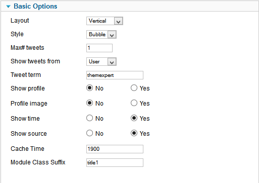

##Installation
----------
Follow [fresh installation guideline](http://www.themexpert.com/documentation/expose-framework/getting-started) if you are having problem to install template.

	

		

  <!-- Default panel contents -->
  
Complimentary Extensions

  <!-- List group -->
  

    
<a class="list-group-item" href="http://www.themexpert.com/joomla/extensions/xpert-slider">Xpert Slider</a>

    
<a class="list-group-item" href="http://www.themexpert.com/joomla/extensions/xpert-scroller">Xpert Scroller</a>

    
<a class="list-group-item" href="http://www.themexpert.com/joomla/extensions/xpert-tabs">Xpert Tabs</a>

    
<a class="list-group-item" href="http://www.themexpert.com/joomla/extensions/xpert-tweets">Xpert Tweets</a>

  

	

	

		

  <!-- Default panel contents -->
  
Optional

  <!-- List group -->
  

    
<a  class="list-group-item" href="http://virtuemart.net/">Virtuemart</a>

    
<a  class="list-group-item" href="http://getk2.org/">K2</a>

  

	

##Template Settings
----------
To load factory settings of this template please open template settings and click `Configurator` button. Under `Load configurationbutton` you will see all available settings there and choose settings named as your template name. Then press load button and you're done!

##Homepage Settings
----------
The screenshot below shows you the modules we have published on the homepage of the demo site.

##Module Positions
----------

##Slideshow Settings
----------
This module is powered by our Xpert Slider and here is the settings.

##Scroller Settings
----------
We used our Xpert Scroller module here and have a look on the settings

##Tweets Settings
----------
This module is powered by our Xpert Tweets and here is the settings.

##Tabs Settings
----------
This module is powered by our Xpert Tabs and here is the settings.
