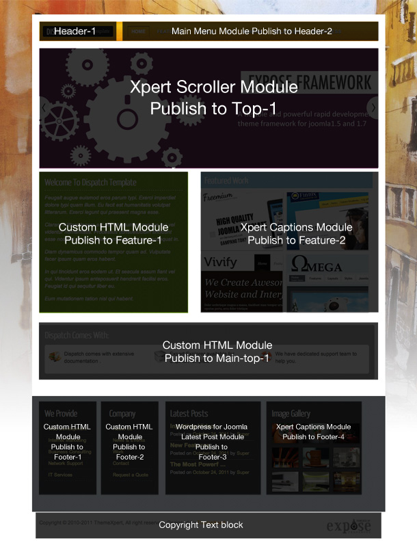
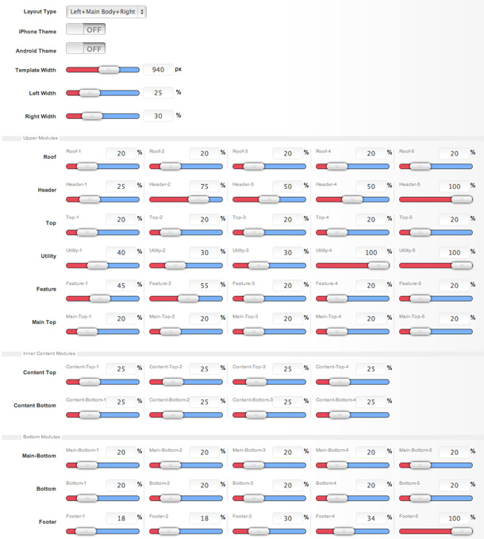
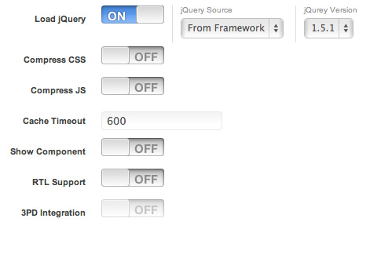
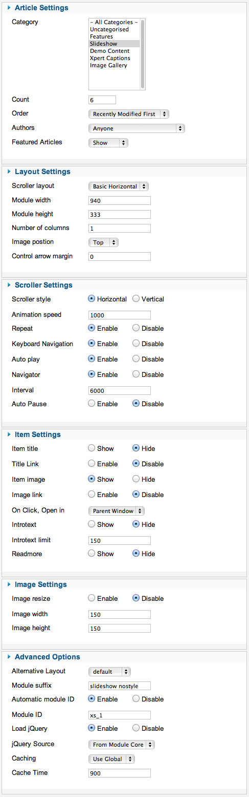
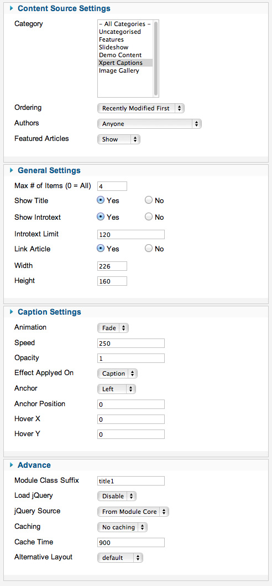
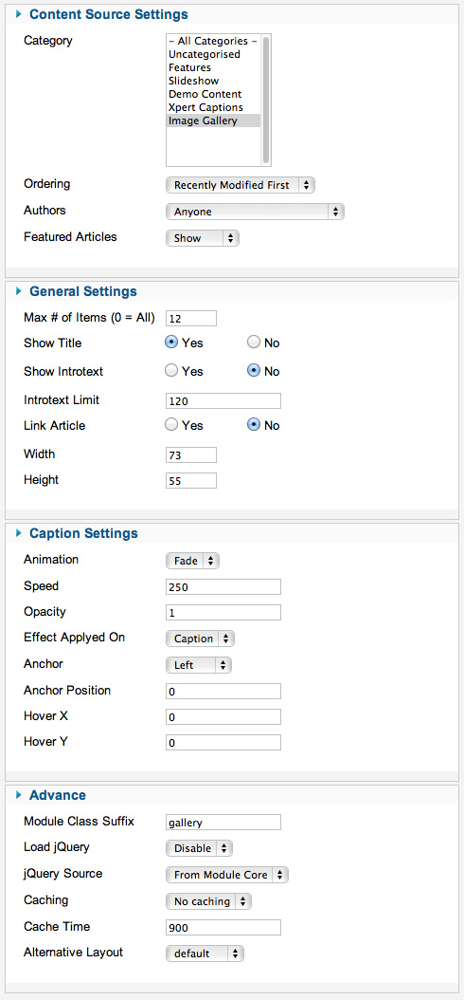

##Installation
----------
Follow [fresh installation guideline](http://www.themexpert.com/documentation/expose-framework/getting-started) if you are having problem to install template.


<div class="row">
	<div class="col-md-6">
		<div class="panel panel-primary">
  <!-- Default panel contents -->
  <div class="panel-heading">Complimentary Extensions</div>

  <!-- List group -->
  <div class="list-group">
    <div><a class="list-group-item" href="http://www.themexpert.com/joomla/extensions/xpert-captions">Xpert Captions</a></div>
    <div><a class="list-group-item" href="http://www.themexpert.com/joomla-extensions/xpert-tabs">Xpert Tabs</a></div>
    <div><a class="list-group-item" href="http://www.themexpert.com/joomla-extensions/xpert-scroller">Xpert Scroller</a></div>
  </div>
</div>
	</div>
	<div class="col-md-6">
		<div class="panel panel-default">
  <!-- Default panel contents -->
  <div class="panel-heading">Optional</div>
  <!-- List group -->
  <div class="list-group">
    <div><a  class="list-group-item" href="http://www.imaqma.com/">HelpDesk</a></div>

    <div><a  class="list-group-item" href="http://www.kunena.org/">Kunena Forum</a></div>
  </div>
</div>
	</div>
</div>

##Homepage Settings
----------
Dispatch Homepage fully based on modules, and we turned on component disable for the Homepage, to do this go to
```Extensions → Template Manager → Tx_Parallax → Advance```
And turn on `Component Disable` option and enter your Home page menu id.


The screenshot below shows you the modules we have published on the homepage of the demo site.



**Explain**

- **Logo:** This is a custom HTML module published to header-1 module position using module class suffix: `logo nostyle`. Write this below code on your editor(remove the / from href) otherwise your logo won’t appear,
```
<a href="./">Dispatch</a>
```
*Make sure you turn off the editor to no-editor mode from Global Configuration.*

- **Menu:** The menu is rendered via the core Joomla menu module, and the menu options are controlled via the template. This menu is using module class suffix: `tx-menu`

- **Slideshow:** Xpert Scroller module is published in top-1 position. You can see a screenshot of the specific configuration below.

- **Xpert Captions:** Xpert Captions module published in feature-2 and footer-4 positions. You can see a screenshot of the specific configuration below.

##Layout Settings



##Typography Settings


##Advance Settings



##Module Positions


##Scroller settings

This module is powered by Xpert Scroller and here is the settngs.



##Featured-work Settings

We used our Xpert Captions module here and have a look on the settings.




##Image Gallery Settings
This module is powered by Xpert Captions and here is the settngs.




##Wordpress for Joomla Layout override

<p>We've changed some code on default twentyten theme provided by corePHP's Wodpress for Joomla package. To get exact same look and feel like demo download <code>loop.php</code> file from <code>Dispatch</code> download directory and upload it to</p>

```
/component/com_wordpress/wp/wp-content/themes/twentyten
```