##Installation

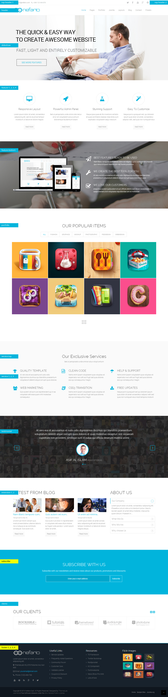

##Layout Configuration and Template Manager

Before starting with Nefario please take a look with the power of T3V3 framework and its Layout Configuration.

- [Backend Overview](https://www.youtube.com/watch?v=BhRBVcd-BTQ)
- [Layout Overview](https://www.youtube.com/watch?v=cqfRrWV-IPY)
- [Mega Menu](https://www.youtube.com/watch?v=cqfRrWV-IPY)
- [Adding Animation Effect for Megamenu](https://www.youtube.com/watch?v=2jIEfewSCRg)
- [How to install Google Analytics](https://www.youtube.com/watch?v=yiY7RlzA6kM)

###Slideshow

Home page slideshow comes with Revolution Slider. Please, see this video tutorial to understand revolution slider.

###Feature

Title part comes with `ITL Feature` module along with font awesome and published on position name `feature-1, feature-2, feature-3, feature-4.` Just type the icon name (exclude: fa fa-), Title and Description. If you leave read more link blank then (read more) button will not visible on front-end.

###Feature-Bottom

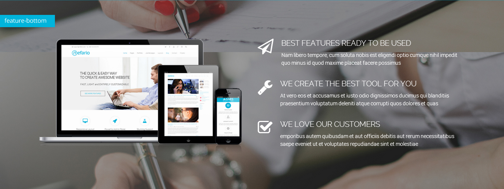

Title part comes with custom html module and published on position name `feature-bottom.` Check the html code:

<textarea style="width: 550px; height: 180px";>

	 
	

		<h3>Best features ready to be used</h3>
		
Nam libero tempore, cum soluta nobis est eligendi optio cumque nihil impedit quo minus id quod maxime placeat facere possimus

	

</textarea>
###Portfolio

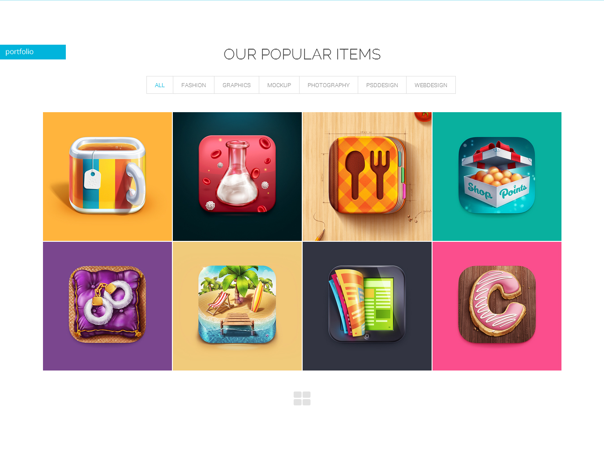

This parts comes by great Roksprocket module with Joomla article. At first create some article with category `Portfolio.` Put images on intro image box from Images and links tab. Image dimension I used 600px X 600px.

See the below configuration of Roksprocket module style `Mosaic`.

###Service

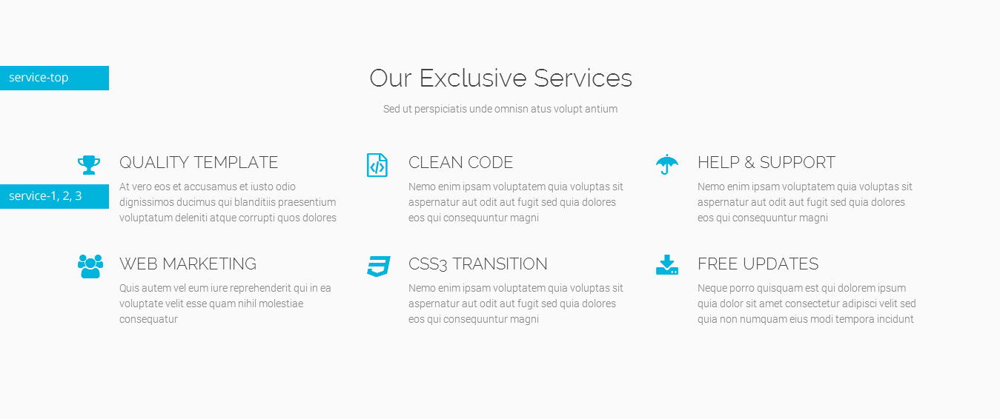

Title part comes with `ITL Feature` module along with line icons and published on position name `service-1, service-2, service-3`. Just type the icon name (exclude: fa fa-), Title and Description.

Then click on `Advanced Ta`b and change `Alternative Layout` from `Default` to `service` and you're done.

###About Us

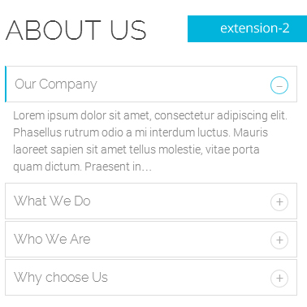

This part also comes by great Roksprocket module (list layout) with Joomla article. Category `service`.

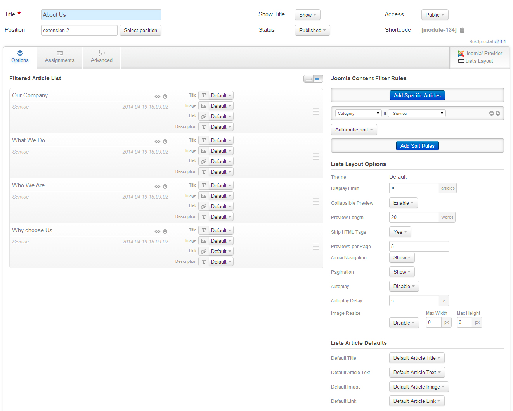

###What Our Client's Say

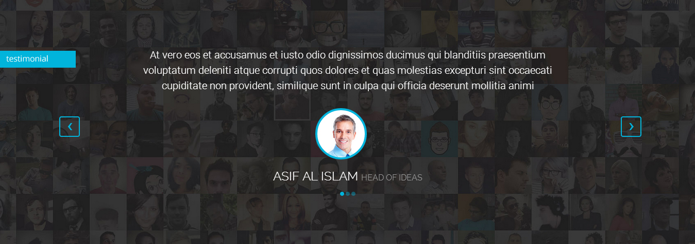

This parts also comes by great Roksprocket module (features layout's showcase theme & module class suffix is testimonial) with Joomla article. Category `testimonial`.

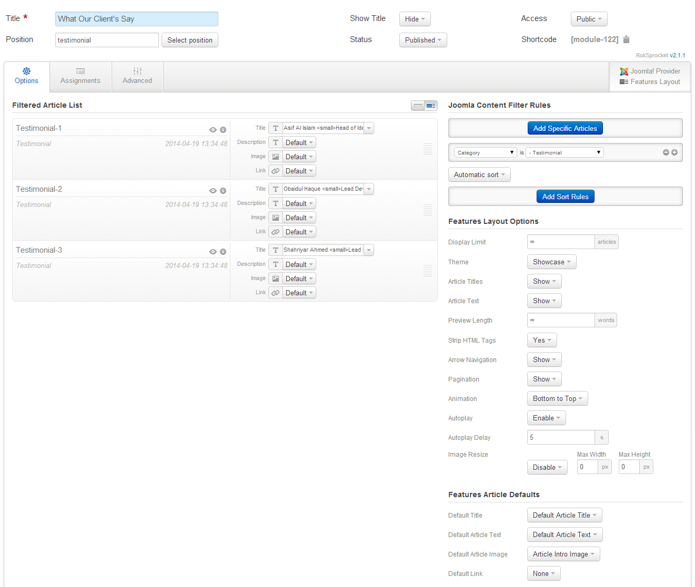

###Subscribe

###Our Clients

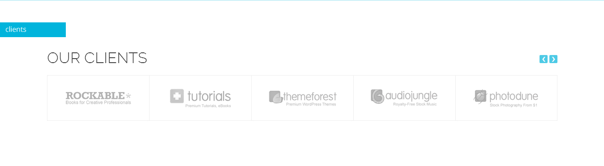

Our Clients made by Roksprocket module and style type strips. Need to create joomla article with category Partners. Use joomla intro image option to attach partners logo. Then see the configuration:

###Latest From Blog

We used News Show Pro Gk5 to present Latest News from K2 with module class suffix `nefario-latest-post`.

###Photo Gallary

This part comes by shortcode. Image dimension is 600px X 600px. Below the html of shortcode:

<textarea style="width: 550px; height: 80px";>
{gallery}itl_demo/gallery{/gallery}
</textarea>

###Feature Tab

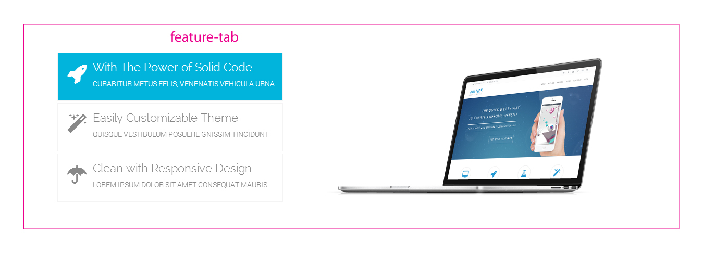

It comes by RokSprokcet module with Joomla article. At first create a category Main tab and publish 3 article with some text and images.

`Configuration:` Tab tables, icon and text comes by custom field. See the image below and on the right side you can see module configuration. You have to use module class suffix `feature-tab` to see the styles as in demo.

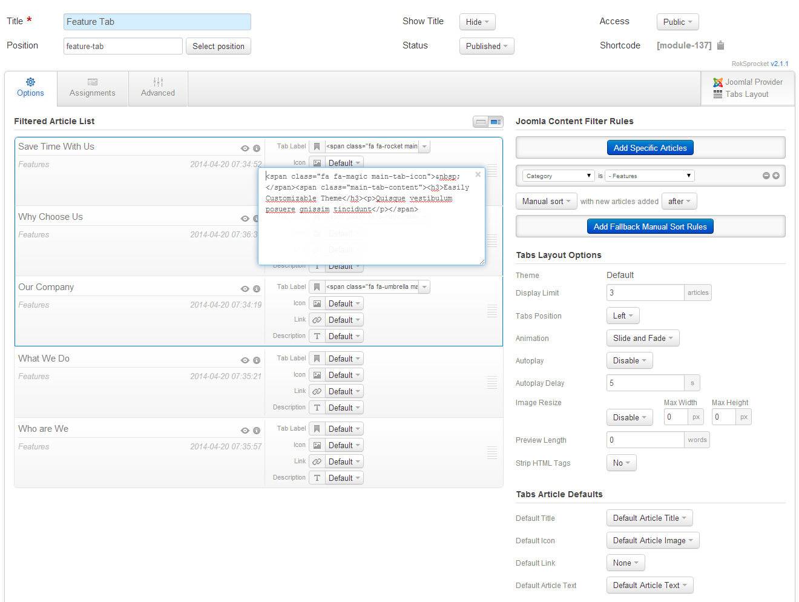

<textarea style="width: 450px; height: 100px";>
&nbsp;

<h3>Easily Customizable Theme</h3>

Quisque vestibulum posuere gnissim tincidunt

</textarea>

###Team Members

Its an article in nefario-demo category.See the shown code below

<textarea style="width: 650px; height: 500px";>

<h4>Lance Dorgan</h4>

Art Director

Cum sociis natoque penatibus et magnis dis parturient montes, nascetur ridiculus mus. Lorem ipsum dolor sit amet, consectetuer adipiscing elit.

<ul class="list-inline">
<li>

<a class="tooltip-on" href="http://www.facebook.com" title="Facebook"><em class="fa fa-facebook"> </em></a>

</li>
<li>

<a class="tooltip-on" href="http://www.twitter.com" title="Twitter"><em class="fa fa-twitter"> </em></a>

</li>
<li>

<a class="tooltip-on" href="http://www.google.com" title="GooglePlus"><em class="fa fa-google-plus"> </em></a>

</li>
<li>

<a class="tooltip-on" href="http://www.linkedin.com" title="Linkedin"><em class="fa fa-linkedin"> </em></a>

</li>
</ul>

</textarea>

###Pricing Table

Its an article in nefatio-demo category. See the shown code below

<textarea style="width: 650px; height: 350px";>

<h5>Basic</h5>

<h4>$15</h4>
 / mo 

<ul>
<li> 100GB Storage</li>
<li> All Themes</li>
<li> Access to Tutorials</li>
<li> Auto Backup</li>
<li> Extended Security</li>
</ul>
<a class="btn btn-primary pricing-btn" href="#"> Sign Up </a>

</textarea>

###T3 Documenation with video link
Here is the [documenation link](http://t3-framework.org/documentation.html) of T3 Framework.

At a galance [video](http://t3-framework.org/video-series.html) of T3 framework