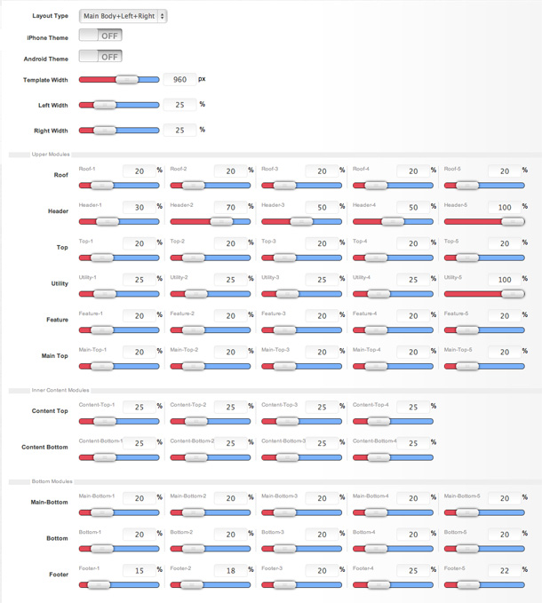
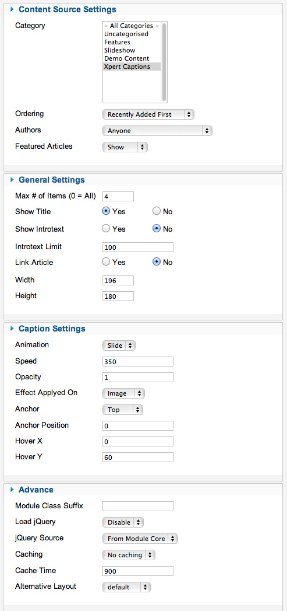

##Installation
----------
Follow [fresh installation guideline](http://www.themexpert.com/documentation/expose-framework/getting-started) if you are having problem to install template.

	

		

  <!-- Default panel contents -->
  
Complimentary Extensions

  <!-- List group -->
  

    
<a class="list-group-item" href="http://www.themexpert.com/joomla/extensions/xpert-captions">Xpert Scroller</a>

    
<a class="list-group-item" href="http://www.themexpert.com/joomla/extensions/xpert-tabs" >Xpert Captions</a> 

  

	

	

		

  <!-- Default panel contents -->
  
Optional

  <!-- List group -->
  

    
<a  class="list-group-item" href="http://getk2.org/">K2</a>

  

	

##Homepage Settings
----------
The screenshot below shows you the modules we have published on the homepage of the demo site. Please see the explanation below regarding the usage and any other relevant information of the modules.

**Explain:**

- **Logo:** This is a custom HTML module published to header-1 module position using module class suffix: `logo nostyle`. Write this below code on your editor(remove the / from href) otherwise your logo won’t appear, <pre>&lt;a href=""&gt;Omega&lt;/a&gt;</pre> 
***Make sure you turn off the editor to no-editor mode from Global Configuration.***

- **Menu:** The menu is rendered via the core Joomla menu module, and the menu options are controlled via the template. This menu is using module class suffix: `tx-menu`
- **Slideshow:** Xpert Scroller module is published in top-1. You can see a screenshot of the specific configuration below.
- **Xpert Captions:** Xpert Captions module published in feature-1 position. You can see a screenshot of the specific configuration below.
- **Custome HTML module:** Footer1-5, sidebar-left and sidebar-right custom HTML module.

##Layout Settings
----------

##Module Positions
----------

##Slideshow settings
----------
We used our Xpert Scroller here and have a look on the settings

##Captions settings
----------
This module is powered by Xpert Captions and here is the settings.

