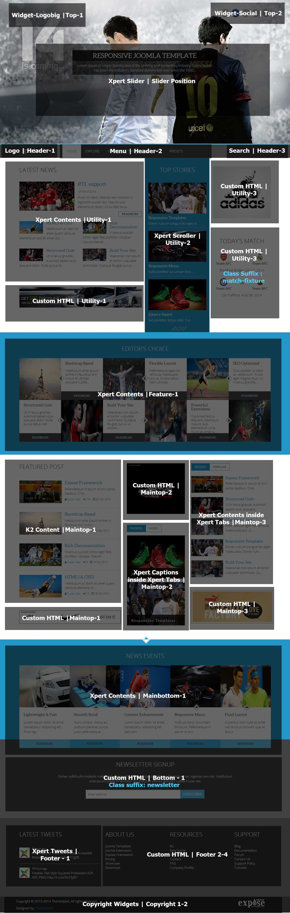
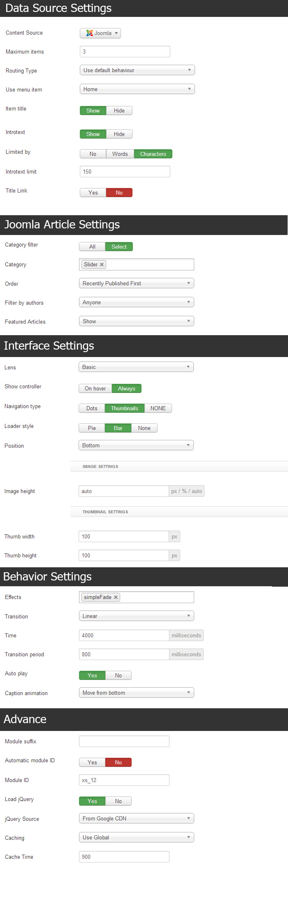
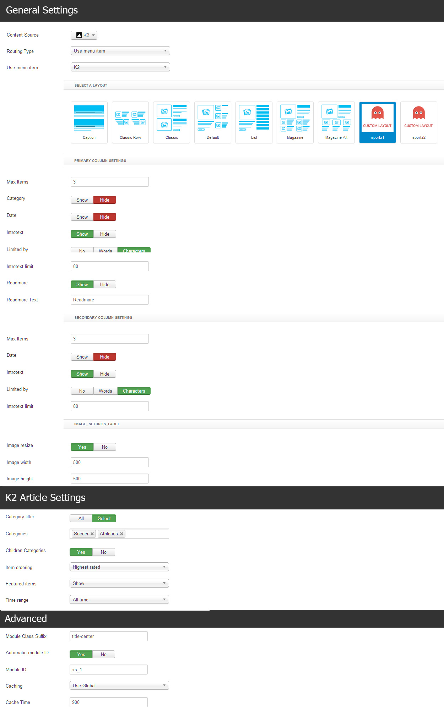
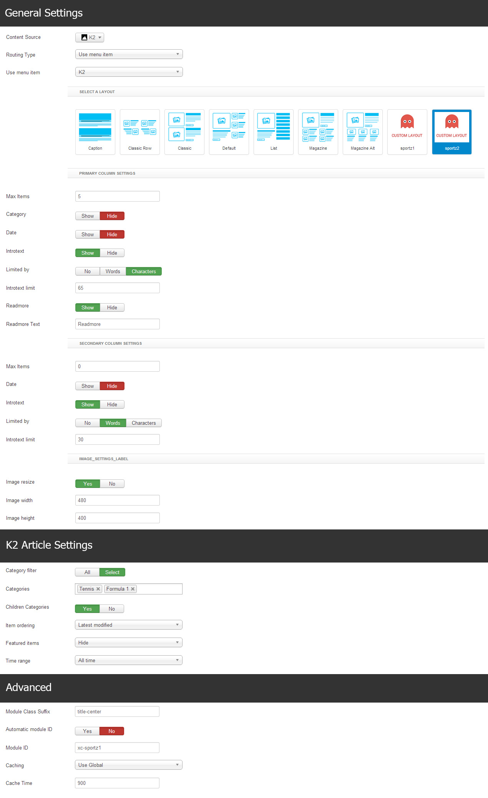

##[Installation](#installation)
----------
Follow [fresh installation guideline](http://www.themexpert.com/documentation/expose-framework/getting-started) if you are having problem to install template.


<div class="row">
	<div class="col-md-6">
		<div class="panel panel-primary">
  <!-- Default panel contents -->
  <div class="panel-heading">Complimentary Extensions:</div>

  <!-- List group -->
  <ul class="list-group">
    <li class="list-group-item"><a href="http://www.themexpert.com/joomla-extensions/xpert-slider">Xpert Slider</a></li>
    <li class="list-group-item"><a href="http://www.themexpert.com/joomla-extensions/xpert-tabs">Xpert Tabs</a></li>
    <li class="list-group-item"><a href="http://www.themexpert.com/joomla-extensions/xpert-tweets">Xpert Tweets</a></li>
    <li class="list-group-item"><a href="http://www.themexpert.com/joomla-extensions/xpert-scroller">Xpert Scroller</a></li>
    <li class="list-group-item"><a href="http://www.themexpert.com/joomla-extensions/xpert-contents">Xpert Contents</a></li>
    <li class="list-group-item"><a href="http://www.themexpert.com/joomla-extensions/xpert-captions">Xpert Captions</a></li>
  </ul>
</div>
	</div>
	<div class="col-md-6">
		<div class="panel panel-default">
  <!-- Default panel contents -->
  <div class="panel-heading">Optional:</div>
  <!-- List group -->
  <ul class="list-group">
    <li class="list-group-item"><a href="http://getk2.org">K2</a></li>
  </ul>
</div>
	</div>
</div>
##[Template Settings](#template_settings)
----------
To load factory settings of this template please open template settings and click `Configurator` button. Under `Load configurationbutton` you will see all available settings there and choose settings named as your template name. Then press load button and you're done!


##[Homepage Settings](#homepage_settings)
----------
The screenshot below shows you the modules we have published on the homepage of the demo site.



##[Slideshow Settings](#slideshow_settings)
----------
This module is powered by our Xpert Slider and here are the settings.

```
Module Position: Slider
```



##[Scroller Settings](#scroller_settings)
----------
We've used our Xpert Scroller module here, have a look on the settings.

```
Module Position: Utility-2
```


##[Latest News Settings](#latest-news-settings)
----------
We've used Xpert Contents module here, have a look on the settings.

```
Module Position: Utility-1
```


##[Editor's Choice Settings](#editor-choice_settings)
----------
This module is powered by our Xpert Contents and here are the settings.
```
Module Position: Feature-1
```




##[News Events Settings](#news_events_settings)
----------
We've used Xpert Contents module here, have a look on the settings.
```
Module Position: Mainbottom-1
```




##[Featured Post Settings](#featured_post_settings)
----------
This module is powered by K2 Contents and here are the settings.
```
Module Position: Maintop-1
```


