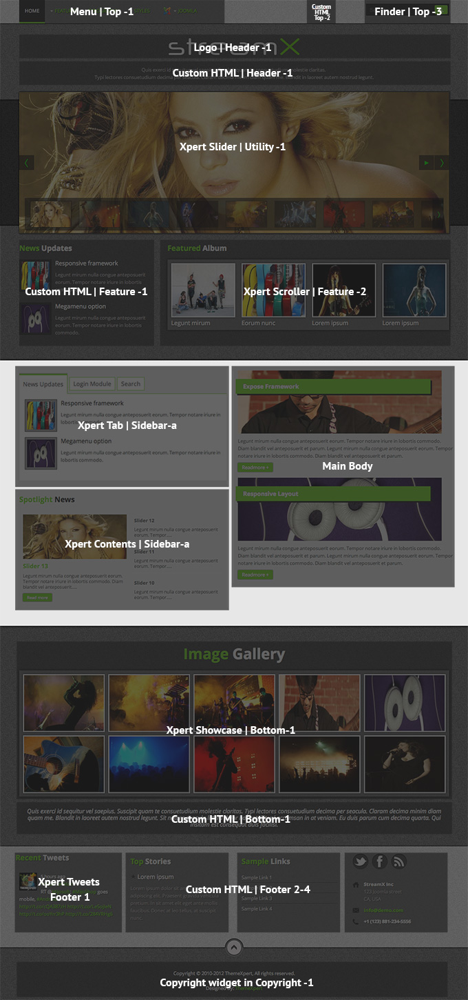
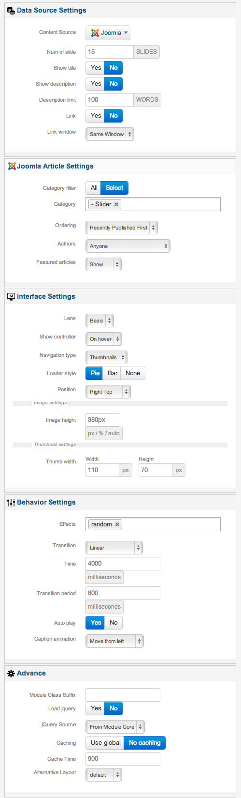
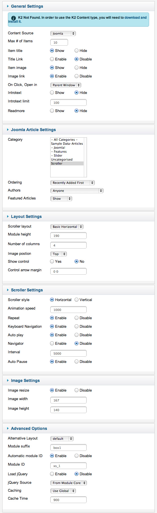
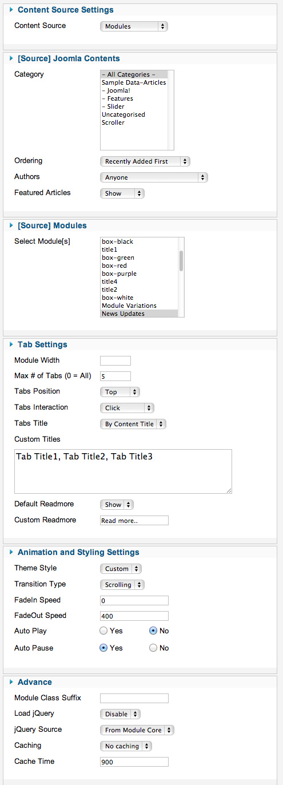
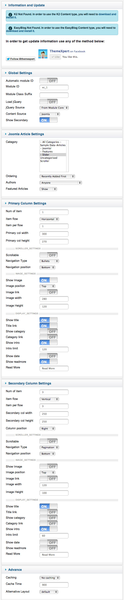
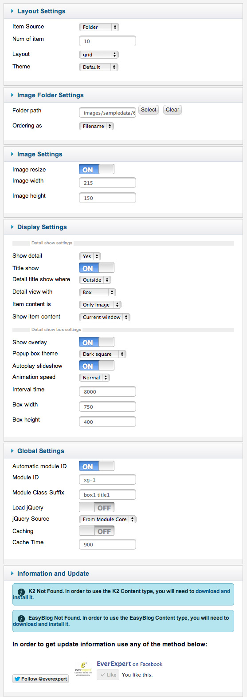
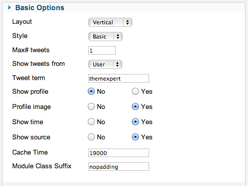

##Installation
----------
Follow [fresh installation guideline](http://www.themexpert.com/documentation/expose-framework/getting-started) if you are having problem to install template.

	

		

  <!-- Default panel contents -->
  
Complimentary Extensions

  <!-- List group -->
  

    
<a class="list-group-item" href="http://www.themexpert.com/joomla/extensions/xpert-slider">Xpert Slider</a>

    
<a class="list-group-item" href="http://www.themexpert.com/joomla-extensions/xpert-tabss">Xpert Tabs</a>

    
<a class="list-group-item" href="http://www.themexpert.com/joomla-extensions/xpert-scroller">Xpert Scroller</a>

    
<a class="list-group-item" href="http://www.themexpert.com/joomla/extensions/xpert-contents">Xpert Contents</a>

    
<a class="list-group-item" href="http://www.themexpert.com/joomla/extensions/xpert-tweets">Xpert Tweets</a>

    
Xpert Showcase (Deprecated)

  

	

##Template Settings
----------
To load factory settings of this template please open template settings and click `Configurator` button. Under `Load configurationbutton` you will see all available settings there and choose settings named as your template name. Then press load button and you're done!

##Homepage Settings
----------
The screenshot below shows you the modules we have published on the homepage of the demo site.

##Module Positions

###Slideshow Settings

This module is powered by Xpert Slider and here is the settings.

##Scroller Settings

This module is powered by Xpert Scroller and here is the settings.

##Tab Settings

This module is powered by Xpert Tabs and here is the settings.

##Content Settings
This module is powered by Xpert Contents and here is the settings.

##Showcase Settings
This module is powered by Xpert Showcase but it is deprecated now. You can use Xpert Gallery instead of it. Here is the required settings.

##Tweets Settings

This module is powered by Xpert Tweets and here is the settings.

