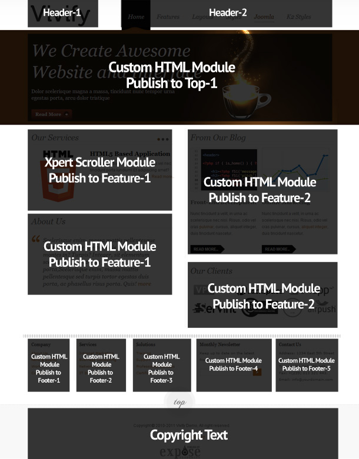
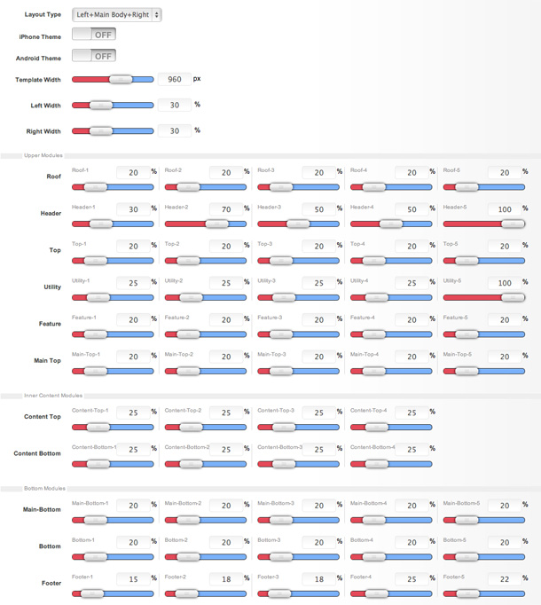
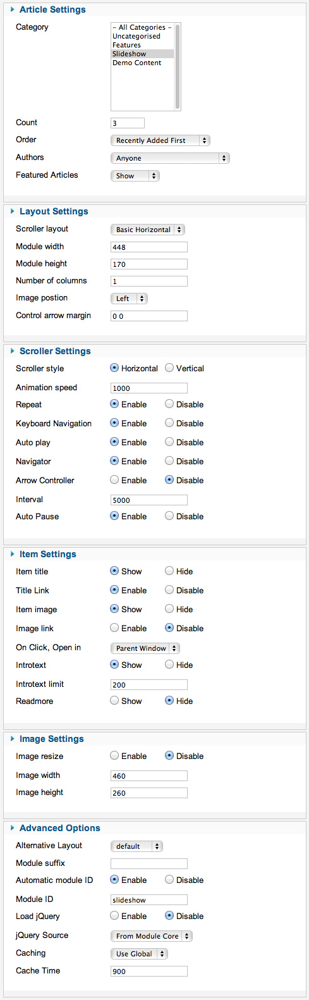

##Installation
----------
Follow [fresh installation guideline](http://www.themexpert.com/documentation/expose-framework/getting-started) if you are having problem to install template.

	

		

  <!-- Default panel contents -->
  
Complimentary Extensions

  <!-- List group -->
  

    
<a class="list-group-item" href="http://www.themexpert.com/joomla/extensions/xpert-scroller">Xpert Scroller</a>

  

	

	

		

  <!-- Default panel contents -->
  
Optional

  <!-- List group -->
  

    
<a  class="list-group-item" href="http://getk2.org/">K2</a>

  

	

##Homepage Settings
----------
The screenshot below shows you the modules we have published on the homepage of the demo site. Please see the explanation below regarding the usage and any other relevant information of the modules.

**Explain:**

- **Logo:** This is a custom HTML module published to header-1 module position using module class suffix: `logo nostyle`. Write this below code on your editor(remove the / from href) otherwise your logo won’t appear, <pre>&lt;a href=""&gt;Vivify&lt;/a&gt;</pre> 
***Make sure you turn off the editor to no-editor mode from Global Configuration.***

- **Menu:** The menu is rendered via the core Joomla menu module, and the menu options are controlled via the template. This menu is using module class suffix: `tx-menu`
- **Featured Text and Background Module:** This is a custom html module publish to top-1 module position using module class suffix: `bg`. Here is the code below to show you how we write the html:

 <pre class="prettyprint">
 &lt;h2 class="big italic normal"&gt;We Create Awesome &lt;br /&gt; Website and Interface&lt;/h2&gt;
 &lt;p class="medium"&gt;Dolor scelerisque magna a massa, tincidunt nunc tempor urna&lt;/p&gt;
 &lt;p class="medium"&gt;egestas porta, arcu dolor tristique&lt;/p&gt;
 &lt;a href="#" class="readon2"&gt;&lt;span&gt;Read More&lt;/span&gt;&lt;/a&gt;</pre>

- **Slideshow:** Xpert Scroller module is published in feature-1. You can see a screenshot of the specific configuration below.

- **Custome HTML module:** Feature1-5, Footer1-5 custom HTML module.

##Layout Settings
----------

##Module Positions
----------

##Slideshow Settings
----------
This module is powered by our Xpert Scroller and here is the settings.

