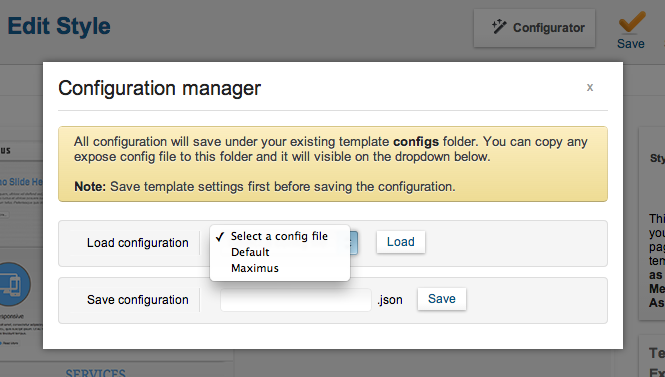
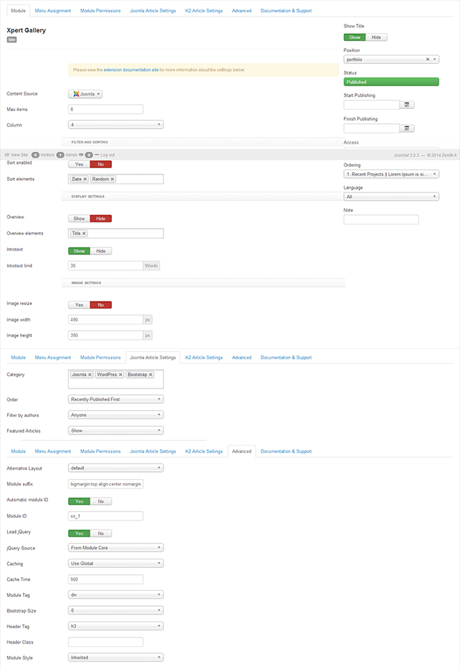
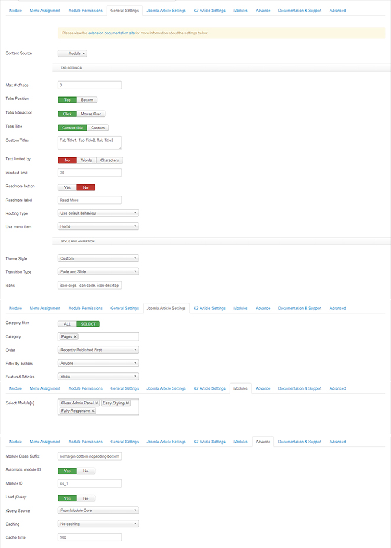

##[Installation](#installation)
----------
Follow [fresh installation guideline](http://www.themexpert.com/documentation/expose-framework/getting-started) if you are having problem to install template.

	

		

  <!-- Default panel contents -->
  
Complimentary Extensions

  <!-- List group -->
  <ul class="list-group">
    <li class="list-group-item"><a href="http://www.themexpert.com/joomla-extensions/xpert-gallery">Xpert Gallery</a></li>
    <li class="list-group-item"><a href="http://www.themexpert.com/joomla-extensions/xpert-accordion">Xpert Accordion</a></li>
    <li class="list-group-item"><a href="http://www.themexpert.com/joomla-extensions/xpert-tabs">Xpert Tabs</a></li>

 
 
  </ul>

	

	

		

  <!-- Default panel contents -->
  
Optional Extensions

  <!-- List group -->
  <ul class="list-group">
    <li class="list-group-item"><a href="http://stackideas.com/easyblog">EasyBlog</a></li>
    <li class="list-group-item"><a href="http://stackideas.com/easydiscuss">EasyDiscuss</a></li>
  </ul>

	

##[Template Settings](#template_settings)
----------
To load factory settings of this template please open template settings and click `Configurator` button. Under `Load configurationbutton` you will see all available settings there and choose settings named as your template name. Then press load button and you're done!

##[Homepage Settings](#homepage_settings)
----------
The screenshot below shows you the modules we have published on the homepage of the demo site.

##[Gallery Settings](#gallery_settings)
----------
This module is powered by our Xpert Gallery and here are the settings.

##[Tabs Settings](#tabs_settings)
----------
We've used Xpert Tabs module here, have a look on the settings.

