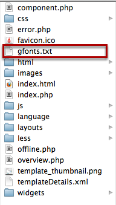

Expose comes with a rich typography settings provide live preview to check the font before apply. The font list provide the list of fonts available from ```Google Fonts``` and ```General Font family```. To work with this settings you need to select the font first and see the preview, if you are satisfied with the preview provide the right selector and Save.


## Adding New Google Fonts
Adding new Google font is really simple. There is a gfonts.txt file under your ```templates/TEMPLATES/``` folder. You need to delete the file and browse the template settings page. Expose will then fetch all the latest Google fonts and re-generate the file again and you can see the fonts on font drop-down.

