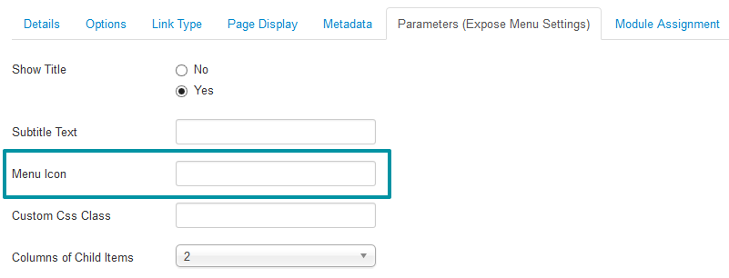

[Font Awesome](http://fortawesome.github.io/Font-Awesome/) gives you scalable vector icons that can instantly be customized — size, color, drop shadow, and anything that can be done with the power of CSS. Expose framework has full support for Font Awesome with more user-friendly way.

## In Menu Item

1. Open a Menu item (Like: Home).
1. Click on *__ Parameters (Expose Menu Settings)__*.
1. Insert [Font Awesome](http://fortawesome.github.io/Font-Awesome/3.2.1/icons/) icon code in *__Menu icon__* field.
1. Click to save from right top and Your menu icon will be added.

## In Module Title

1. Open any Module (Like: Login Module).
1. Click on *__ Advanced__* tab.
1. Insert [Font Awesome](http://fortawesome.github.io/Font-Awesome/3.2.1/icons/) icon code in *__ Module class suffix__* field.
1. Click Save button and Your menu icon will be added.

