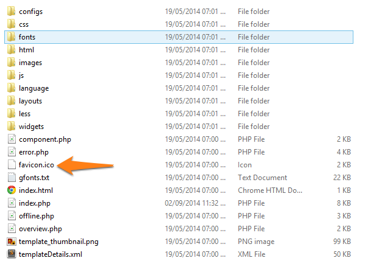

To change your site favicon please follow these steps

1. Go to Template root directory as example: ```htdocs\appy\templates\tx_appy```
1. replace __favico.ico__ file with your own __favico.ico__ file
1. clear browser cache and reload your site



To add favicon in joomla site this [Blog](http://www.themexpert.com/index.php?option=com_easydiscuss&view=post&id=6195&Itemid=146) will be helpful.