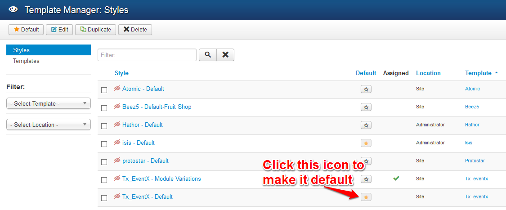

The Expose framework itself is independent of any template. Each Expose powered template relies on the Expose framework to provide the underlying base and extensive functionality that enables the creation of such powerful sites. To make the update and deployment of framework as easy as possible we've seperated the library from template.

## Framework bundle
Framework bundle consist of 2 files:
1. Framework library
1. Framework plugin

__Framework library :__ This is the main framework library file works as a engine for Expose based template.
__Framework plugin :__ This is the system plugin file load mega menu parameters in Joomla backend and provide the mega menu functionality.
<p class="alert alert-warning">This system plugin must be installed and enabled from Joomla backend.</p>

## Installation
Unlike any other Joomla template/extension, installation of Expose framework and template is fairly simple. Use the extensions installer in the Joomla administration, go to ```Extensions => Extensions Manager => Install```

Click on ```Browse``` select the downloaded Expose framework library and click on ```Upload & Install``` Repeat this step again to install Expose template.


<p class="alert alert-info"><strong>Heads up!</strong> Expose framework library not required to be activate. It just need to install and it will be used when needed.</p>

## Activate Plugin
By default Expose plugin is active, but if it's not then go to ```Extensions => Plug-in Manager``` Type expose and search and enable the plugin.


## Activate Template
To activate the new template go to ```Extensions => Template Manager``` choose the installed template and click on ```Default```
By clicking on the templates name, you'll be able to change all template specific settings.

