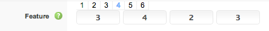

## Grid System Explained
The default Expose grid system utilizes 12 columns based on <a href="http://twitter.github.com/bootstrap/index.html" target="_blank">Twitter Bootstrap</a> and by default the 12 column ```3 | 3 | 3 | 3``` of the default setting divided into an equal sized block for each of the 4 module positions you have active or published.


Expose supports a handful of media queries to help make your website more appropriate on different devices and screen resolutions. Block width in different screen size (picture above).

## Module Positions Layouts

Each of the major module rows/sections has
- Number in top links from 1 to 6 which represent the number of positions you want to configure for and
- Input box allow you to set the grid size.

If you are setting up the layout for a page which has 4 positions in use, you have to first select the #4 link at the top of the section for that position. If you had modules in 4 different module positions like ```feature-1``` ```feature-2``` ```feature-5``` and ```feature-6``` that would mean your active positions would be 4.
      


For Example, we have chosen the layout ```3 | 4 | 2 | 3``` which means that module position feature-1 is assigned 3 grids, feature-2 is assigned 4, feature-3 is assigned 2 and feature-4 is assigned 3 grids. After hitting Apply or Save this will cause the front-end's layout to change and display:


    
Expose is flexible enough that you can configure different layouts for different numbers of module positions. Joomla has the ability to show different modules on different menu items, so you may have 4 modules published on your Home menu item, but only 2 modules published on one of your internal pages.

## Mainbody Layouts


    
Expose has 3 types of Mainbody layouts that provides the ability for a Expose powered template to effectively support 3 column layout. The main difference between module layout with mainbody is generally displayed along side up to 2 sidebars. You can turned OFF any sidebar for specific menu items and the sidebar width will add with the mainbody width. For example, we have chosen Sidebar A and Sidebar B layout ```3 | 4``` means mainbody layout will be ```5``` based on ```12``` grid calculation system. If any of the page has no Sidebar A then Mainbody layout would be ```5+3(Sidebar A)=8```