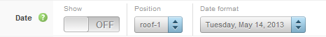
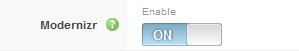
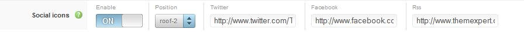

Widgets are tiny little features which enhence templates capability and power. Expose widget based architecture gives ability to create a powerful widgets within a short span of time. The following widgets are available by default with Expose based templates:

## Logo
The Logo widget controls the output of the template's main logo. From this option you can enable/disable the display of the logo, as well as select a location for the logo to display in using any of the available module positions in the template. You can select the logo type image/text. By selecting image Logo widget load logo images comes with template or you can upload and select image through image uploader. <em>Logo tagline will only visible when logo type text is selected otherwise it will not visible on your site</em>. Load mobile feature give ability to show the widget on mobile device.

 

## Date
The Date widget controls the output of the current date display. From this option you can enable/disable the display of the date, enable/disable the use of client side date, choose from several different date format options and select a location for the date to display in using any of the available module positions in the template. Load mobile feature give ability to show the widget on mobile device.

## Copyright
The Copyright widget controls the output of the copyright text. From this option you can enable/disable the display of the copyright text, input custom copyright text to be displayed, as well as select a location for the copyright text to display in using any of the available module positions in the template. Load mobile feature give ability to show the widget on mobile device.

## Font Resizer
The font resizer widget gives your visitor ability to increase/decrease font size. From this option you can set the selector where the font re-size will take effect, you can specify CSS ID or class selector.

## Scroll To Top
The Scroll To Top widget controls the output of a link/button that when clicked will smoothly scroll the page back to the top. From this option you can enable/disable the display of the to top button, as well as select a location for the to top button to display in using any of the available module positions in the template.

## Word Format
Word format widget will wrap all words with a span. It is extremely useful when you want to style some words from a sentence like first word of title.

## Lazy Loader
The Lazy loader widget controls the loading of images in long web pages. Images outside of viewport (visible part of web page) wont be loaded before user scrolls to them.

## Modernizr
Modernizr is an open-source JavaScript library that helps you build the next generation of HTML5 and CSS3-powered websites. From this option you can enable/disable the load Modernizr javascript library.

## Expose Logo
The Expose Logo widget controls the output of the expose framework logo. From this option you can enable/disable the display of the logo, as well as select a location for the logo to display in using any of the available module positions in the template.

 

## Google Analytics
The Google Analytics widget allows you to enable Google Analytics tracking on your site in a quick and easy way. Just enable the feature and input your UA Key assigned to you by Google in the field provided.

## Social Icons
This Social widget will help your customer to connect with you through social media like facebook, twitter. You have to enable the option, set the module position and give your social profile link into the specific field.

