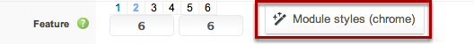

Expose comes with a very handful unique feature call ```Module styles``` which allow you to present your module blocks in different layout/styles. Each of the major module row/section has a button ```Module styles (chrome)``` Click that button and a popup will comes with all available module style lists.


      
By default all module blocks is rendered by Standard Style but you can choose any rendering method for a specific module position.
1. Click the drop-down menu of a module position
1. Click Save button then click the Save button from Joomla toolbar.


## Standard Style
Standard Style is a natural style rendered by default and module class suffix can be applied in this layout. Module class suffix gives a different look and feel of a module block.


## Tab Style
By selecting Tab Style all modules published on that position will show in a Tab view. For example, we have chosen Tab Style for Feature-1 and all module published in Feature-1 is presented in Tab view. 


## Accordion Style
By selecting Accordion Style all modules published on that position will show in a Accordion view. For example, we have chosen Accordion Style for Feature-1 and all module published in Feature-1 is presented in Accordion view. 


## Basic Style
Basic style will rendered the module without module title and removed all other div inside it. Module Class Suffix will not applicable for this style and this style is idea for showing banner/ads.

