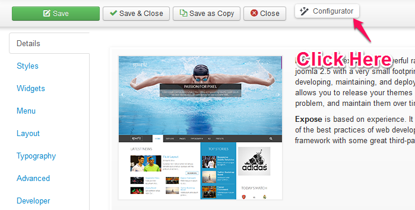

__Save :__ Go to Template admin and click on *overview/Details* tab. Now, click to *Configurator* button and in *Save Configuration* input box provide a name and hit save.

__Load :__ Go to Template admin and click on *Overview/Details* tab Now, click to *Configurator* button and Load a Configuration JSON Which you saved before. 

