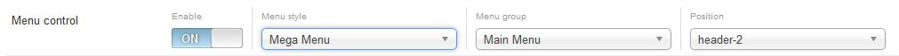
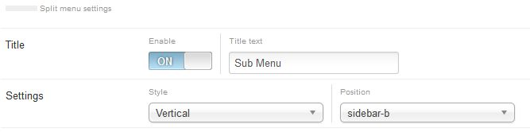

## Menu Control Explained

Menu control need to be enable to show menu on your website. If you want to build a menu less page you can turned this OFF.



Menu type is to determine what type of menu the menu system will render and which menu group from Menu name settings. Select the right module position for the menu


Expose has 2 menu system built-in:
1. Mega menu - Quad column menu system able to load module
1. Split menu - split menu shows the submenu items on a separate menu instead of a dropdown or indentation

## Mega Menu Settings
Configuring megamenu is very simple, go to *Menu &gt; Main Menu* then select a menu item. Megamenu settings will appear right side of the parameters click to expand.


    
__Show Title :__ Show/hide menu title  
__Subtitle Text :__ Menu sub-title/description  
__Menu Icon :__ Show icon font in menu. eg: icon-home  
__Custom CSS Class :__ Supply additional class for the menu item.  
__Columns of Child Items :__ Number of Columns. Works for first level menu items, with groups = Y for each subset going into each column.  
__Drop-Down Width[px] :__ Bind the Drop-Down Width, leave this empty will set the width automatically based on child item text length.  
__Column Width :__ Set the submenu column width, by default its 200px  
__Submenu Column[i] Width :__  You can specify the column width for example, colw2=300 will set 2nd column width to 300px. ```Remember, do not add 'px or %' with the value.```  
__Group :__ This settings will allow the group together all the submenu child item  
__Submenu Content :__  To load modules click Modules option and module list will appear under this option, select module you want to load. You can load a module position so all modules published under this position will show in child item.


__Animations :__ Allows for a variety of animations to be set for the menu.  
__Render level :__ Level to start rendering the menu at. Setting the start and end levels to the same # and setting 'Show Sub-menu Items' to yes will only display that single level.

## Split Menu Settings

__Title :__ Show/Hide menu title  
__Settings :__ This settings applicable only for subnav



## Offcanvas Menu Settings
For mobile devices our megamenu turns into Offcanvas menu which will show as a trigger icon beside site Logo, just need to click on that icon to show full menu.


__Render Level :__ Level to start rendering the menu at. Setting the start and end levels to the same # and setting 'Show Sub-menu Items' to yes will only display that single level.