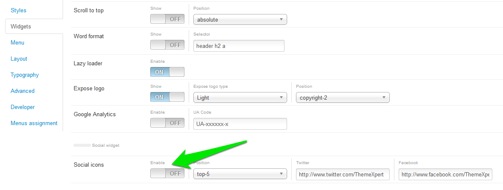

## Edit copyright info
To edit copyright info *__Login__* to your joomla site's admin panel, go to *__Template Manager__*, select the template. In template configuration page go to the *__widget__* tab and you will see copyright text box there, change it as the way you want.

## Disabling social widget
To disable social widget at first *__Login__* to your joomla site's admin panel, go to *__Template Manager__* select the template. In template configuration page go to the *__widget__* tab and you will see *__social icon__* field there. You can change the link to yours or you can turn it off.

