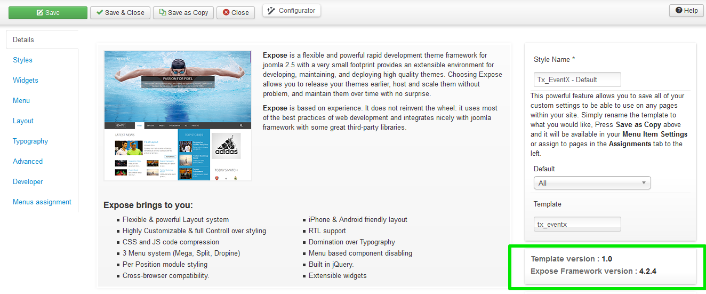

## Designed by ThemeXpert
### Expose v3/4
To remove ThemeXpert branding information open *__designedby.php__* file located at
```templates/tx_templatename/widgets```
You will find a code block like:
	/* public function isEnabled()
    {
        return FALSE;
    }*/

un-comment this line then it should look like:
	public function isEnabled()
    {
        return FALSE;
    }

You are done!

### Expose v2
To remove ThemeXpert branding information open your template *__index.php__* file located at
```templates/tx_templatename```
scroll down to the bottom and find out a line like:
	<?php $expose->loadGists(array('copyright','legal','exposelogo'));?> 
now remove the 'legal' with single quotation and coma right after that, so it should look like:  
	<?php $expose->loadGists(array('copyright','exposelogo'));?>

You are done!
### Not sure which version you are using?
Go to ```Extensions > Template manager``` and open your template, if you see a overview tab with details(image below) you already know your version if you don't see this page means your are using Expose v2.



## Powered by Expose
To remove powered by framework button you have to go ```template settings => Widgets => Expose Logo``` and set it off.

