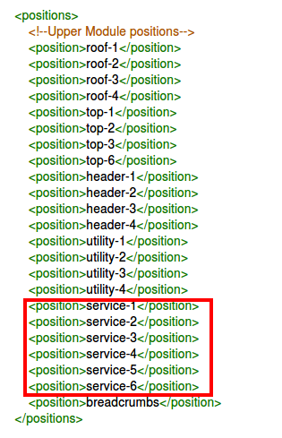
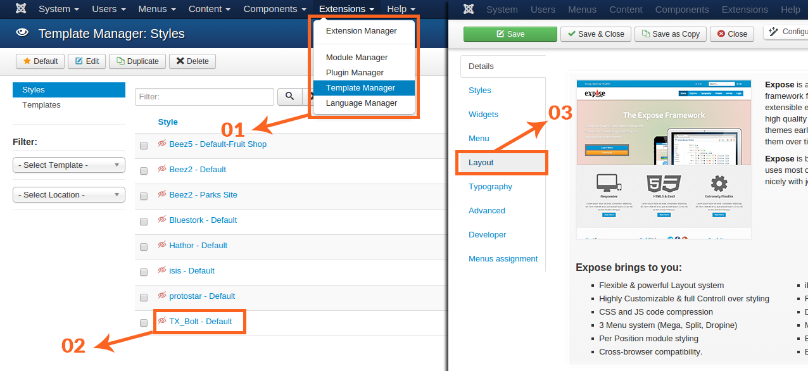
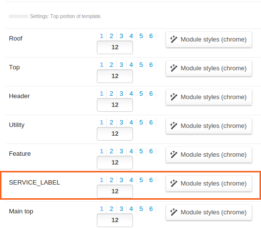

## Step 01
To create a new module position, you have to open default template root via **Extensions > Template Manager > activated default template** link   and edit the **templateDetails.xml** file. Once you opened templateDetails.xml, you can notice all built-in positions are wrapped within ```<position></position>``` tag. Now add your prefered module position name in ```<positions></positions>``` tag. I termed my module position name “Service”, Have a look on image below, how I wrapped module position name in ```<position></position>``` tag. 


##Step 02

To create your new module position setting, scroll a down to the **layout Setting** area, copy the following code and paste in layout setting section. I have named my position **Sevice**, just rename **Service** with your prefered one.  


```
<field name="service-chrome" type="moduleschrome" max-mods="6" class="remove-lbl"
        default="service-1:standard,service-2:standard,service-3:standard,service-4:standard,service-5:standard,service-6:standard" description="MODULE_CHROME_DESC">
        <option value="standard">Standard</option>
        <option value="tabs">Tabs</option>
        <option value="accordion">Accordion</option>
        <option value="basic">Basic</option>
</field>
```

##Step 03

Now head over to the **Template Manager** from **Extensions Menu**, click activated template link from **Style** column (My active template is **Bolt**), click on **layout** tab from left sidebar, refresh the **Layout Manager** hitting ``ctrl + F5`` and hit ``Save and Close``.



Now you can see in the image below our custom module position ``SERVICE_LABEL`` has been created.



Now you can publish your modules in your newly created position


