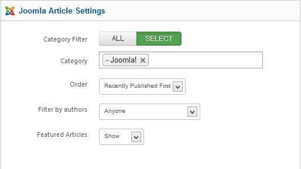

##Before you begin
Xpert Accordion doesn't work without some content, so the first thing you will need to do is create some articles or K2 items or modules. 

If you have a Expert Explorer package that includes Xpert Accordion, you can view the demo content for an example.

Once you have your selection of content ready, you can then start to work with Xpert Accordion.

##General Settings


**Content Source :** Choose your content source from where your content will come.

**Maximum Items :** Maximum item you want to show.

**Limited by :** This option allow whether you limit introtext by word or character or no limitation.

**Introtext limit :** Intro text charectar limit.

**Style :** Select style of the accordion.

**Load jQuery :&nbsp;**This option allow you to enable or disable loading jquery on your site. If your template already load jQuery then disable this option otherwise you should enable it.

**jQuery Source :&nbsp;**This option allow you to load jQuery form 2 source, Google CDN or from Module Core. We recommend to user ```Google CDN``` for live site because it will load faster and save your bandwidth, for local testing/development you can load jQuery ```From Module Core```

**Caching :** Select whether to cache the content of the module.

**Cache Time :** The time before the module is reached.

**Module class suffix :** This allows you to apply a unique CSS style to this module, if you desire and have the style set in the template.

##Joomla Article Settings


**Category Filter :** Set whether article will fetch from all categories or specific categories.

**Category :** This option will only show if you set select in the Category Filter option. You can specify single or multiple categories here.

**Order :** Sort your article by selected order.

**Filter by Authors :** Filter all articles by authors.

**Featured Articles :** You can disable showing featured article or featured article only.

##K2 Article Settings


**Category Filter :** Select all or specific category.

**Categories :** This option will only show if you set select in the Category Filter option. You can specify single or multiple categories here.

**Children Categories :** This option allow you to fetch item from any clildren category you've selected.

**Item Ordering**&nbsp;:&nbsp;Select your article sorting order.

**Featured Items :&nbsp;**You can disable showing featured article or featured article only.

**Time range :&nbsp;** Set time range if ordering is set to 'most popular' or 'most commented'.

##Modules


**Select Module :** Select single or multiple module.

##Troubleshooting
<em>**Do i need jQuery?**</em>

Yes this module require it.


<em>**Text not showing, why?**</em>

Make sure you have some text in your article.


<em>**I can't save or apply admin settings, why?**</em>

We recommend to use Firefox 4+/Chrome/Safari/Opera for admin management. It has some problem saving settings from ```Internet Explorer```


<em>**Why do article open on the same page?**</em>

When your articles or category of these article not assigned on menu item joomla will open article under home menu item. To avoide this you should create a menu item and assign a category for it, then you can hide the menu item.