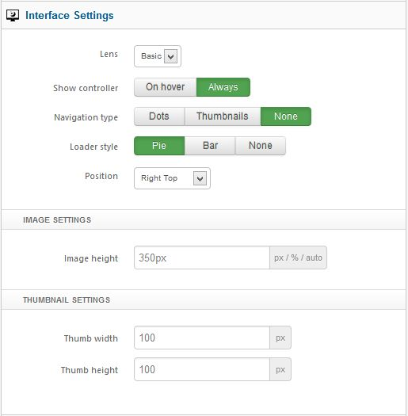
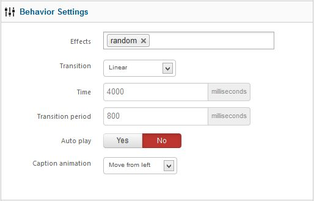

##Before You Begin
Xpert Slider doesn't work without some content, so the first thing you will need to do is create some Joomla or K2 or Easyblog. If you have a Expert Explorer package that includes Xpert Slider, you can view the demo content for an example.

You should first create a new category or select one that you wish to display images from. Then place new images into it with your content. Make sure to provide text if you wish to show some descriptions of image, as these are what is used to display the snippets.

Once you have your selection of images ready, you can then start to work with Xpert Slider.

##Data Source Settings
In this section you will specify the source of the data.

**Content Source:**Select source of content. Base of your selection the next tab will load

**Maximum Items:**Number of items to show.

**Item Title :** This option allow you to show or hide article title.

###Intro Settings
**Introtext:**This option allow whether you want to show introtext or not.

**Limited by:**This option allow whether you limit introtext by word or character or no limitation.

**Introtext Limit: **Set introtext character or word limit.

**Title Link:** Set whether title will be linkable or not.

##Joomla Article Settings
After selecting joomla as the content source this settings section will load.

**Category Filter :** Select all or specific category.

**Category :** Choose specific category.

**Order :** Select your article sorting order.

**Filter by Authors :** If you want to show articles from specified authors, make your selection.

**Featured Articles :** You can disable showing of featured articles or show only featured articles.

##K2 Article Settings
This section will only load if you have K2 installed and selected content source is K2.

**Category Filter :** Select all or specific category from all the article will come.

**Categories :** Choose specific category.

**Children Categories :** This option allow you to fetch item from any children category you’ve selected.

**Item Ordering:** Select the way your item will sort.

**Featured Items :** Make your choice whether you want to disable showing of featured items or show only the featured items.

**Time Range :** If ordering is set to ‘most popular’ or ‘most commented’ then you can set the time range.

##Interface Settings
In this section you can set how your slideshow will look. Make your choice and build a perfect one.

**Lens :** Lens defines how to render the slideshow in frontend.
**Show Controller :** Set whether controller will show on hover or always.
**Navigation Type :** Select which way you want to show the navigation.
**Loader Style :** Specify the loader style.
**Position :** Set the position where the loader will load.
**Image Height :** Set image height in px value. Do not insert px in input box.
**Thumbnail Settings :** Width and height of thumbnail in px value. Do not insert px in input box.

##Behavior Settings

**Effects :** You can use more than one effect.
**Transition :** Choose how the sliding effects take on.
**Time :** Milliseconds between the end of the sliding effect and the start of the next one.
**Transition Period :** Length of the sliding effect in milliseconds.
**Autoplay :** When enabled the sliding starts automatically.
**Caption Animation :** Select caption animation style.

##Advance

**Module Suffix :** A suffix to be applied to the css class of the module. This allows for individual module styling.

**Automatic Module ID:** If you have multiple Xpert Slider module in one page this option will add a unique module id to each.

**Module ID:** If you want to assign module id by yourself then <code>Disable</code> Automatic Module Id and insert your own id.

**Load jQuery :** This option allow you to enable or disable loading jquery on your site. If your template already load jquery then disable this otherwise you should enable it.

**jQuery Source :** Select jQuery source. Google CDN is recommended for live site.

**Caching :** Select whether to cache the content of this module.

**Cache Time :** The time before the module is recached.

##Documentation & Support
In this section you will get the documentation and support informations.

##Troubleshooting
<em>**Do i need jQuery?**</em>

Yes this module require it.

<em>**Module Keep loading, why?**</em>

This is possible for a few reasons. If jQuery is already included on your site by the template or another extension, then make sure to disable it in in XpertCaptions. Sometime another extension load jquery, make sure jquery loaded only once in header and top of all script.

<em>**Image not showing, why?**</em>

Make sure your image path is ok and you have no **/** beginning of your image path. For K2 article it looks for article image not image from introtext, so make sure you have article image for each article.

<em>**Text not showing, why?**</em>
Make sure you have some text in your article and you've turned on **show introtext**&nbsp;option form module settings.

<em>**I can't save or apply admin settings, why?**</em>

We recommend to use Firefox 4+/Chrome/Safari/Opera for admin management. It has some problem saving settings from **Internet Explorer**.