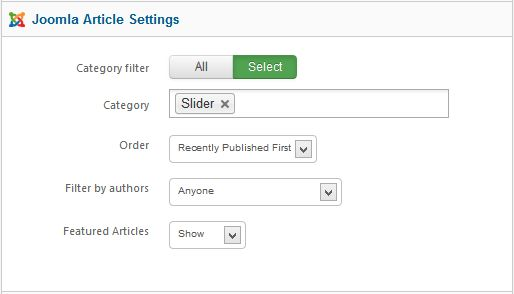

##Before you begin
Parallax Slider doesn't work without some content, so the first thing you will need to do is create some articles or K2 items. 

If you have a Expert Explorer package that includes Xpert Scroller, you can view the demo content for an example.

You should first create a new category or select one that you wish to display articles from. Then place new articles into it with your content. Make sure to provide intro text and if you wish an image, as these are what is used to display the snippets.

Once you have your selection of content ready, you can then start to work with Parallax Slider.

##General Settings


**Content Source :&nbsp;**Choose your content source from where your content will come.

**Maximum Items :** Maximum item you want to show.

**Module Height :** Set module height in px value. Do not insert px in input box.

###Title Settings
**Item title :** Show or Hide item title.

**Title link :** Make article title linkable, it will link to the article.

###Intro Settings

**Introtext :** Show or hide introtext

**Limited by :** This option allow whether you limit introtext by word or character or no limitation.

**Introtext limit :** Intro text charectar limit.

**Readmore :** Show or hide readmore link.

**On Click, Open in :** Select where the article open.

###Image Settings
**Item image :** Show or hide item image.

**Image Position :** Select your image position for items.

**Image width:** Specify image width in ```px``` value. Do not enter px on the field.

**Image height:** Specify image height in ```px``` value. Do not enter px on the field.

##Joomla Article Settings


**Category Filter :** Set whether article will fetch from all categories or specific categories.

**Category :** This option will only show if you set select in the Category Filter option. You can specify single or multiple categories here.

**Order :** Sort your article by selected order.

**Filter by Authors :** Filter all articles by authors.

**Featured Articles :** You can disable showing featured article or featured article only.

##K2 Article Settings


**Category Filter :** Select all or specific category.

**Categories :** This option will only show if you set select in the Category Filter option. You can specify single or multiple categories here.

**Children Categories :** This option allow you to fetch item from any clildren category you've selected.

**Item Ordering :** Select your article sorting order.

**Featured Items :&nbsp;**You can disable showing featured article or featured article only.

**Time range :&nbsp;**Set time range if ordering is set to 'most popular' or 'most commented'.

##Style Settings


**Style :** Select the style theme you want to use. Custom will let you use your own customized style. Create parallax-slider.css file under your template/css folder and this option will load this style automatically.

**Auto play :**&nbsp;When enabled the scrolling starts automatically upon page load.

**Interval :**&nbsp;The time (in milliseconds) between autoscrolls.

**Show Control :** Show or hide control arrow.

##Advanced Options


**Alternative Layout :** Use a different layout from the supplied module or overrides in the template.

**Module suffix :** This allows you to apply a unique CSS style to this module, if you desire and have the style set in the template.

**Automatic Module Id :** If you have multiple Xpert Scroller module in one page this option will add a unique module id to each.

**Module Id :&nbsp;**If you want to assign module id by yourself then ```Disable``` Automatic Module Id and insert your own id.

**Load jQuery :&nbsp;**This option allow you to enable or disable loading jquery on your site. If your template already load jQuery then disable this option otherwise you should enable it.

**jQuery Source :&nbsp;**This option allow you to load jQuery form 2 source, Google CDN or from Module Core. We recommend to user ```Google CDN``` for live site because it will load faster and save your bandwidth, for local testing/development you can load jQuery ```From Module Core```

**Caching :** Select whether to cache the content of the module.

**Cache Time :** The time before the module is reached.

##Documentation & Support
In this section you will get the documentation and support informations.


##Troubleshooting
<em>**Do i need jQuery?**</em>
Yes this module requires it.


<em>**Module not scrolling, why?**</em>

This is possible for a few reasons. If jQuery is already included on your site by the template or another extension, then make sure to disable it in in Parallax Slider. Sometime another extension load jquery, make sure jquery loaded only once in header and top of all script.


<em>**Image not showing, why?**</em>

Make sure your image path is ok and you have no ```/``` beginning of your image path. For K2 article it looks for article image not image from introtext, so make sure you have article image for each article.


<em>**Text not showing, why?**</em>

Make sure you have some text in your article and you've turned on ```show introtext```&nbsp;option form module settings.


<em>**I can't save or apply admin settings, why?**</em>

We recommend to use Firefox 4+/Chrome/Safari/Opera for admin management. It has some problem saving settings from ```Internet Explorer```.


<em>**Why do article open on the same page?**</em>

When your articles or category of these article not assigned on menu item joomla will open article under home menu item. To avoide this you should create a menu item and assing a category for it, then you can hide the menu item.