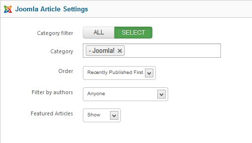
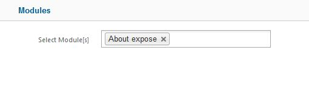
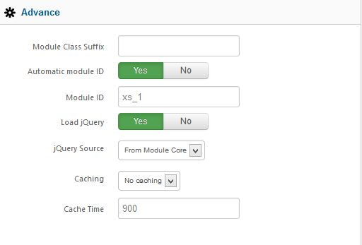
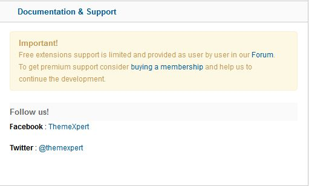

##Before You Begin
Xpert Tabs doesn't work without some content, so the first thing you will need to do is create some Joomla or K2 or Module content. 

If you have a Expert Explorer package that includes Xpert Tabs, you can view the demo content for an example.

Once you have your selection of images ready, you can then start to work with Xpert Tabs.

##General Settings

**Content Source:** Select source of content. Base of your selection the next tab will load.

###Tab Settings
**Max# of tabs :**Maximum number of tabs to show, put 0 to show them all.

**Tabs Position :**Position of tabs navigation bar.

**Tabs Interaction :**Make your choice for triggering the tab change.

**Tabs Title :** Choose the way your Tabs title will set.

**Custom Titles :**If you choose custom title then enter title name separated by<code>,</code>

**Text limited by:**This option allow whether you limit introtext by word or character or no limitation.

**Introtext Limit :**Set introtext character or word limit.

**Readmore Button :** Show or Hide readmore button.

**Readmore label :** Set readmore button label.

###Style & Animation
**Theme Style :** Select the style theme you want to use. 

Custom will let you use your own customized style. Create xperttabs.css file under your template/css folder and this option will load this style automatically.

**Transition Type :** Set the type of the transition.

##Joomla Article Settings
After selecting joomla as the content source this settings section will load.

**Category Filter :** Select all or specific category.

**Category :** Choose specific category.

**Order :** Select your article sorting order.

**Filter by Authors :** If you want to show articles from specified authors, make your selection.

**Featured Articles :** You can disable showing of featured articles or show only featured articles.

##K2 Article Settings
This section will only load if you have K2 installed and selected content source is K2.

**Category Filter :** Select all or specific category from all the article will come.

**Categories :** Choose specific category.

**Children Categories :** This option allow you to fetch item from any children category you’ve selected.

**Item Ordering:** Select the way your item will sort.

**Featured Items :** Make your choice whether you want to disable showing of featured items or show only the featured items.

**Time Range :** If ordering is set to ‘most popular’ or ‘most commented’ then you can set the time range.

##Modules
This section will only load if your selected content source is Module.

**Select Module :** Select single or multiple module

##Advance

**Module Class Suffix :** A suffix to be applied to the css class of the module. This allows for individual module styling.

**Automatic Module ID:** If you have multiple Xpert Tabs module in one page this option will add a unique module id to each.

**Module ID:** If you want to assign module id by yourself then <code>Disable</code> Automatic Module Id and insert your own id.

**Load jQuery :** This option allow you to enable or disable loading jquery on your site. If your template already load jquery then disable this otherwise you should enable it.

**jQuery Source :** Select jQuery source. Google CDN is recommended for live site.

**Caching :** Select whether to cache the content of this module.

**Cache Time :** The time before the module is recached.

##Documentation & Support
In this section you will get the documentation and support informations.

##Troubleshooting
<em>**Do i need jQuery?**</em>

Yes this module requires it.

<em>**Tabs not showing, why?**</em>

This is possible for a few reasons. If jQuery is already included on your site by the template or another extension, then make sure to disable it in XpertTabs. Sometime another extension load jquery, make sure jquery loaded only once in header and top of all script.

<em>**I can't save or apply admin settings, why?**</em>

We recommend to use Firefox 4+/Chrome/Safari/Opera for admin management. It has some problem saving settings from <code>Internet Explorer</code>