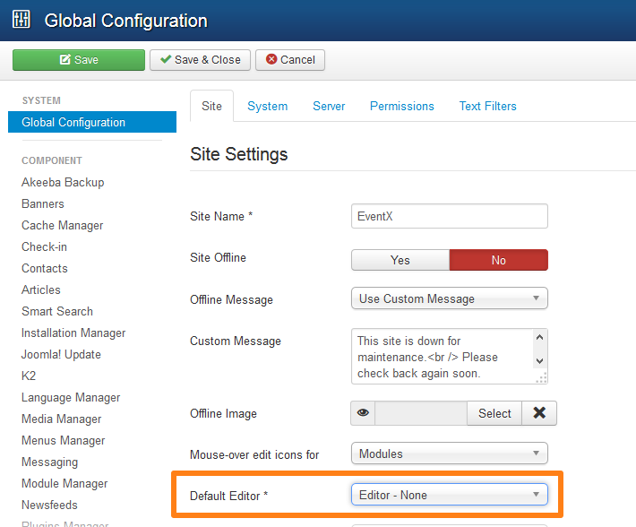

To add any 3rd party plugin code like **Facebook** or **Twitter** to article or module, login to your site's admin panel, go to `global configuration -> Site -> Default Editor` And select `Editor - None`.

Now open a `Custom Html` module or `Joomla article` and paste the code you've.