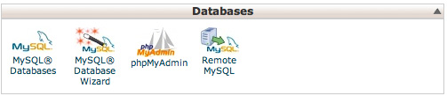
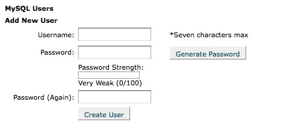
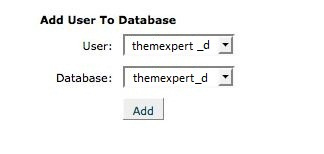
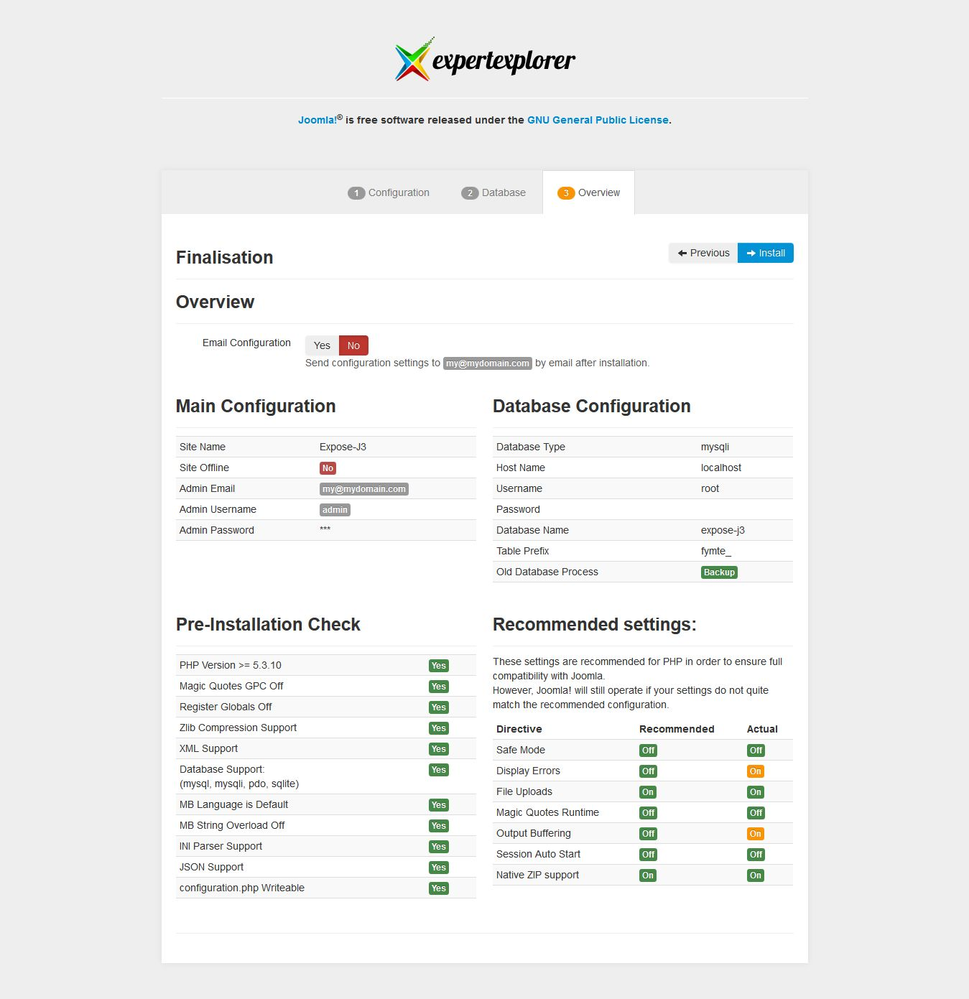
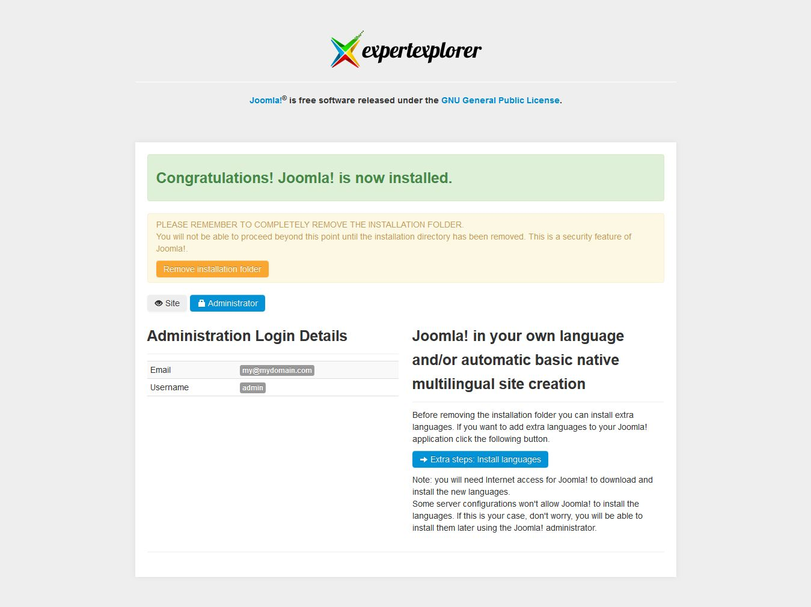

<iframe width="660" height="335" src="//www.youtube.com/embed/tRwCvqJkvAM?rel=0" frameborder="0" allowfullscreen></iframe>

Most of the templates of ThemeXpert come with Quickstart. Because, Quickstart is easy to set up Joomla. There are many different servers and they have different requirements to set up Joomla. Searching in [Joomla Docs](http://docs.joomla.org) is one of the best ways to get an over view about different serves environments that joomla requires.
Lets consider that, you have the server set up and you are ready to install a template and the demo content you see on the demo sites.
The step by step process for installing a Quickstart on a cpanel server using Joomla 3.0 is given below.

1. The first step is to download the Quickstart, you want to use from the ThemeXpert download area. To navigate to the download area you have to login first and then go to Club/Free download section.
1. After downloading you can then unzip and upload the package contents to your server using any type of FTP(file transfer protocol) client. Or if you have shell access then you can upload the zip file and can extract it in the zip directly on your server. The second process is more faster! In this example we are going to unzip the package on our local server or localhost.
1. After that you need to navigate to the folder that you uploaded your Expert Explorer to. Your url might look like this ```http://www.mysite.com/joomla/index.php```
1. Once the page opens it should look something like the image below. You can select any language from the language list. Fill out the site name, email, admin name and password. After that please click on Next button.
     


## Database Configuration
1. The next page is the ```Database Configuration``` page. The informations you will enter in the database fields will be important. This is where the actual information for your Joomla installation are going to be stored. In a nutshell you have to create a mysql database, a user for the database and then assign that user to the database you created. This step requires a slight detour and we need to open up cpanel on our server.


1. Now open the cpanel account on your live server. Generally you will find this by navigating to http://www.mysite.com/cpanel. Once you have logged in navigate to the database area of the cpanel account. This may look different on your server depending on the theme ... but the image below shows you what it looks like on one of our servers.



You can use the database wizard to step through the process but for those who don’t have the wizard on their cpanel install this is how you create the database.
Please click on the mysql database icon and write the name of the database you want to use for your site in the image window provided. You can use any name as you want to here. Then click on the Create database button and you should receive a success message telling you that the database has been created.


Navigate back to the mysql database page and scroll down to where the Create new mysql user input boxes are.



The username and password you put in here are really up to you, but for your Joomla site security its advisable that you use the random password generator if you have it on the page.
After clicking Create New User you should receive the success message and you should then be able to navigate back to the mysql page and scroll down the page again. Take a note of the username and password - as we will need this later.
You now have to assign the user to the database. For this, where it says "Add user to database" there select the database and the user you have just created and make sure they appear in the top and the bottom drop down boxes.



Once you have the new user and new database in the select boxes click add. The following screen should appear.


Assign full or all privileges to the user and click "make changes" submit or add user or whichever submit button you have there. You should receive another success message telling you that your user has been added to the database. You need to pay close attention to the names they use here as the database prefix and user prefix will be needed when filling out the information in the next step. As an example the dummy database we created while doing this tutorial is called test and on our server we can access it by using themexpert_d

1. We are now ready to enter the information into ```Database Configuration``` page. In Joomla 3 it gives you the option of choosing whether to use mysql or mysqli - in most cases you will choose MYSQLI.
In the label where it says host name you need to write the name provided by your host for your hosting plan. In most cases this should be localhost but on other server environments this may be different.
In the username and password field enter the details from the previous step. Don’t forget to put in the prefix to the database. Next is the database name field - grab the name of the database and put it in that field - when ready press next.

## Overview & Finalisation
1. The next one is the ```Overview``` page where you get all the info about main-configuration, database configuration, pre-installation check and recommened settings. After having a look on all the settings just click on Install.



1. After clicking Install you will go to a page where it will show you the progress and after that you'll reach the final page which tells you that you have successfully installed the package. To go ahead you have to remove or rename the installation file in the Joomla directory



After removing the installation directory you can see two options ```Site, Administrator```. If you click on Site option, then you can see your sites frontend and if you click on Administrator option then you will go to the Administrator login page to enter the backend.
Click on the site button and you will see exact same site like our demo installed and configured on your server! Now you can edit, change and add to the site to personalize it and start to market your Joomla web presence. Best of luck.


